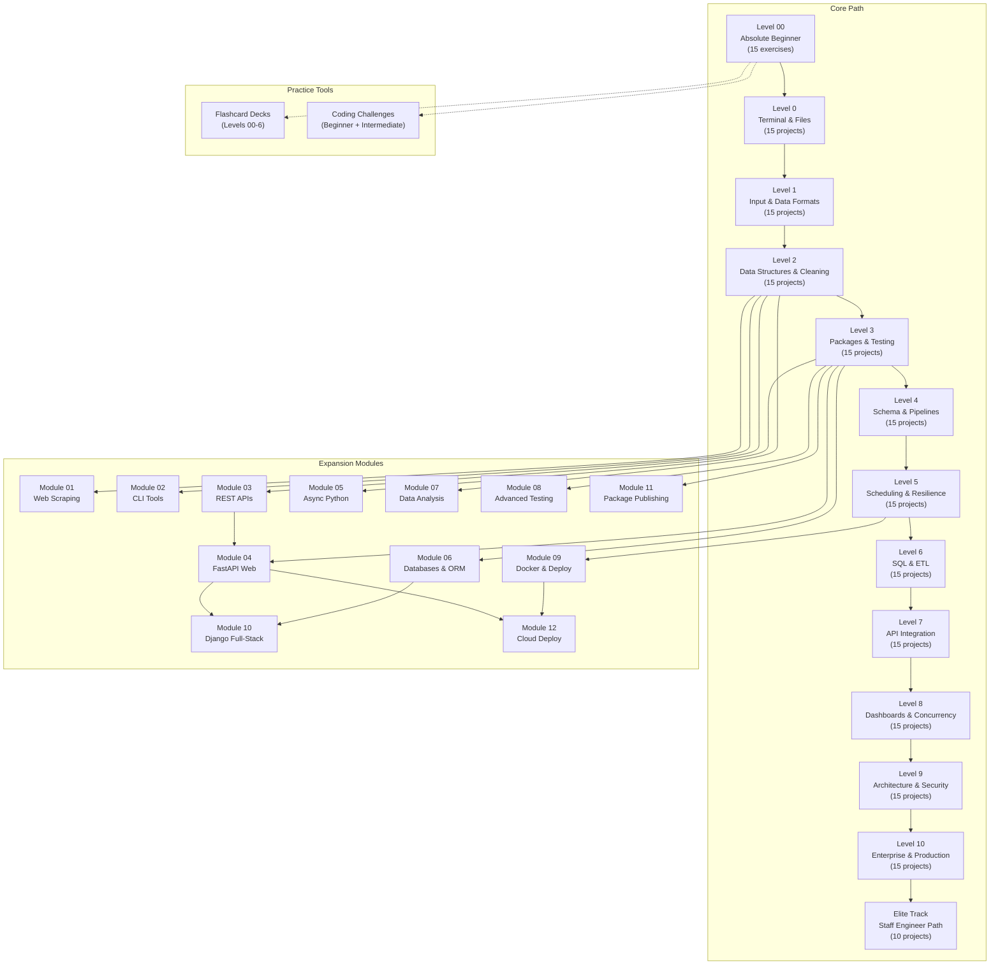

# Curriculum Map

Prev: [README](./README.md) | [Home](./README.md) | Next: [START_HERE](./START_HERE.md)

---

Visual overview of the entire curriculum: how levels connect, where expansion modules branch off, and what every project covers.

---

## Curriculum Dependency Diagram

**How to read this diagram:**

- **Solid arrows** = prerequisite (complete the source before starting the target).
- **Dotted arrows** = practice tools available alongside any level.
- Modules branch off from the core path at different points. Some modules have other modules as prerequisites (Module 04 requires Module 03; Module 10 requires Modules 04 + 06; Module 12 requires Modules 04 + 09).

---

## Projects at a Glance

### Level 00 -- Absolute Beginner

| # | Project | Difficulty | Est. Time | Key Skill |
|---|---------|------------|-----------|-----------|
| 01 | first-steps | Easy | 30 min | Running Python |
| 02 | hello-world | Easy | 30 min | Print statements |
| 03 | your-first-script | Easy | 30 min | Script files |
| 04 | variables | Easy | 30 min | Variable assignment |
| 05 | numbers-and-math | Easy | 30 min | Arithmetic operators |
| 06 | strings-and-text | Easy | 30 min | String operations |
| 07 | user-input | Easy | 30 min | Input function |
| 08 | making-decisions | Easy | 30 min | If/else logic |
| 09 | lists | Easy | 30 min | List basics |
| 10 | for-loops | Easy | 30 min | Iteration |
| 11 | while-loops | Easy | 30 min | While loops |
| 12 | dictionaries | Easy | 30 min | Key-value pairs |
| 13 | functions | Easy | 30 min | Defining functions |
| 14 | reading-files | Easy | 30 min | File I/O |
| 15 | putting-it-together | Easy | 30 min | Combining concepts |

### Level 0 -- Terminal and Files

| # | Project | Difficulty | Est. Time | Key Skill |
|---|---------|------------|-----------|-----------|
| 01 | terminal-hello-lab | Easy | 1-2 hr | Terminal basics |
| 02 | calculator-basics | Easy | 1-2 hr | Arithmetic logic |
| 03 | temperature-converter | Easy | 1-2 hr | Unit conversion |
| 04 | yes-no-questionnaire | Easy | 1-2 hr | Boolean logic |
| 05 | number-classifier | Easy | 1-2 hr | Conditionals |
| 06 | word-counter-basic | Easy | 1-2 hr | String splitting |
| 07 | first-file-reader | Easy | 1-2 hr | File reading |
| 08 | string-cleaner-starter | Easy | 1-2 hr | String methods |
| 09 | daily-checklist-writer | Easy | 1-2 hr | File writing |
| 10 | duplicate-line-finder | Easy | 1-2 hr | Set operations |
| 11 | simple-menu-loop | Easy | 1-2 hr | Loop control |
| 12 | contact-card-builder | Easy | 1-2 hr | Dict construction |
| 13 | alarm-message-generator | Easy | 1-2 hr | String formatting |
| 14 | line-length-summarizer | Easy | 1-2 hr | List comprehensions |
| 15 | level0-mini-toolkit | Easy | 1-2 hr | Combining skills |

### Level 1 -- Input and Data Formats

| # | Project | Difficulty | Est. Time | Key Skill |
|---|---------|------------|-----------|-----------|
| 01 | input-validator-lab | Easy | 1-2 hr | Input validation |
| 02 | password-strength-checker | Easy | 1-2 hr | String analysis |
| 03 | unit-price-calculator | Easy | 1-2 hr | Numeric parsing |
| 04 | log-line-parser | Easy | 1-2 hr | Text parsing |
| 05 | csv-first-reader | Easy | 1-2 hr | CSV reading |
| 06 | simple-gradebook-engine | Easy | 1-2 hr | Data aggregation |
| 07 | date-difference-helper | Easy | 1-2 hr | Date handling |
| 08 | path-exists-checker | Easy | 1-2 hr | Path validation |
| 09 | json-settings-loader | Easy | 1-2 hr | JSON parsing |
| 10 | ticket-priority-router | Easy | 1-2 hr | Conditional routing |
| 11 | command-dispatcher | Easy | 1-2 hr | Function dispatch |
| 12 | file-extension-counter | Easy | 1-2 hr | File system traversal |
| 13 | batch-rename-simulator | Easy | 1-2 hr | Path manipulation |
| 14 | basic-expense-tracker | Easy | 1-2 hr | Data accumulation |
| 15 | level1-mini-automation | Easy | 1-2 hr | End-to-end automation |

### Level 2 -- Data Structures and Cleaning

| # | Project | Difficulty | Est. Time | Key Skill |
|---|---------|------------|-----------|-----------|
| 01 | dictionary-lookup-service | Medium | 1-2 hr | Dict operations |
| 02 | nested-data-flattener | Medium | 1-2 hr | Nested structures |
| 03 | data-cleaning-pipeline | Medium | 1-2 hr | Data cleaning |
| 04 | error-safe-divider | Medium | 1-2 hr | Exception handling |
| 05 | text-report-generator | Medium | 1-2 hr | Report formatting |
| 06 | records-deduplicator | Medium | 1-2 hr | Deduplication |
| 07 | list-search-benchmark | Medium | 1-2 hr | Performance testing |
| 08 | mini-inventory-engine | Medium | 1-2 hr | State management |
| 09 | config-driven-calculator | Medium | 1-2 hr | Config parsing |
| 10 | mock-api-response-parser | Medium | 1-2 hr | JSON processing |
| 11 | retry-loop-practice | Medium | 1-2 hr | Retry patterns |
| 12 | csv-to-json-converter | Medium | 1-2 hr | Format conversion |
| 13 | validation-rule-engine | Medium | 1-2 hr | Rule evaluation |
| 14 | anomaly-flagger | Medium | 1-2 hr | Outlier detection |
| 15 | level2-mini-capstone | Medium | 1-2 hr | Capstone integration |

### Level 3 -- Packages and Testing

| # | Project | Difficulty | Est. Time | Key Skill |
|---|---------|------------|-----------|-----------|
| 01 | package-layout-starter | Medium | 2-3 hr | Package structure |
| 02 | cli-arguments-workbench | Medium | 2-3 hr | Argument parsing |
| 03 | logging-baseline-tool | Medium | 2-3 hr | Logging setup |
| 04 | test-driven-normalizer | Medium | 2-3 hr | TDD workflow |
| 05 | refactor-monolith-drill | Medium | 2-3 hr | Code refactoring |
| 06 | structured-error-handler | Medium | 2-3 hr | Error hierarchies |
| 07 | batch-file-auditor | Medium | 2-3 hr | File auditing |
| 08 | template-driven-reporter | Medium | 2-3 hr | Template rendering |
| 09 | reusable-utils-library | Medium | 2-3 hr | Library design |
| 10 | dependency-boundary-lab | Medium | 2-3 hr | Dependency management |
| 11 | project-config-bootstrap | Medium | 2-3 hr | Project setup |
| 12 | parser-with-fixtures | Medium | 2-3 hr | Test fixtures |
| 13 | quality-gate-runner | Medium | 2-3 hr | Quality checks |
| 14 | service-simulator | Medium | 2-3 hr | Service mocking |
| 15 | level3-mini-capstone | Medium | 2-3 hr | Capstone integration |

### Level 4 -- Schema and Pipelines

| # | Project | Difficulty | Est. Time | Key Skill |
|---|---------|------------|-----------|-----------|
| 01 | schema-validator-engine | Medium | 2-3 hr | Schema validation |
| 02 | excel-input-health-check | Medium | 2-3 hr | Excel validation |
| 03 | robust-csv-ingestor | Medium | 2-3 hr | CSV ingestion |
| 04 | data-contract-enforcer | Medium | 2-3 hr | Data contracts |
| 05 | path-safe-file-mover | Medium | 2-3 hr | Safe file ops |
| 06 | backup-rotation-tool | Medium | 2-3 hr | Backup strategies |
| 07 | duplicate-record-investigator | Medium | 2-3 hr | Duplicate detection |
| 08 | malformed-row-quarantine | Medium | 2-3 hr | Data quarantine |
| 09 | transformation-pipeline-v1 | Medium | 2-3 hr | Pipeline design |
| 10 | run-manifest-generator | Medium | 2-3 hr | Manifest generation |
| 11 | audit-log-enhancer | Medium | 2-3 hr | Audit logging |
| 12 | checkpoint-recovery-tool | Medium | 2-3 hr | Recovery patterns |
| 13 | reconciliation-reporter | Medium | 2-3 hr | Data reconciliation |
| 14 | configurable-batch-runner | Medium | 2-3 hr | Batch processing |
| 15 | level4-mini-capstone | Medium | 2-3 hr | Capstone integration |

### Level 5 -- Scheduling and Resilience

| # | Project | Difficulty | Est. Time | Key Skill |
|---|---------|------------|-----------|-----------|
| 01 | schedule-ready-script | Medium-Hard | 2-3 hr | Task scheduling |
| 02 | alert-threshold-monitor | Medium-Hard | 2-3 hr | Threshold alerts |
| 03 | multi-file-etl-runner | Medium-Hard | 2-3 hr | Multi-file ETL |
| 04 | config-layer-priority | Medium-Hard | 2-3 hr | Config layering |
| 05 | plugin-style-transformer | Medium-Hard | 2-3 hr | Plugin architecture |
| 06 | metrics-summary-engine | Medium-Hard | 2-3 hr | Metrics aggregation |
| 07 | resilient-json-loader | Medium-Hard | 2-3 hr | Resilient loading |
| 08 | cross-file-joiner | Medium-Hard | 2-3 hr | Data joining |
| 09 | template-report-renderer | Medium-Hard | 2-3 hr | Report rendering |
| 10 | api-polling-simulator | Medium-Hard | 2-3 hr | API polling |
| 11 | retry-backoff-runner | Medium-Hard | 2-3 hr | Backoff strategies |
| 12 | fail-safe-exporter | Medium-Hard | 2-3 hr | Safe exports |
| 13 | operational-run-logger | Medium-Hard | 2-3 hr | Operational logging |
| 14 | change-detection-tool | Medium-Hard | 2-3 hr | Change detection |
| 15 | level5-mini-capstone | Medium-Hard | 2-3 hr | Capstone integration |

### Level 6 -- SQL and ETL

| # | Project | Difficulty | Est. Time | Key Skill |
|---|---------|------------|-----------|-----------|
| 01 | sql-connection-simulator | Medium-Hard | 3-4 hr | SQL connections |
| 02 | staging-table-loader | Medium-Hard | 3-4 hr | Staging tables |
| 03 | idempotency-key-builder | Medium-Hard | 3-4 hr | Idempotent ops |
| 04 | upsert-strategy-lab | Medium-Hard | 3-4 hr | Upsert patterns |
| 05 | transaction-rollback-drill | Medium-Hard | 3-4 hr | Transaction safety |
| 06 | query-performance-checker | Medium-Hard | 3-4 hr | Query optimization |
| 07 | sql-summary-publisher | Medium-Hard | 3-4 hr | Result publishing |
| 08 | data-lineage-capture | Medium-Hard | 3-4 hr | Data lineage |
| 09 | incremental-load-simulator | Medium-Hard | 3-4 hr | Incremental loads |
| 10 | table-drift-detector | Medium-Hard | 3-4 hr | Schema drift |
| 11 | dead-letter-row-handler | Medium-Hard | 3-4 hr | Error queues |
| 12 | etl-health-dashboard-feed | Medium-Hard | 3-4 hr | Health monitoring |
| 13 | batch-window-controller | Medium-Hard | 3-4 hr | Batch scheduling |
| 14 | sql-runbook-generator | Medium-Hard | 3-4 hr | Runbook automation |
| 15 | level6-mini-capstone | Medium-Hard | 3-4 hr | Capstone integration |

### Level 7 -- API Integration

| # | Project | Difficulty | Est. Time | Key Skill |
|---|---------|------------|-----------|-----------|
| 01 | api-query-adapter | Medium-Hard | 3-4 hr | API adapters |
| 02 | monitoring-api-adapter | Medium-Hard | 3-4 hr | Monitoring APIs |
| 03 | unified-cache-writer | Medium-Hard | 3-4 hr | Cache writing |
| 04 | source-field-mapper | Medium-Hard | 3-4 hr | Field mapping |
| 05 | polling-cadence-manager | Medium-Hard | 3-4 hr | Polling cadence |
| 06 | token-rotation-simulator | Medium-Hard | 3-4 hr | Token rotation |
| 07 | stale-data-detector | Medium-Hard | 3-4 hr | Staleness detection |
| 08 | ingestion-observability-kit | Medium-Hard | 3-4 hr | Observability |
| 09 | contract-version-checker | Medium-Hard | 3-4 hr | API versioning |
| 10 | multi-source-reconciler | Medium-Hard | 3-4 hr | Source reconciliation |
| 11 | pipeline-feature-flags | Medium-Hard | 3-4 hr | Feature flags |
| 12 | incident-mode-switch | Medium-Hard | 3-4 hr | Incident handling |
| 13 | service-account-policy-check | Medium-Hard | 3-4 hr | Service accounts |
| 14 | cache-backfill-runner | Medium-Hard | 3-4 hr | Cache backfill |
| 15 | level7-mini-capstone | Medium-Hard | 3-4 hr | Capstone integration |

### Level 8 -- Dashboards and Concurrency

| # | Project | Difficulty | Est. Time | Key Skill |
|---|---------|------------|-----------|-----------|
| 01 | dashboard-kpi-assembler | Hard | 3-4 hr | KPI assembly |
| 02 | query-cache-layer | Hard | 3-4 hr | Query caching |
| 03 | pagination-stress-lab | Hard | 3-4 hr | Pagination |
| 04 | filter-state-manager | Hard | 3-4 hr | State management |
| 05 | export-governance-check | Hard | 3-4 hr | Export governance |
| 06 | response-time-profiler | Hard | 3-4 hr | Performance profiling |
| 07 | concurrency-queue-simulator | Hard | 3-4 hr | Queue concurrency |
| 08 | fault-injection-harness | Hard | 3-4 hr | Fault injection |
| 09 | graceful-degradation-engine | Hard | 3-4 hr | Graceful degradation |
| 10 | dependency-timeout-matrix | Hard | 3-4 hr | Timeout handling |
| 11 | synthetic-monitor-runner | Hard | 3-4 hr | Synthetic monitoring |
| 12 | release-readiness-evaluator | Hard | 3-4 hr | Release readiness |
| 13 | sla-breach-detector | Hard | 3-4 hr | SLA monitoring |
| 14 | user-journey-tracer | Hard | 3-4 hr | Journey tracing |
| 15 | level8-mini-capstone | Hard | 3-4 hr | Capstone integration |

### Level 9 -- Architecture and Security

| # | Project | Difficulty | Est. Time | Key Skill |
|---|---------|------------|-----------|-----------|
| 01 | architecture-decision-log | Hard | 4-6 hr | ADR writing |
| 02 | domain-boundary-enforcer | Hard | 4-6 hr | Domain modeling |
| 03 | event-driven-pipeline-lab | Hard | 4-6 hr | Event-driven design |
| 04 | observability-slo-pack | Hard | 4-6 hr | SLO definitions |
| 05 | capacity-planning-model | Hard | 4-6 hr | Capacity planning |
| 06 | reliability-scorecard | Hard | 4-6 hr | Reliability metrics |
| 07 | canary-rollout-simulator | Hard | 4-6 hr | Canary deploys |
| 08 | change-impact-analyzer | Hard | 4-6 hr | Impact analysis |
| 09 | security-baseline-auditor | Hard | 4-6 hr | Security auditing |
| 10 | data-governance-enforcer | Hard | 4-6 hr | Data governance |
| 11 | recovery-time-estimator | Hard | 4-6 hr | Recovery planning |
| 12 | incident-postmortem-generator | Hard | 4-6 hr | Postmortems |
| 13 | platform-cost-estimator | Hard | 4-6 hr | Cost modeling |
| 14 | cross-team-handoff-kit | Hard | 4-6 hr | Handoff processes |
| 15 | level9-mini-capstone | Hard | 4-6 hr | Capstone integration |

### Level 10 -- Enterprise and Production

| # | Project | Difficulty | Est. Time | Key Skill |
|---|---------|------------|-----------|-----------|
| 01 | enterprise-python-blueprint | Hard | 4-6 hr | Enterprise patterns |
| 02 | autonomous-run-orchestrator | Hard | 4-6 hr | Orchestration |
| 03 | policy-as-code-validator | Hard | 4-6 hr | Policy enforcement |
| 04 | multi-tenant-data-guard | Hard | 4-6 hr | Multi-tenancy |
| 05 | compliance-evidence-builder | Hard | 4-6 hr | Compliance |
| 06 | resilience-chaos-workbench | Hard | 4-6 hr | Chaos engineering |
| 07 | high-risk-change-gate | Hard | 4-6 hr | Change management |
| 08 | zero-downtime-migration-lab | Hard | 4-6 hr | Zero-downtime ops |
| 09 | strategic-architecture-review | Hard | 4-6 hr | Architecture review |
| 10 | executive-metrics-publisher | Hard | 4-6 hr | Executive reporting |
| 11 | production-readiness-director | Hard | 4-6 hr | Production readiness |
| 12 | onboarding-accelerator-system | Hard | 4-6 hr | Developer onboarding |
| 13 | legacy-modernization-planner | Hard | 4-6 hr | Modernization |
| 14 | sme-mentorship-toolkit | Hard | 4-6 hr | Knowledge transfer |
| 15 | level10-grand-capstone | Hard | 4-6 hr | Grand capstone |

### Elite Track -- Staff Engineer Path

| # | Project | Difficulty | Est. Time | Key Skill |
|---|---------|------------|-----------|-----------|
| 01 | algorithms-complexity-lab | Expert | 6-8 hr | Algorithm analysis |
| 02 | concurrent-job-system | Expert | 6-8 hr | Concurrency design |
| 03 | distributed-cache-simulator | Expert | 6-8 hr | Distributed caching |
| 04 | secure-auth-gateway | Expert | 6-8 hr | Auth architecture |
| 05 | performance-profiler-workbench | Expert | 6-8 hr | Profiling |
| 06 | event-driven-architecture-lab | Expert | 6-8 hr | Event-driven systems |
| 07 | observability-slo-platform | Expert | 6-8 hr | SLO platform |
| 08 | policy-compliance-engine | Expert | 6-8 hr | Compliance engine |
| 09 | open-source-maintainer-simulator | Expert | 6-8 hr | OSS maintenance |
| 10 | staff-engineer-capstone | Expert | 6-8 hr | Staff-level synthesis |

### Expansion Modules

#### Module 01 -- Web Scraping (Prereq: Level 2)

| # | Project | Difficulty | Est. Time | Key Skill |
|---|---------|------------|-----------|-----------|
| 01 | fetch-a-webpage | Medium | 1-2 hr | HTTP requests |
| 02 | parse-html | Medium | 1-2 hr | BeautifulSoup |
| 03 | extract-structured-data | Medium | 2-3 hr | CSS selectors |
| 04 | multi-page-scraper | Medium | 2-3 hr | Pagination |
| 05 | save-to-csv | Medium | 1-2 hr | CSV export |

#### Module 02 -- CLI Tools (Prereq: Level 2)

| # | Project | Difficulty | Est. Time | Key Skill |
|---|---------|------------|-----------|-----------|
| 01 | click-basics | Medium | 1-2 hr | Click framework |
| 02 | multi-command-cli | Medium | 2-3 hr | Subcommands |
| 03 | interactive-prompts | Medium | 1-2 hr | User prompts |
| 04 | file-processor-cli | Medium | 2-3 hr | File processing |
| 05 | typer-migration | Medium | 2-3 hr | Typer framework |

#### Module 03 -- REST APIs (Prereq: Level 2)

| # | Project | Difficulty | Est. Time | Key Skill |
|---|---------|------------|-----------|-----------|
| 01 | first-api-call | Medium | 1-2 hr | GET requests |
| 02 | query-parameters | Medium | 1-2 hr | URL parameters |
| 03 | post-and-auth | Medium | 2-3 hr | POST and auth |
| 04 | error-handling | Medium | 2-3 hr | API error handling |
| 05 | api-client-class | Medium | 2-3 hr | Client design |

#### Module 04 -- FastAPI Web (Prereq: Level 3 + Module 03)

| # | Project | Difficulty | Est. Time | Key Skill |
|---|---------|------------|-----------|-----------|
| 01 | hello-fastapi | Medium | 1-2 hr | FastAPI basics |
| 02 | crud-api | Medium | 2-3 hr | CRUD endpoints |
| 03 | database-backed | Medium-Hard | 3-4 hr | DB integration |
| 04 | authentication | Medium-Hard | 3-4 hr | JWT auth |
| 05 | full-app | Medium-Hard | 4-6 hr | Full application |

#### Module 05 -- Async Python (Prereq: Level 3)

| # | Project | Difficulty | Est. Time | Key Skill |
|---|---------|------------|-----------|-----------|
| 01 | async-basics | Medium | 1-2 hr | async/await |
| 02 | concurrent-requests | Medium | 2-3 hr | Concurrent HTTP |
| 03 | async-file-processing | Medium | 2-3 hr | Async file I/O |
| 04 | producer-consumer | Medium-Hard | 3-4 hr | Queue patterns |
| 05 | async-web-server | Medium-Hard | 3-4 hr | Async server |

#### Module 06 -- Databases and ORM (Prereq: Level 3)

| # | Project | Difficulty | Est. Time | Key Skill |
|---|---------|------------|-----------|-----------|
| 01 | sqlite-basics | Medium | 1-2 hr | SQLite |
| 02 | sqlalchemy-models | Medium | 2-3 hr | ORM models |
| 03 | crud-operations | Medium | 2-3 hr | ORM CRUD |
| 04 | migrations-alembic | Medium-Hard | 3-4 hr | Alembic |
| 05 | query-optimization | Medium-Hard | 3-4 hr | Query tuning |

#### Module 07 -- Data Analysis (Prereq: Level 2)

| # | Project | Difficulty | Est. Time | Key Skill |
|---|---------|------------|-----------|-----------|
| 01 | pandas-basics | Medium | 1-2 hr | Pandas intro |
| 02 | filtering-grouping | Medium | 2-3 hr | Data filtering |
| 03 | data-cleaning | Medium | 2-3 hr | Data cleaning |
| 04 | visualization | Medium | 2-3 hr | Matplotlib |
| 05 | analysis-report | Medium | 3-4 hr | Full analysis |

#### Module 08 -- Advanced Testing (Prereq: Level 3)

| # | Project | Difficulty | Est. Time | Key Skill |
|---|---------|------------|-----------|-----------|
| 01 | parametrize | Medium | 1-2 hr | Parametrized tests |
| 02 | mocking | Medium | 2-3 hr | Mock objects |
| 03 | fixtures-advanced | Medium | 2-3 hr | Advanced fixtures |
| 04 | property-based | Medium-Hard | 3-4 hr | Hypothesis |
| 05 | integration-testing | Medium-Hard | 3-4 hr | Integration tests |

#### Module 09 -- Docker and Deployment (Prereq: Level 5)

| # | Project | Difficulty | Est. Time | Key Skill |
|---|---------|------------|-----------|-----------|
| 01 | first-dockerfile | Medium-Hard | 2-3 hr | Dockerfiles |
| 02 | multi-stage-build | Medium-Hard | 2-3 hr | Multi-stage builds |
| 03 | docker-compose | Medium-Hard | 3-4 hr | Compose stacks |
| 04 | ci-github-actions | Medium-Hard | 3-4 hr | GitHub Actions |
| 05 | production-config | Medium-Hard | 3-4 hr | Production setup |

#### Module 10 -- Django Full-Stack (Prereq: Module 04 + Module 06)

| # | Project | Difficulty | Est. Time | Key Skill |
|---|---------|------------|-----------|-----------|
| 01 | django-setup | Medium-Hard | 2-3 hr | Django project |
| 02 | views-templates | Medium-Hard | 3-4 hr | Views and templates |
| 03 | forms-auth | Hard | 3-4 hr | Forms and auth |
| 04 | rest-framework | Hard | 3-4 hr | DRF APIs |
| 05 | complete-app | Hard | 4-6 hr | Full Django app |

#### Module 11 -- Package Publishing (Prereq: Level 3)

| # | Project | Difficulty | Est. Time | Key Skill |
|---|---------|------------|-----------|-----------|
| 01 | package-structure | Medium | 2-3 hr | src layout |
| 02 | build-and-test | Medium | 2-3 hr | Build pipeline |
| 03 | publish-to-pypi | Medium | 2-3 hr | TestPyPI publish |

#### Module 12 -- Cloud Deployment (Prereq: Module 04 + Module 09)

| # | Project | Difficulty | Est. Time | Key Skill |
|---|---------|------------|-----------|-----------|
| 01 | deploy-to-railway | Medium-Hard | 3-4 hr | Railway deploy |
| 02 | deploy-with-database | Hard | 3-4 hr | Postgres deploy |
| 03 | production-checklist | Hard | 3-4 hr | Production hardening |

---

## Summary

| Section | Projects | Estimated Total Time |
|---------|----------|---------------------|
| Level 00 | 15 | ~7.5 hours |
| Level 0 | 15 | ~15-30 hours |
| Level 1 | 15 | ~15-30 hours |
| Level 2 | 15 | ~15-30 hours |
| Level 3 | 15 | ~30-45 hours |
| Level 4 | 15 | ~30-45 hours |
| Level 5 | 15 | ~30-45 hours |
| Level 6 | 15 | ~45-60 hours |
| Level 7 | 15 | ~45-60 hours |
| Level 8 | 15 | ~45-60 hours |
| Level 9 | 15 | ~60-90 hours |
| Level 10 | 15 | ~60-90 hours |
| Elite Track | 10 | ~60-80 hours |
| Modules (12) | 56 | ~120-170 hours |
| **Total** | **246** | **~580-840 hours** |

---

Prev: [README](./README.md) | [Home](./README.md) | Next: [START_HERE](./START_HERE.md)
