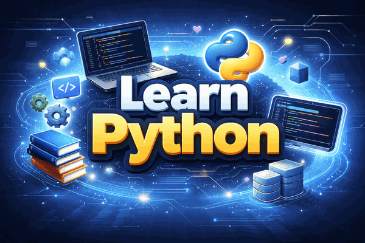

# 🐍 Learn Python — Zero to World-Class Full-Stack Developer

<p align="center">
  
</p>

<p align="center">
  
  
  
  
  
  
  <a href="./LICENSE"></a>
  
</p>
<p align="center">
  <a href="https://github.com/travisjneuman/learn.python/stargazers"></a>
  <a href="https://github.com/travisjneuman/learn.python/network/members"></a>
  <a href="https://github.com/travisjneuman/learn.python/commits/main"></a>
  <a href="https://github.com/travisjneuman/learn.python/issues"></a>
</p>

<p align="center">
  <strong>A complete, hands-on Python curriculum.<br>From "what is a terminal?" to deploying production applications.</strong>
</p>

---

## What Makes This Different

This is not a video course — **you build real things**.

This is not a bootcamp — **you go at your own pace**.

This is not a reference manual — **it is a complete guided path**.

251 projects, not toy examples. Every document, concept guide, project, quiz, and challenge is connected through a single click chain. Start at the beginning and follow the "Next" links. That's it.

---

## 🔨 What You'll Build

| Domain | Examples |
|--------|----------|
| **CLI Tools** | Password checkers, file renamers, batch automation scripts |
| **Web Scrapers** | HTML parsers, pagination handlers, CSV exporters |
| **REST API Clients** | JSON consumers, authenticated API callers, retry-enabled clients |
| **FastAPI Applications** | CRUD endpoints, JWT authentication, Pydantic-validated APIs |
| **Async Systems** | Concurrent task runners, async HTTP fetchers, queue processors |
| **Database Applications** | SQLAlchemy models, Alembic migrations, query optimizers |
| **Data Analysis** | Pandas pipelines, matplotlib visualizations, data cleaners |
| **Django Full-Stack Apps** | Models, views, templates, DRF APIs, full CRUD applications |
| **Dockerized Services** | Multi-stage builds, docker-compose stacks, CI/CD pipelines |
| **Cloud Deployments** | Railway/Render hosting, Postgres-backed production apps |

---

## 🚀 Quick Start

```bash
git clone https://github.com/travisjneuman/learn.python.git
cd learn.python
```

Open [START_HERE.md](./START_HERE.md) and follow the guide. You'll be writing Python in under 10 minutes.

Never used a terminal before? Start with [00_COMPUTER_LITERACY_PRIMER.md](./00_COMPUTER_LITERACY_PRIMER.md) — it explains everything from scratch.

Not sure how to use this curriculum? Read the [Getting Started Guide](./GETTING_STARTED.md). Have questions? Check the [FAQ](./FAQ.md).

Already know JavaScript, Java, C#, or Ruby? Jump to the [Fast Track](./FAST_TRACK.md) to skip what you already know.

---

## 🗺️ Curriculum Roadmap

The curriculum is a straight line from zero experience to production-grade engineering. Every stage builds on the last.

| Stage | Docs | What You Learn | Projects |
|-------|------|----------------|----------|
| **Absolute Beginner** | 00–03 | What is a terminal, how to install Python, first commands | 15 exercises |
| **Foundations** | 04 | Variables, loops, functions, files, errors, collections | 15 projects |
| **Quality & Testing** | 09 | pytest, ruff, black, writing tests that catch real bugs | 15 projects |
| **Intermediate Python** | 05–08 | Excel/CSV automation, SQL basics, data pipelines | 60 projects |
| **Professional Practices** | 10–12 | Packages, logging, refactoring, dependency management | 45 projects |
| **Operations & Integration** | 13–15 | Scheduling, monitoring, ETL, caching, APIs | 45 projects |
| **Elite Track** | Curriculum 16–50 | Architecture, observability, resilience, security, cost modeling | 10 projects |
| **Expansion Modules** | 12 modules | Web scraping through cloud deployment — real libraries, real tools | 56 projects |

**Total: 251 projects across 13 levels and 12 technology modules.**

See the full [Curriculum Map](./CURRICULUM_MAP.md) for a dependency diagram and every project listed at a glance.

---

## 📁 Project Levels

Every level has a theme, a set of projects, and a capstone that ties everything together.

| Level | Theme | Projects | Example Project |
|-------|-------|----------|-----------------|
| **level-00-absolute-beginner** | First steps — no imports, no tests | 15 | `01-first-steps` |
| **level-0** | Terminal, files, basic I/O | 15 | `02-calculator-basics` |
| **level-1** | Input validation, CSV, JSON, paths | 15 | `05-csv-first-reader` |
| **level-2** | Data structures, cleaning, error handling | 15 | `12-csv-to-json-converter` |
| **level-3** | Packages, logging, test-driven development | 15 | `04-test-driven-normalizer` |
| **level-4** | Schema validation, data contracts, pipelines | 15 | `09-transformation-pipeline-v1` |
| **level-5** | Scheduling, monitoring, resilience patterns | 15 | `11-retry-backoff-runner` |
| **level-6** | SQL, staging, ETL, idempotent operations | 15 | `09-incremental-load-simulator` |
| **level-7** | API adapters, caching, polling, observability | 15 | `08-ingestion-observability-kit` |
| **level-8** | Dashboards, concurrency, fault injection | 15 | `08-fault-injection-harness` |
| **level-9** | Architecture, SLOs, capacity planning, security | 15 | `06-reliability-scorecard` |
| **level-10** | Enterprise blueprints, compliance, production readiness | 15 | `11-production-readiness-director` |
| **elite-track** | Algorithms, distributed systems, staff-engineer capstone | 10 | `06-event-driven-architecture-lab` |

---

## 🧩 Expansion Modules

Twelve self-contained technology modules. Each one teaches a real Python library or framework through 3–5 progressive projects.

| # | Module | Projects | Prerequisite | What You Learn |
|---|--------|----------|--------------|----------------|
| 01 | [Web Scraping](./projects/modules/01-web-scraping/) | 5 | Level 2 | requests, BeautifulSoup, CSS selectors, pagination, CSV export |
| 02 | [CLI Tools](./projects/modules/02-cli-tools/) | 5 | Level 2 | click, typer, subcommands, interactive prompts, progress bars |
| 03 | [REST APIs](./projects/modules/03-rest-apis/) | 5 | Level 2 | requests, JSON parsing, authentication, retries, API client design |
| 04 | [FastAPI Web Apps](./projects/modules/04-fastapi-web/) | 5 | Level 3 + Module 03 | FastAPI, Pydantic, uvicorn, CRUD endpoints, JWT auth |
| 05 | [Async Python](./projects/modules/05-async-python/) | 5 | Level 3 | async/await, asyncio, aiohttp, queues, concurrent tasks |
| 06 | [Databases & ORM](./projects/modules/06-databases-orm/) | 5 | Level 3 | sqlite3, SQLAlchemy, Alembic migrations, query optimization |
| 07 | [Data Analysis](./projects/modules/07-data-analysis/) | 5 | Level 2 | pandas, matplotlib, data cleaning, grouping, visualization |
| 08 | [Advanced Testing](./projects/modules/08-testing-advanced/) | 5 | Level 3 | parametrize, mocking, fixtures, hypothesis, integration tests |
| 09 | [Docker & Deployment](./projects/modules/09-docker-deployment/) | 5 | Level 5 | Dockerfile, multi-stage builds, docker-compose, GitHub Actions |
| 10 | [Django Full-Stack](./projects/modules/10-django-fullstack/) | 5 | Module 04 + Module 06 | Django models, views, templates, DRF, full CRUD app |
| 11 | [Package Publishing](./projects/modules/11-package-publishing/) | 3 | Level 3 | pyproject.toml, src layout, build, TestPyPI |
| 12 | [Cloud Deployment](./projects/modules/12-cloud-deploy/) | 3 | Module 04 + Module 09 | Railway/Render, Postgres, production checklist |

**Suggested order:** Modules 01–03 and 07 after Level 2. Modules 04–06, 08, 11 after Level 3. Modules 09–10, 12 after Level 5.

---

## 📖 Concept Guides

34 reference documents that explain core ideas in plain language. Most have matching quizzes.

**Beginner**
- [What Is a Variable](./concepts/what-is-a-variable.md) — names, values, types, reassignment
- [How Loops Work](./concepts/how-loops-work.md) — for, while, break, continue
- [Functions Explained](./concepts/functions-explained.md) — parameters, return values, scope
- [Collections Explained](./concepts/collections-explained.md) — lists, dicts, sets, tuples
- [Types and Conversions](./concepts/types-and-conversions.md) — int, str, float, bool, casting
- [Files and Paths](./concepts/files-and-paths.md) — reading, writing, pathlib
- [Errors and Debugging](./concepts/errors-and-debugging.md) — try/except, tracebacks, common mistakes
- [Reading Error Messages](./concepts/reading-error-messages.md) — traceback anatomy, common errors decoded
- [Git Basics](./concepts/git-basics.md) — commits, branches, remotes, workflow
- [Reading Documentation](./concepts/reading-documentation.md) — navigating docs, API references, help()

**Intermediate**
- [How Imports Work](./concepts/how-imports-work.md) — modules, packages, the import system
- [The Terminal Deeper](./concepts/the-terminal-deeper.md) — shell, PATH, environment variables
- [Classes and Objects](./concepts/classes-and-objects.md) — OOP fundamentals, methods, inheritance
- [Decorators Explained](./concepts/decorators-explained.md) — closures, @syntax, practical patterns
- [Virtual Environments](./concepts/virtual-environments.md) — venv, pip, dependency isolation
- [Comprehensions Explained](./concepts/comprehensions-explained.md) — list, dict, set, generator comprehensions
- [Args and Kwargs Explained](./concepts/args-kwargs-explained.md) — *args, **kwargs, unpacking
- [Context Managers Explained](./concepts/context-managers-explained.md) — with statement, __enter__/__exit__
- [Enums Explained](./concepts/enums-explained.md) — Enum, IntEnum, Flag, practical usage
- [Regex Explained](./concepts/regex-explained.md) — patterns, groups, re module
- [Type Hints Explained](./concepts/type-hints-explained.md) — annotations, mypy, generics
- [Dataclasses Explained](./concepts/dataclasses-explained.md) — @dataclass, fields, post_init
- [Match/Case Explained](./concepts/match-case-explained.md) — structural pattern matching (3.10+)
- [Testing Strategies](./concepts/testing-strategies.md) — unit, integration, fixtures, mocking
- [Debugging Methodology](./concepts/debugging-methodology.md) — systematic approaches, tools, techniques
- [Jupyter Notebooks](./concepts/jupyter-notebooks.md) — cells, kernels, interactive workflows
- [Modern Python Tooling](./concepts/modern-python-tooling.md) — ruff, uv, pyproject.toml, modern ecosystem

**Advanced**
- [HTTP Explained](./concepts/http-explained.md) — requests, responses, status codes, headers
- [API Basics](./concepts/api-basics.md) — REST, JSON, authentication, rate limiting
- [Async Explained](./concepts/async-explained.md) — event loops, async/await, concurrency vs parallelism
- [Generators and Iterators](./concepts/generators-and-iterators.md) — yield, lazy evaluation, iterator protocol
- [Collections Deep Dive](./concepts/collections-deep-dive.md) — defaultdict, Counter, deque, namedtuple
- [Functools and Itertools](./concepts/functools-and-itertools.md) — lru_cache, partial, chain, groupby
- [Security Basics](./concepts/security-basics.md) — input validation, secrets, common vulnerabilities

See the [Concepts README](./concepts/README.md) for the full index.

---

## 🎯 Practice Tools

Build fluency between projects with targeted practice.

### Quizzes (34)
One quiz per concept guide. Run them from the terminal:
```bash
python concepts/quizzes/what-is-a-variable-quiz.py
```

### Flashcards (16 decks)
Spaced repetition cards using a Leitner box system. Cards you get right appear less often. Cards you miss come back immediately. Decks cover all 13 levels plus 4 expansion modules.
```bash
python practice/flashcards/review-runner.py
```

### Coding Challenges (30)
Short, focused exercises — 10 to 30 minutes each. 15 beginner challenges (swap variables, FizzBuzz, palindromes) and 15 intermediate challenges (decorators, generators, async fetchers).
```bash
python practice/challenges/beginner/01-swap-variables.py
```

### Diagnostic Assessments
Gauge your current skill level and identify gaps before starting a new level.

### Auto-Grader
Automated feedback on project submissions — checks structure, tests, and code quality.

### Progress Dashboard
Track completed projects, quiz scores, and flashcard retention across the entire curriculum.

---

## 🧭 How to Navigate

Every document in this curriculum has a **Next** link at the bottom. Start at this README, click Next, and follow the chain.

```
README → START_HERE → 00_COMPUTER_LITERACY_PRIMER → 01_ROADMAP → 02_GLOSSARY
  → 03_SETUP → 04_FOUNDATIONS → ... → projects → concepts → practice
```

You never have to figure out what comes next. Just follow the link.

Within each project directory, you'll find:
- `README.md` — what to build and why
- `project.py` (or `exercise.py`) — starter file
- `tests/` — tests to validate your solution (Level 0+)
- `notes.md` — space for your own observations

---

## 🎮 Choose Your Learning Mode

**Play-First** — Open a project, tinker, break things, figure it out. Read the concept doc when you get stuck. Good for people who learn by doing.

**Structured** — Read the concept doc, take the quiz, then do the projects in order. Use the checklist and mastery gates. Good for people who like clear progress markers.

**Hybrid (Recommended)** — Follow the structured path on weekdays. Explore expansion modules and challenges on weekends. Review flashcards daily.

---

## 💻 Cross-Platform Support

This curriculum works on **Windows**, **macOS**, and **Linux**. The setup guide ([03_SETUP_ALL_PLATFORMS.md](./03_SETUP_ALL_PLATFORMS.md)) covers all three with step-by-step instructions.

Requirements:
- Python 3.11+
- A terminal (any)
- A text editor (VS Code recommended)

---

## Path Placeholder Rule

Throughout this curriculum, file paths use the `<repo-root>` placeholder to represent the root directory of this repository — wherever you cloned it on your machine. Replace `<repo-root>` with your actual path.

Example: if you cloned to `~/projects/learn.python`, then `<repo-root>/projects/level-0` means `~/projects/learn.python/projects/level-0`.

---

## 🏁 Deliverable Milestones

These gates mark real, demonstrable competence. Each one produces something you can show.

| Gate | Milestone | What It Proves |
|------|-----------|----------------|
| **A** | Setup complete + first script + first passing test | You can write and run Python |
| **B** | File/Excel automation handles malformed input gracefully | You can build resilient data tools |
| **C** | SQL ETL pipeline is idempotent and recoverable | You understand data integrity |
| **D** | External API data ingested into local database cache | You can integrate external systems |
| **E** | Browser dashboard renders data for non-technical users | You can build for real users |

---

## ✅ Repo Validation

Run these commands to verify the repository structure is intact:

```bash
# Validate curriculum structure
python scripts/validate_curriculum.py

# Run project tests (example: level-0, project 01)
cd projects/level-0/01-terminal-hello-lab
python -m pytest tests/

# Check code quality
ruff check .
```

---

## 📚 Resources & Sources

### Official Documentation
- [Python Official Docs](https://docs.python.org/3/)
- [Python Tutorial](https://docs.python.org/3/tutorial/)
- [VS Code Python Extension](https://marketplace.visualstudio.com/items?itemName=ms-python.python)

### Quality Tooling
- [pytest](https://docs.pytest.org/) — testing framework
- [Ruff](https://docs.astral.sh/ruff/) — fast Python linter
- [Black](https://black.readthedocs.io/) — code formatter
- [mypy](https://mypy.readthedocs.io/) — static type checker

### Data & Automation
- [openpyxl](https://openpyxl.readthedocs.io/) — Excel file handling
- [pandas](https://pandas.pydata.org/docs/) — data analysis
- [SQLAlchemy](https://docs.sqlalchemy.org/) — database ORM
- [FastAPI](https://fastapi.tiangolo.com/) — modern web framework
- [Django](https://docs.djangoproject.com/) — full-stack web framework

### Free Practice & Learning
- [Automate the Boring Stuff with Python](https://automatetheboringstuff.com/) — free online book
- [Exercism Python Track](https://exercism.org/tracks/python) — mentored exercises
- [Python Morsels](https://www.pythonmorsels.com/) — weekly exercises
- [Real Python](https://realpython.com/) — tutorials and guides

---

## 🤝 Contributing

Contributions are welcome. If you find a typo, a broken link, a test that could be better, or want to add a project — open an issue or submit a pull request.

Please read [CONTRIBUTING.md](./CONTRIBUTING.md) for guidelines and [CODE_OF_CONDUCT.md](./CODE_OF_CONDUCT.md) for community standards.

---

## 📋 Additional Resources

| Document | Description |
|----------|-------------|
| [Getting Started Guide](./GETTING_STARTED.md) | How to use this curriculum, time estimates, pacing suggestions |
| [FAQ](./FAQ.md) | Common questions from new learners |
| [Curriculum Map](./CURRICULUM_MAP.md) | Visual dependency diagram and projects-at-a-glance table |
| [Fast Track](./FAST_TRACK.md) | Accelerated path for developers who already know another language |
| [30-Day Python Challenge](./30_DAY_PYTHON_CHALLENGE.md) | Curated 30-day subset of the curriculum with daily goals |
| [Review Schedule](./REVIEW_SCHEDULE.md) | Spaced repetition review calendar with checkpoints per level |
| [Career Readiness](./CAREER_READINESS.md) | Map curriculum levels to job roles, interview prep by stage |
| [Portfolio Guide](./PORTFOLIO_GUIDE.md) | How to present your projects to employers |
| [Teaching Guide](./TEACHING_GUIDE.md) | Classroom adaptation: semester mappings, rubrics, GitHub Classroom |
| [Workshop Kit](./WORKSHOP_KIT.md) | Run a 2-hour Python workshop at meetups and user groups |
| [Accessibility](./ACCESSIBILITY.md) | Screen reader guidance, cognitive accessibility, accommodations |
| [Creator Kit](./CREATOR_KIT.md) | Guide for YouTubers and bloggers creating companion content |
| [Certification Protocol](./curriculum/50_CERTIFICATION_GRADE_COMPLETION_PROTOCOL.md) | Formal completion standard with scoring rubrics and defense format |
| [Validation](./VALIDATION.md) | What the CI checks do and how to run them locally |
| [Tools Guide](./tools/README.md) | Documentation for all curriculum tools (grader, diagnostics, progress tracker) |
| [Changelog](./CHANGELOG.md) | Version history and release notes |
| [Contributing](./CONTRIBUTING.md) | How to contribute to this project |
| [Code of Conduct](./CODE_OF_CONDUCT.md) | Community standards |
| [Translations](./translations/README.md) | Community translations (Spanish, Portuguese in progress) |
| [License](./LICENSE) | MIT License |

## Next

[Next: START_HERE.md →](./START_HERE.md)
