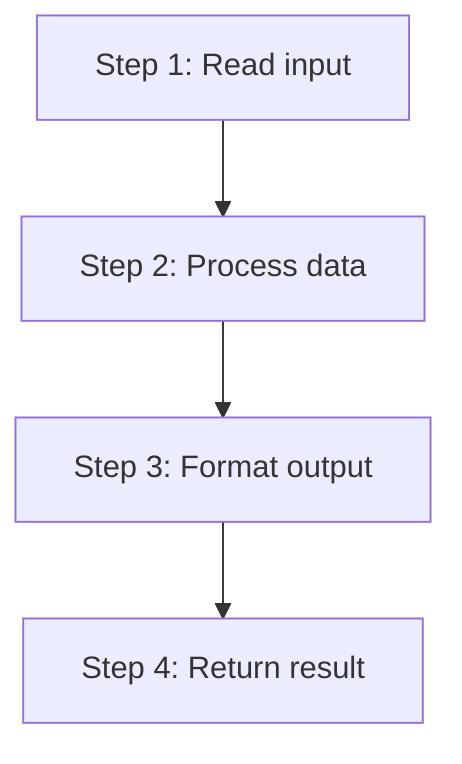

# Walkthrough: [PROJECT_TITLE]

> This guide walks through the **thinking process** for building this project.
> It does NOT give you the complete solution. For that, see [SOLUTION.md](./SOLUTION.md).

## Before reading this

**Try the project yourself first.** Spend at least 20 minutes.

This walkthrough is for AFTER you have attempted the project. If you have not tried yet, close this file and open the [project README](./README.md).

---

## Understanding the problem

[Restate the problem in plain language. What inputs do we have? What output do we need? What constraints exist?]

## Planning before code

Before writing a single line of Python, think about the steps:

1. [First logical step]
2. [Second logical step]
3. [Third logical step]



## Step 1: [First subproblem]

[Explain what this step accomplishes and why it comes first.]

```python
# Just this one piece — not the whole solution
def first_piece():
    ...
```

### Predict before you scroll

What do you think the next step needs to handle? Think about it before reading on.

## Step 2: [Second subproblem]

[Continue building incrementally. Show the thinking, not just the code.]

```python
# Building on step 1
```

## Step 3: Connecting the pieces

[How steps 1 and 2 fit together. Show the structure, not the full implementation.]

## Common mistakes

| Mistake | Why it happens | How to fix |
|---------|---------------|------------|
| [Mistake 1] | [Reason] | [Fix] |
| [Mistake 2] | [Reason] | [Fix] |
| [Mistake 3] | [Reason] | [Fix] |

## Testing your solution

Run the tests to check your work:

```bash
cd <repo-root>/projects/[LEVEL]/[PROJECT]
pytest -q
```

What each test verifies:
- [Test 1]: [What it checks]
- [Test 2]: [What it checks]

## What to explore next

Now that you have a working solution, try these extensions:

1. [Extension idea 1 — builds on what you just learned]
2. [Extension idea 2 — introduces a new concept]
