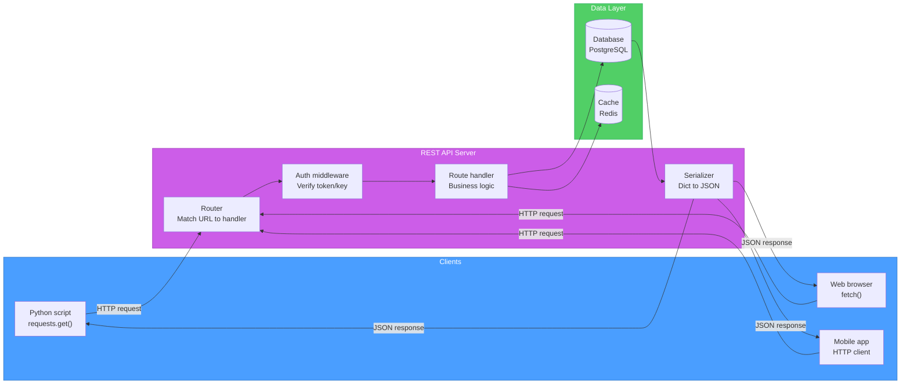
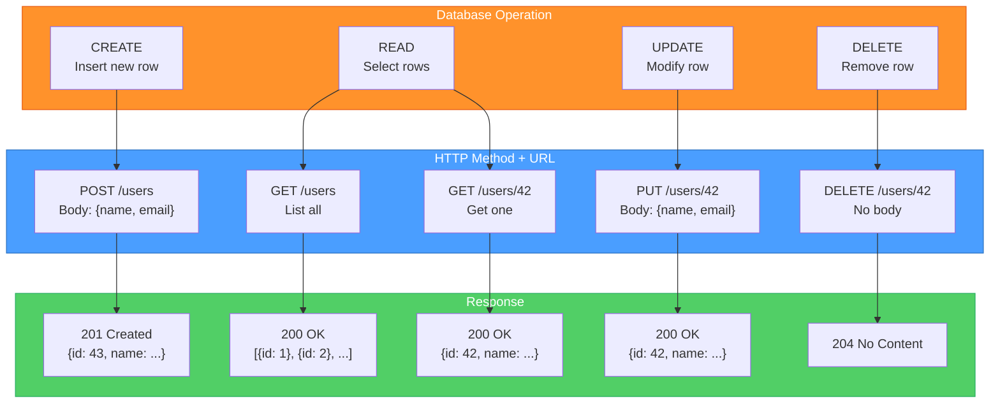
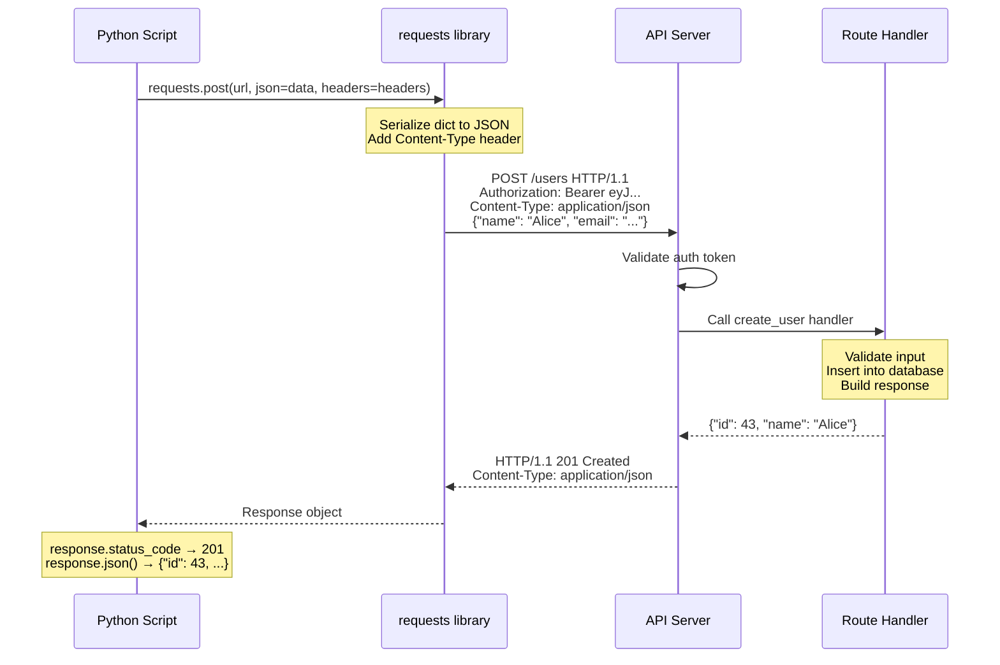
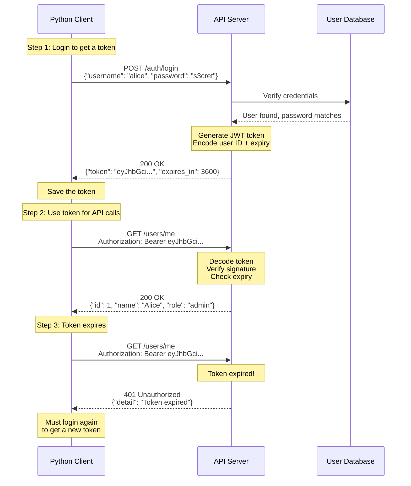

# Diagrams: API Basics

[Back to concept](../api-basics.md)

---

## REST API Architecture

A REST API sits between the client and the database. It receives HTTP requests, processes them, and returns JSON responses.

## CRUD to HTTP Method Mapping

REST maps the four database operations (Create, Read, Update, Delete) to HTTP methods and URL patterns.

## API Request/Response Flow

Step-by-step sequence of a typical API call from Python using the `requests` library.

## Authentication Token Flow

How bearer token authentication works: login once, then include the token with every request.

