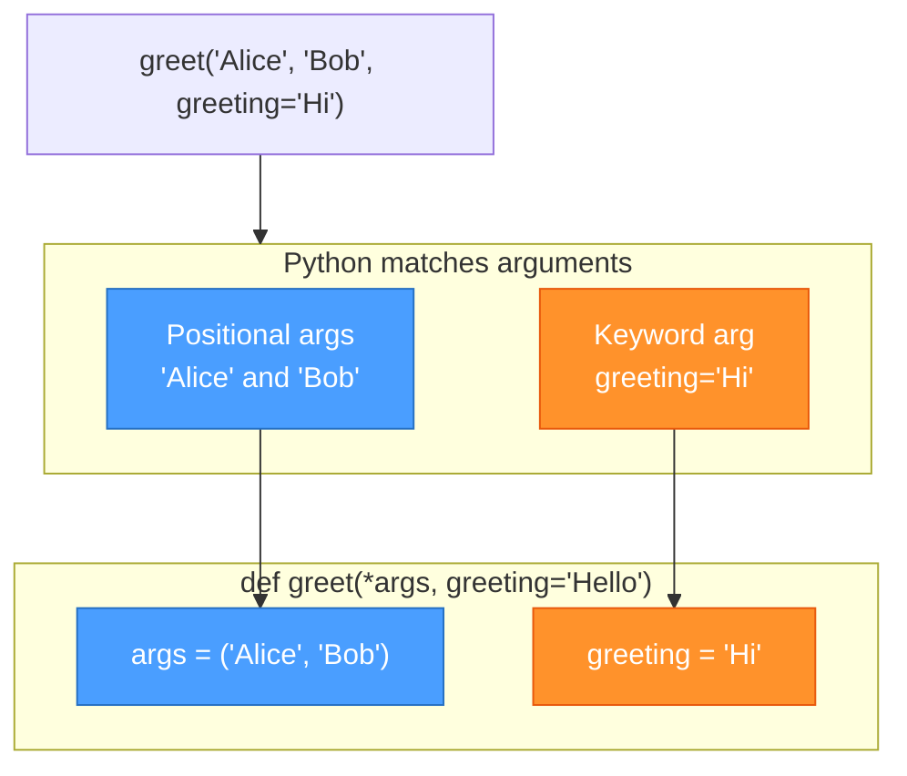
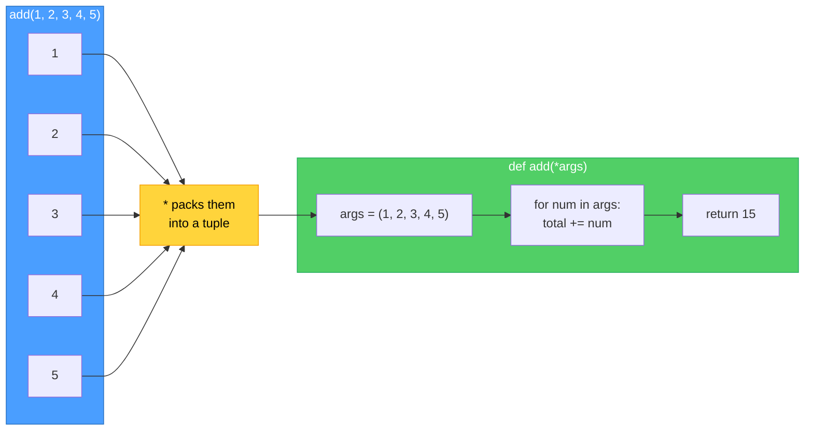
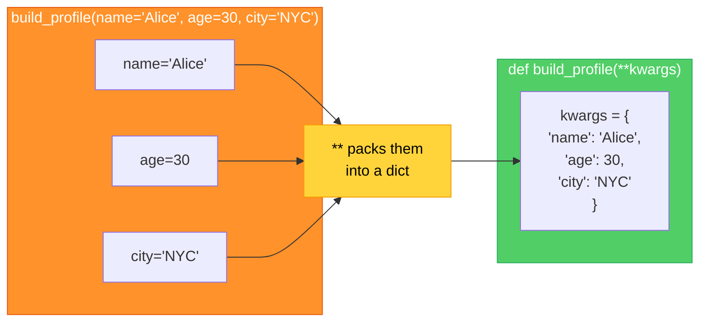
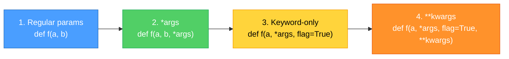

# Diagrams: *args and **kwargs Explained

[Back to concept](../args-kwargs-explained.md)

---

## Argument Passing Flow

Python matches arguments to parameters by position first, then by name.

## *args: Collecting Extra Positional Arguments

`*args` gathers any number of positional arguments into a tuple.

## **kwargs: Collecting Extra Keyword Arguments

`**kwargs` gathers any number of keyword arguments into a dictionary.

## Parameter Order Rule

When combining all parameter types, they must appear in this exact order.

