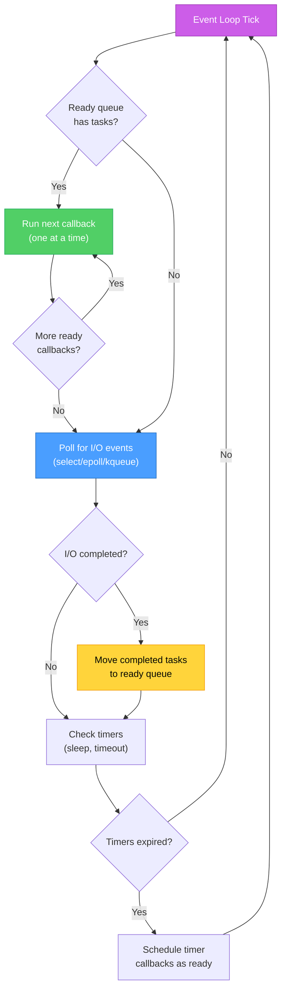
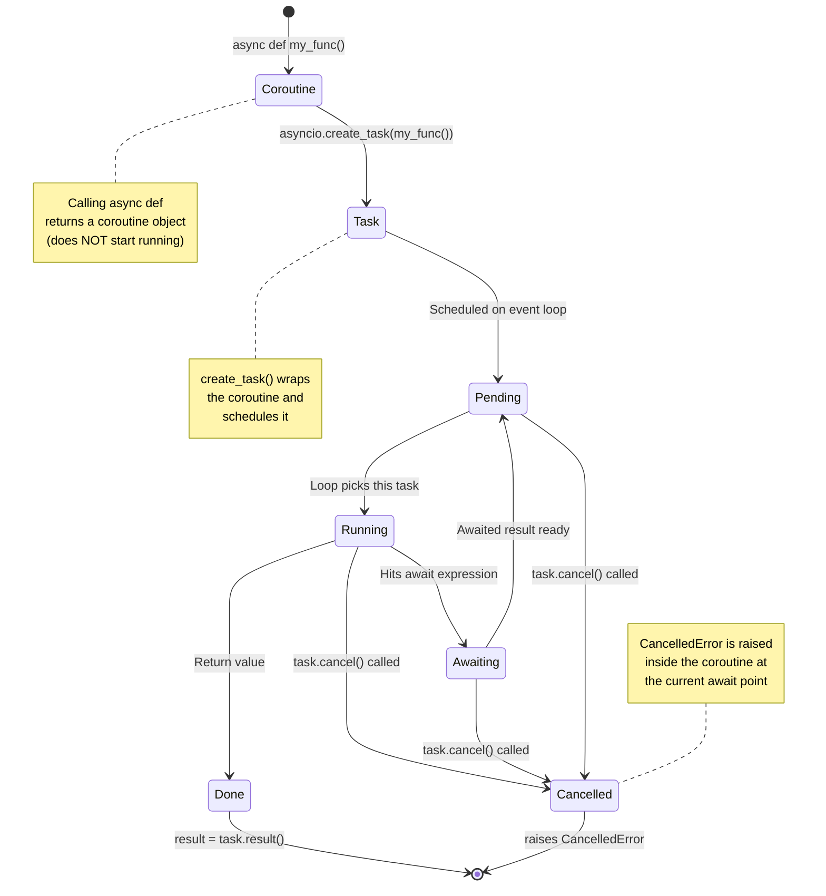
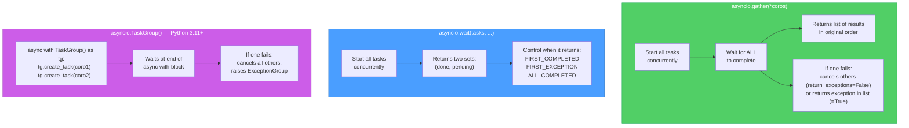

# Async Event Loop Deep Dive — Diagrams

[<- Back to Diagram Index](../../guides/DIAGRAM_INDEX.md)

## Overview

These diagrams go deeper into how Python's asyncio event loop schedules coroutines, manages task lifecycles, and coordinates concurrent operations with `gather()` and `wait()`.

## Event Loop Internals

The event loop maintains queues of ready and waiting tasks. Each iteration ("tick") of the loop runs all ready callbacks, checks for completed I/O, and moves newly-ready tasks into the run queue.



**Key points:**
- The loop runs one callback at a time (single-threaded concurrency, not parallelism)
- I/O polling is where the loop waits for network responses, file reads, etc.
- Timers handle `asyncio.sleep()` and timeout deadlines
- A "tick" is one full cycle: run ready tasks, poll I/O, check timers, repeat

## Task Lifecycle States

A coroutine goes through several states from creation to completion. Understanding these states helps you debug hanging tasks and cancellation behavior.



**Key points:**
- Calling an `async def` function returns a coroutine object but does NOT start executing it
- `create_task()` wraps the coroutine in a Task and schedules it on the loop
- Cancellation raises `CancelledError` at the coroutine's current `await` point
- A task is "done" when it returns, raises an exception, or is cancelled

## gather() vs wait() vs TaskGroup

Three ways to run multiple coroutines concurrently. Each has different error handling and completion semantics.



**Key points:**
- `gather()` is simplest: run tasks, get results in order. Best for "do all of these and give me all results"
- `wait()` gives you fine-grained control: react to the first completion or first failure
- `TaskGroup` (Python 3.11+) is the modern approach with structured concurrency and clean cancellation
- `gather(return_exceptions=True)` collects exceptions as values instead of propagating them

## Sequence: Timeout and Cancellation

What happens when a task exceeds a deadline. This shows the mechanics of `asyncio.wait_for()` and how cancellation propagates.

```mermaid
sequenceDiagram
    participant Main as Main Coroutine
    participant Loop as Event Loop
    participant Task as Slow Task
    participant Timer as Timeout Timer

    Main->>Loop: asyncio.wait_for(slow_task(), timeout=2.0)
    Loop->>Task: Start slow_task()
    Loop->>Timer: Set timer for 2.0 seconds

    Note over Task: Working...<br/>await aiohttp.get(slow_url)
    Note over Loop: Loop continues<br/>running other tasks

    Timer-->>Loop: 2.0 seconds elapsed!
    Loop->>Task: task.cancel()
    Note over Task: CancelledError raised<br/>at current await

    alt Task has try/finally
        Note over Task: finally: cleanup()
        Task-->>Loop: Cleanup complete
    else No cleanup
        Task-->>Loop: CancelledError propagates
    end

    Loop-->>Main: raises asyncio.TimeoutError
    Note over Main: Handle timeout gracefully
```

**Key points:**
- `wait_for()` wraps a coroutine with a deadline and cancels it if the deadline passes
- Cancellation gives the task a chance to clean up in `try/finally` blocks
- The caller receives `TimeoutError`, not `CancelledError`
- Always use timeouts for network operations to prevent tasks from hanging forever

---

| [Back to Diagram Index](../../guides/DIAGRAM_INDEX.md) |
|:---:|
