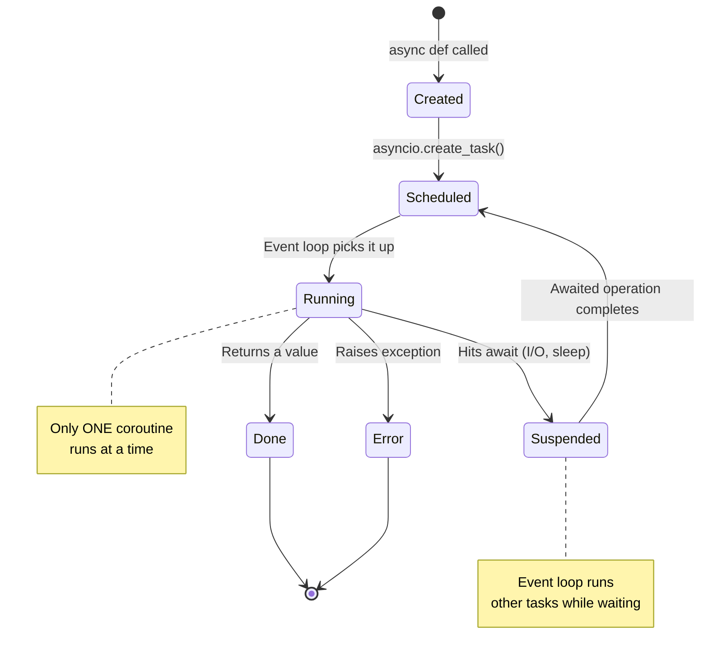
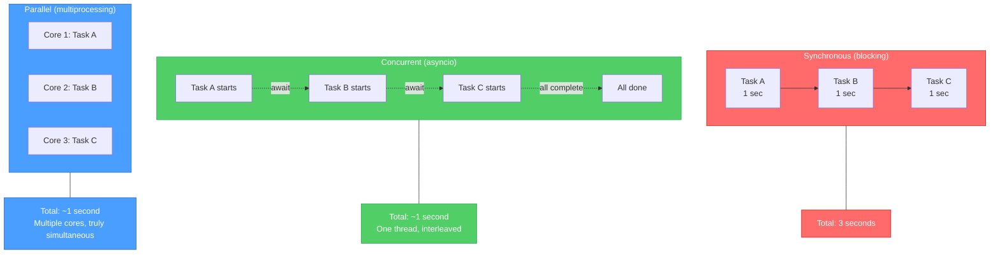
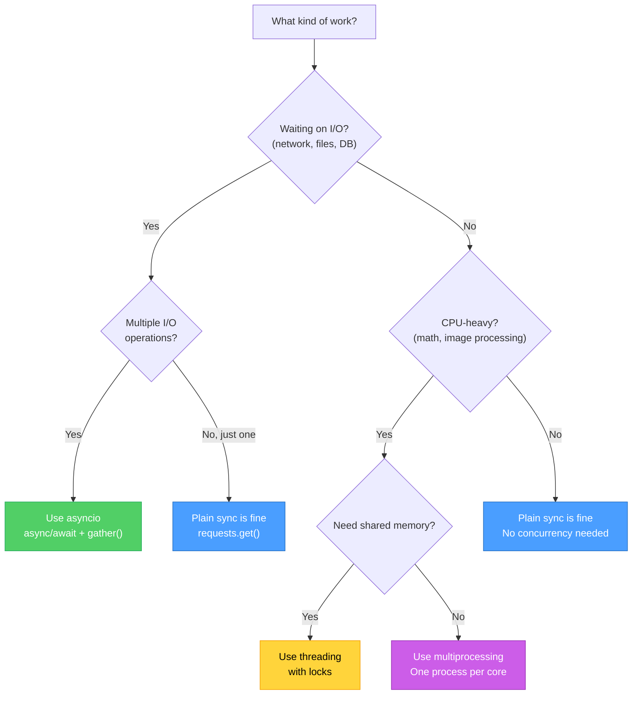

# Diagrams: Async Explained

[Back to concept](../async-explained.md)

---

## Event Loop State Machine

The event loop is the engine that runs async code. It cycles through coroutines, running whichever one is ready and pausing those that are waiting.



## Async/Await Execution Flow

This shows how three concurrent tasks share a single thread. The event loop switches between them whenever one hits an `await`.

```mermaid
sequenceDiagram
    participant Loop as Event Loop
    participant A as Task A (fetch user)
    participant B as Task B (fetch posts)
    participant C as Task C (fetch comments)

    Note over Loop: asyncio.gather(A, B, C)

    Loop->>A: Start Task A
    Note over A: Send HTTP request
    A-->>Loop: await response (I/O wait)

    Loop->>B: Start Task B
    Note over B: Send HTTP request
    B-->>Loop: await response (I/O wait)

    Loop->>C: Start Task C
    Note over C: Send HTTP request
    C-->>Loop: await response (I/O wait)

    Note over Loop: All 3 requests in flight<br/>Loop waits for first completion

    Note over B: Response arrives first!
    Loop->>B: Resume Task B
    Note over B: Parse JSON, return data
    B-->>Loop: Task B done

    Note over A: Response arrives
    Loop->>A: Resume Task A
    Note over A: Parse JSON, return data
    A-->>Loop: Task A done

    Note over C: Response arrives
    Loop->>C: Resume Task C
    Note over C: Parse JSON, return data
    C-->>Loop: Task C done

    Note over Loop: All tasks complete<br/>Total time ≈ slowest task
```

## Concurrent vs Parallel Execution

Concurrent means tasks take turns on one thread. Parallel means tasks literally run at the same time on multiple cores.



## When to Use Which Approach

A decision tree for choosing between sync, async, and multiprocessing.


