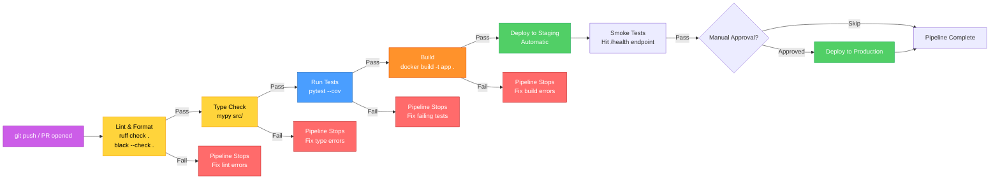
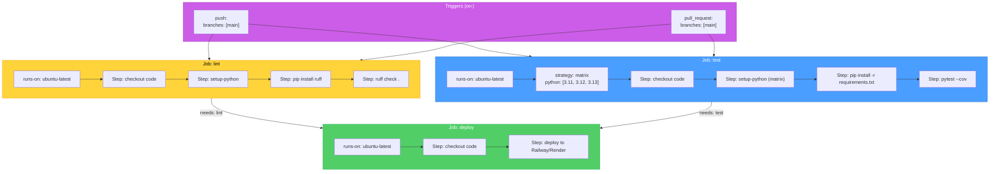
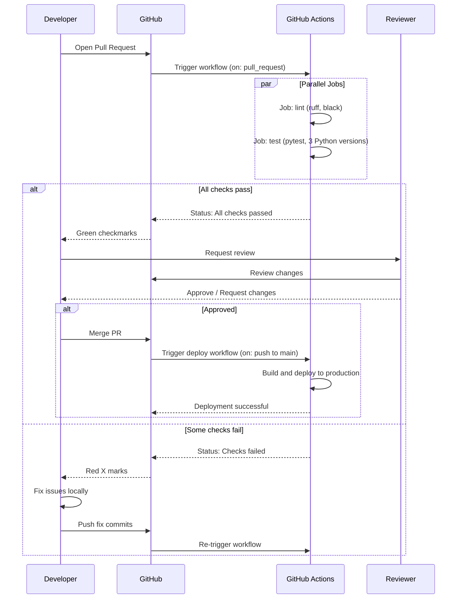

# CI/CD Pipeline — Diagrams

[<- Back to Diagram Index](../../guides/DIAGRAM_INDEX.md)

## Overview

These diagrams show how continuous integration and continuous deployment pipelines automate code quality checks, testing, and deployment using GitHub Actions as the primary example.

## Full CI/CD Pipeline Flow

A CI/CD pipeline runs automatically on every push or pull request. Each stage acts as a gate: if one fails, later stages do not run, preventing broken code from reaching production.

**Key points:**
- Fast checks (lint, format) run first so you get quick feedback on simple mistakes
- Each stage is a gate: failures stop the pipeline early, saving compute time
- Staging deployment happens automatically; production may require manual approval
- Smoke tests verify the deployed app actually starts and responds

## GitHub Actions Workflow Structure

A GitHub Actions workflow is a YAML file in `.github/workflows/`. It defines triggers, jobs, and steps. Jobs run in parallel by default; use `needs` to create dependencies.

**Key points:**
- Jobs run in parallel by default: `lint` and `test` start at the same time
- `needs:` creates dependencies: `deploy` waits for both `lint` and `test` to pass
- Matrix strategy runs the same steps across multiple Python versions simultaneously
- Each job gets a fresh virtual machine: no state leaks between jobs

## Sequence: Pull Request Lifecycle

The full lifecycle from opening a PR to merging, showing how CI checks integrate with code review.

**Key points:**
- CI runs automatically when a PR is opened and on every subsequent push to the PR branch
- Merge is blocked until all required checks pass (configurable in branch protection rules)
- Deploying on merge to `main` means every merged PR goes to production automatically
- Failed checks give immediate feedback: fix and push again to re-trigger

---

| [Back to Diagram Index](../../guides/DIAGRAM_INDEX.md) |
|:---:|
