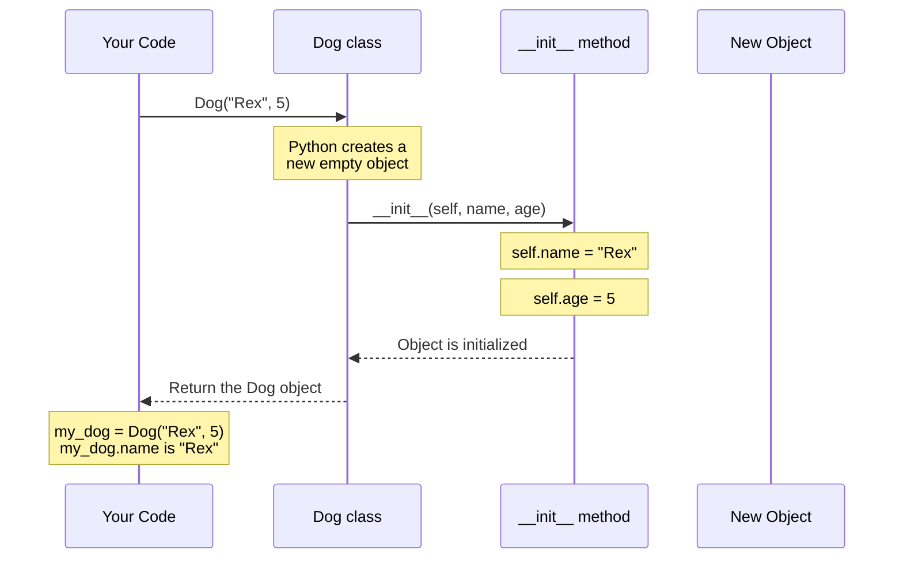
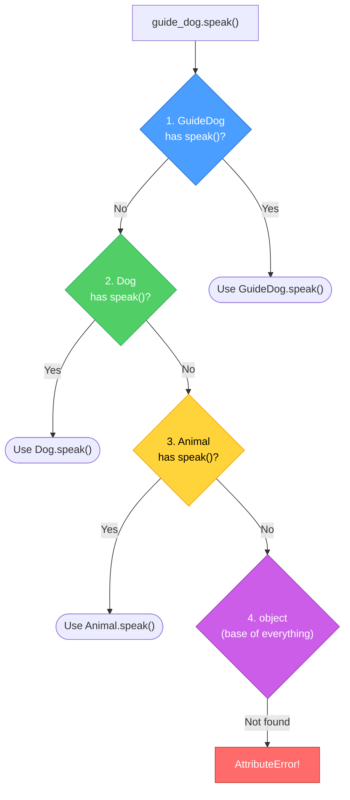
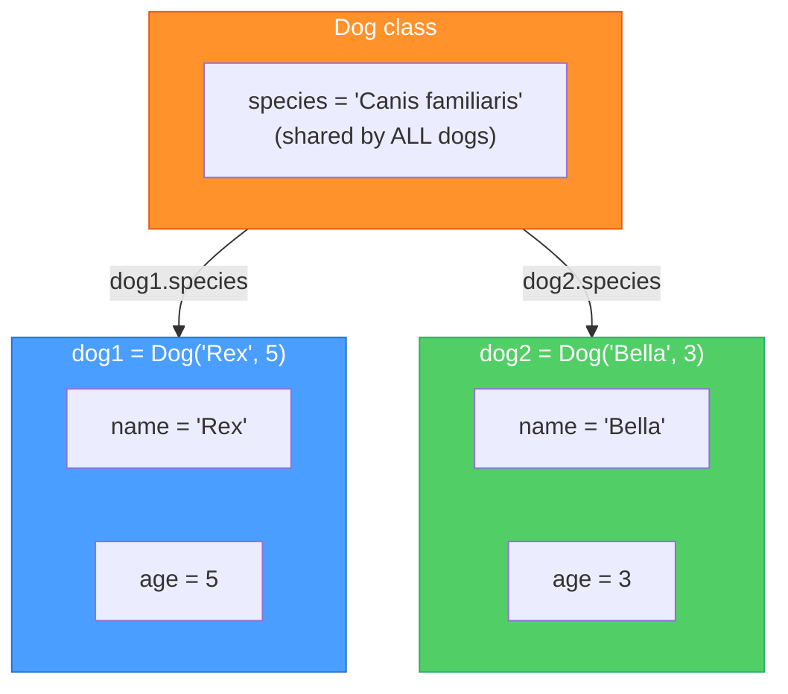

# Diagrams: Classes and Objects

[Back to concept](../classes-and-objects.md)

---

## Class Instantiation Sequence

When you create an object from a class, Python performs several steps behind the scenes.

## Inheritance Hierarchy

Child classes inherit attributes and methods from parent classes, and can add or override them.

```mermaid
classDiagram
    class Animal {
        +name: str
        +sound: str
        +speak() str
        +eat() str
    }

    class Dog {
        +breed: str
        +speak() str
        +fetch() str
    }

    class Cat {
        +indoor: bool
        +speak() str
        +purr() str
    }

    class GuideDog {
        +handler: str
        +guide() str
    }

    Animal <|-- Dog : inherits
    Animal <|-- Cat : inherits
    Dog <|-- GuideDog : inherits

    note for Dog "Overrides speak()&#10;Adds fetch()"
    note for GuideDog "Inherits from Dog&#10;AND from Animal"
```

## Method Resolution Order (MRO)

With multiple inheritance, Python searches for methods in a specific order called the MRO.

## Class vs Instance Attributes

Class attributes are shared by all objects. Instance attributes belong to one object.

