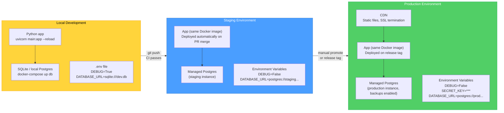
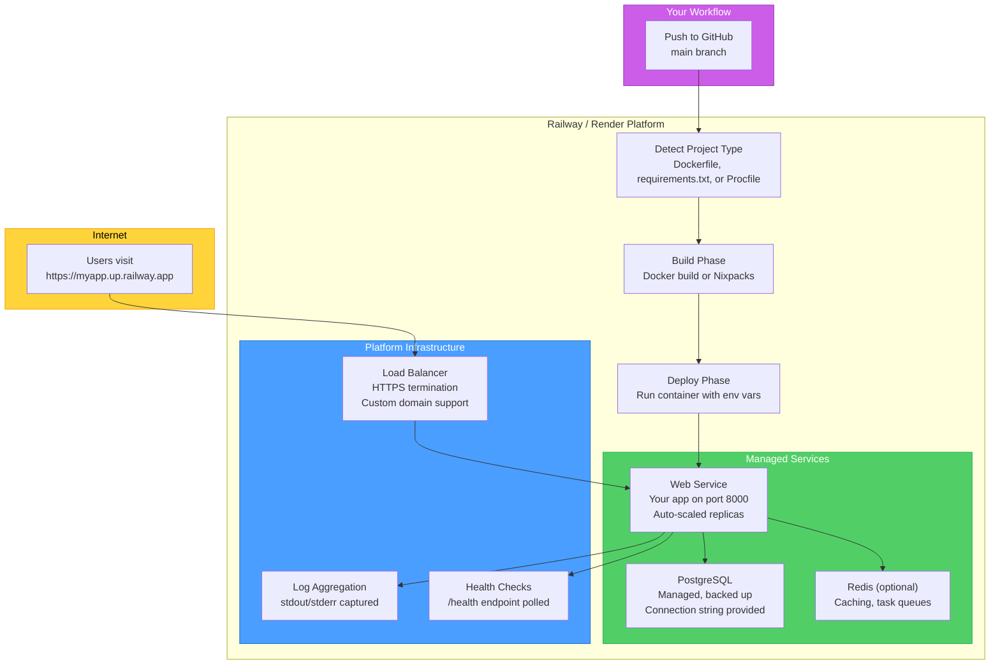
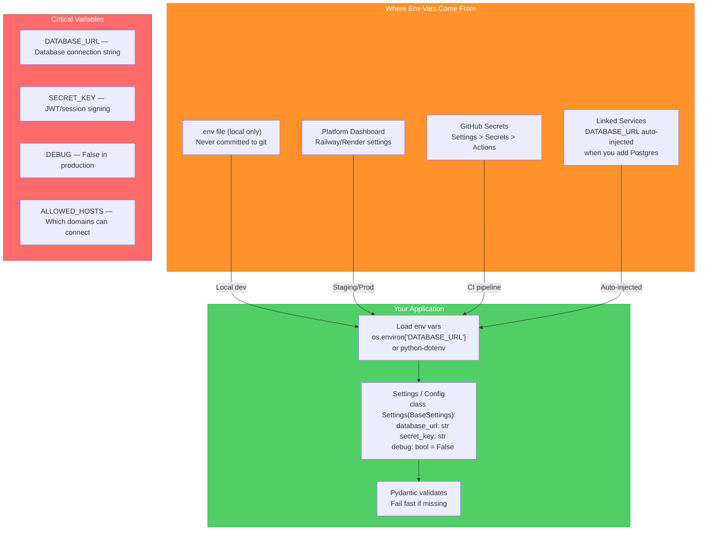

# Cloud Deployment Topology — Diagrams

[<- Back to Diagram Index](../../guides/DIAGRAM_INDEX.md)

## Overview

These diagrams show how a Python application moves from local development through staging to production, the architecture of popular deployment platforms (Railway, Render, Fly.io), and how environment variables, databases, and networking fit together in the cloud.

## Local to Staging to Production

Each environment serves a different purpose. Local is for writing code, staging is for testing in a production-like setting, and production serves real users.

**Key points:**
- The same Docker image runs in all environments; only environment variables change
- Never hardcode secrets: use environment variables set in the platform dashboard
- Staging should mirror production as closely as possible (same database engine, same OS)
- Production databases should have automated backups enabled

## Platform Architecture: Railway / Render

PaaS platforms like Railway and Render handle infrastructure so you can focus on your code. They detect your app type, build it, and run it behind a load balancer with a managed database alongside.

**Key points:**
- Push to GitHub triggers automatic build and deploy (no manual server management)
- The platform provides the `DATABASE_URL` environment variable automatically when you add a database
- HTTPS is handled by the platform's load balancer (you do not configure SSL certificates)
- Health check endpoints (`/health`) let the platform restart crashed instances automatically

## Environment Variable Flow

Environment variables are the standard way to configure applications across environments. They keep secrets out of your code and make the same image work everywhere.

**Key points:**
- `.env` files are for local development only: add `.env` to `.gitignore` immediately
- Use Pydantic `BaseSettings` to load and validate environment variables with type safety
- Platform-linked services (Postgres, Redis) inject their connection strings automatically
- Fail fast on startup if required variables are missing: do not let the app run in a broken state

---

| [Back to Diagram Index](../../guides/DIAGRAM_INDEX.md) |
|:---:|
