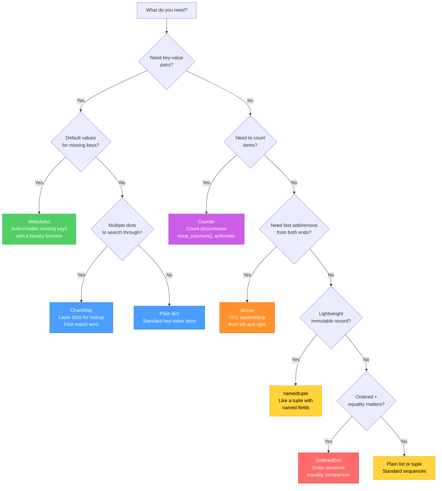
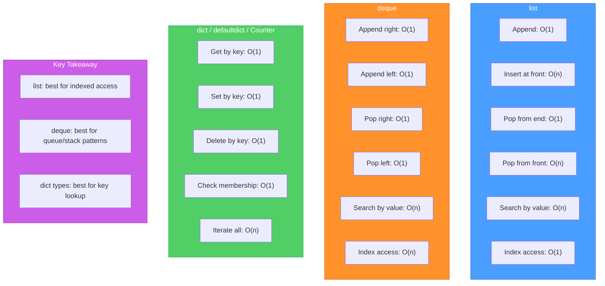
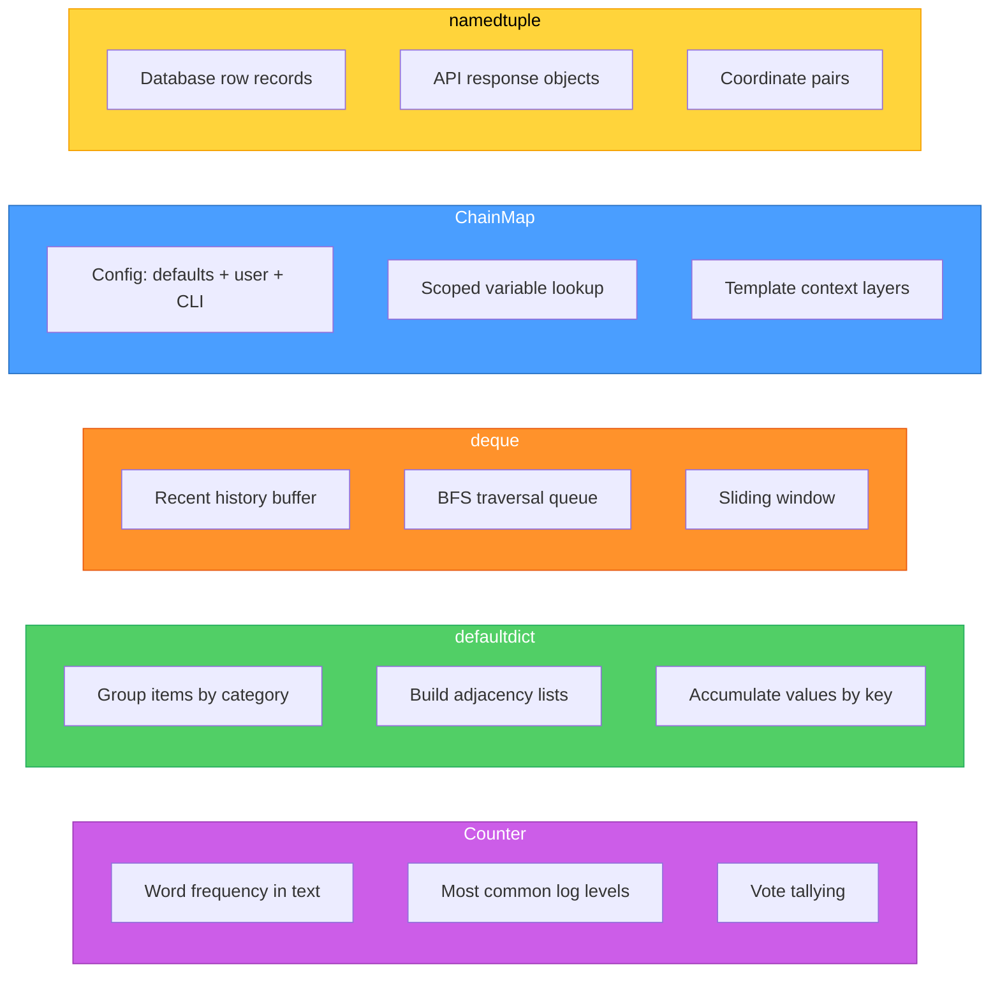

# Diagrams: Collections Deep Dive

[Back to concept](../collections-deep-dive.md)

---

## Collection Type Decision Tree

Use this flowchart to pick the right collection type for your use case.

## Performance Comparison

Big-O time complexity for common operations across collection types.

## When to Use Each Collection

A comparison showing the strengths of each collection type through real-world examples.

