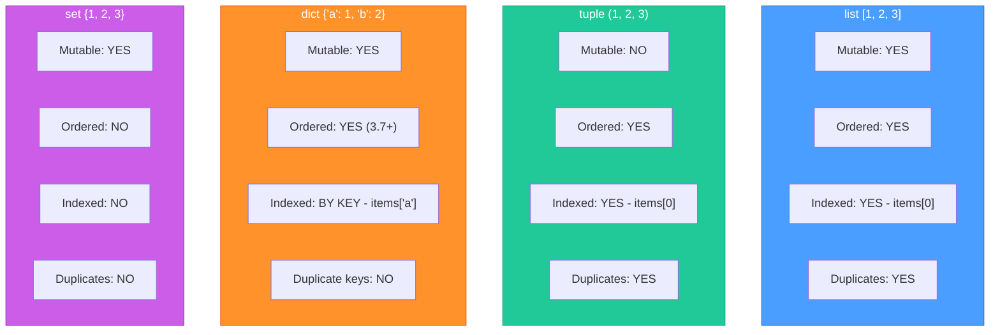
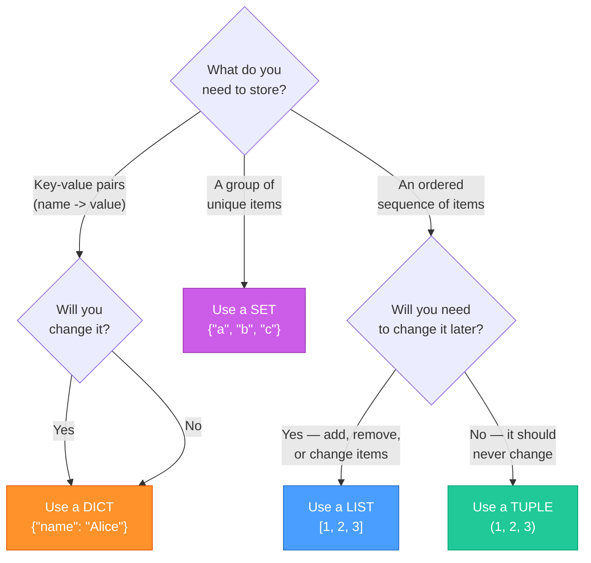
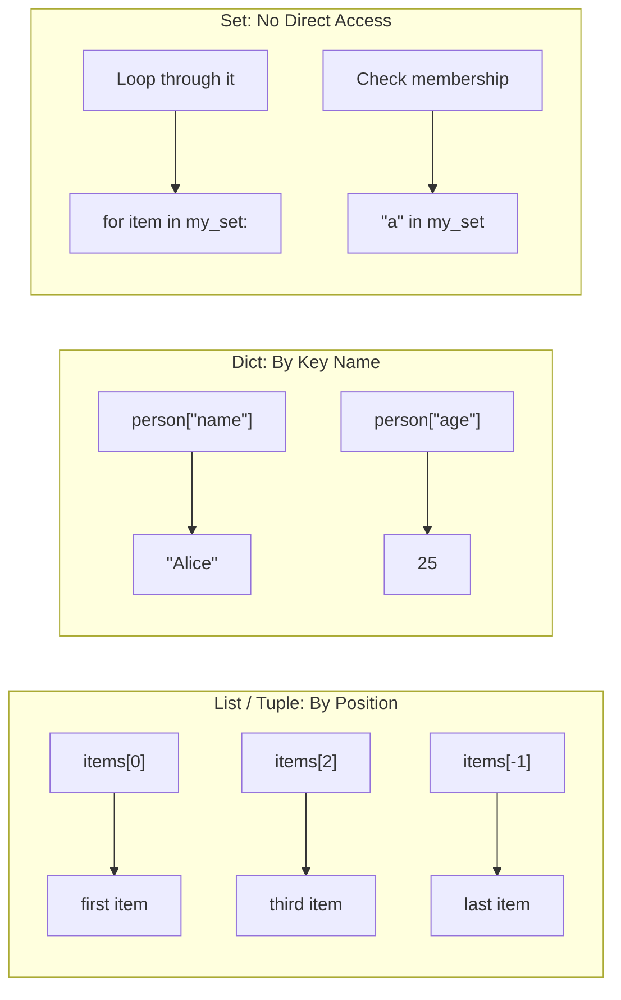

# Diagrams: Collections Explained

[Back to concept](../collections-explained.md)

---

## Side-by-Side Comparison

Each collection type has different properties. Pick the one that fits your needs.

## Decision Tree: Which Collection Should I Use?

## How You Access Data in Each Collection

