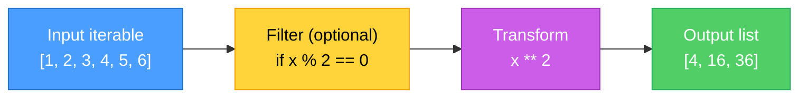
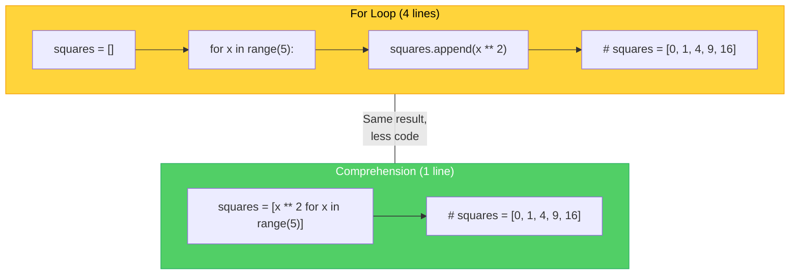
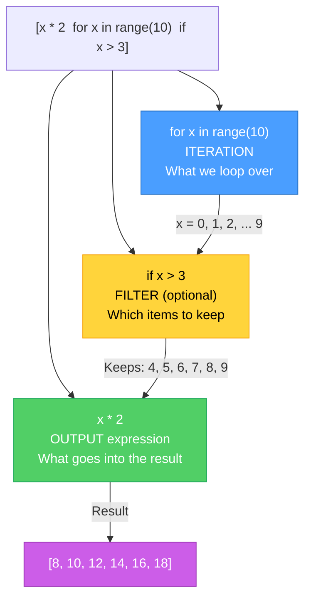
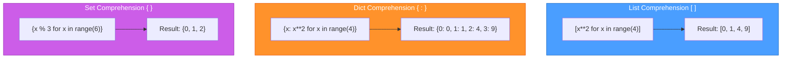

# Diagrams: Comprehensions Explained

[Back to concept](../comprehensions-explained.md)

---

## List Comprehension Data Flow

A list comprehension takes an iterable, optionally filters it, transforms each item, and collects results.

## Comprehension vs Loop: Side by Side

Every comprehension can be rewritten as a for loop. The comprehension is just more concise.

## Anatomy of a Comprehension

Breaking down the parts of `[expression for item in iterable if condition]`.

## List vs Dict vs Set Comprehension

The brackets you use determine what type of collection you get.

