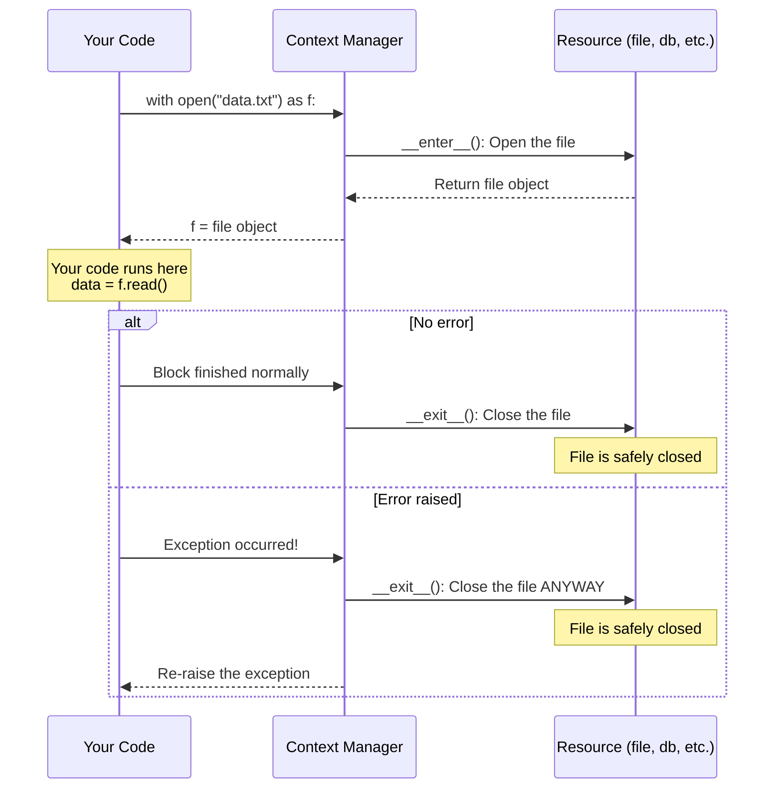
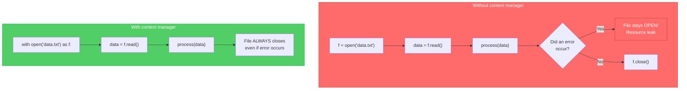
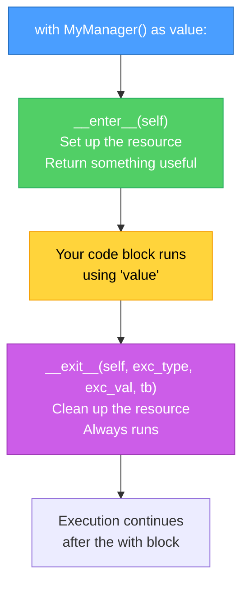
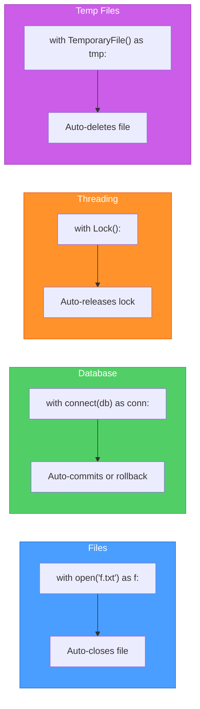

# Diagrams: Context Managers Explained

[Back to concept](../context-managers-explained.md)

---

## The with Statement Lifecycle

A context manager guarantees that setup and cleanup happen, even if an error occurs inside the block.

## Resource Management: With vs Without

Using `with` prevents resource leaks. Without it, you must remember to clean up manually.

## Enter and Exit: Behind the Scenes

Every context manager is an object with `__enter__` and `__exit__` methods.

## Common Context Managers

Python provides context managers for many resources that need cleanup.

