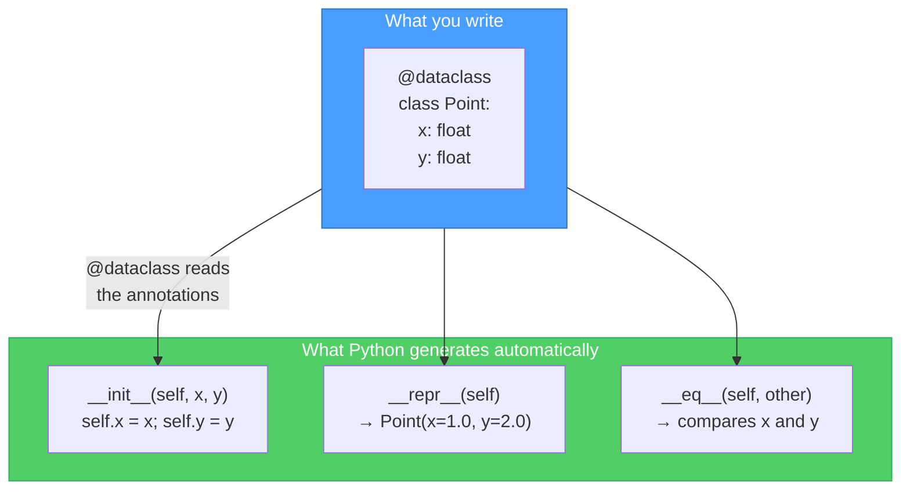
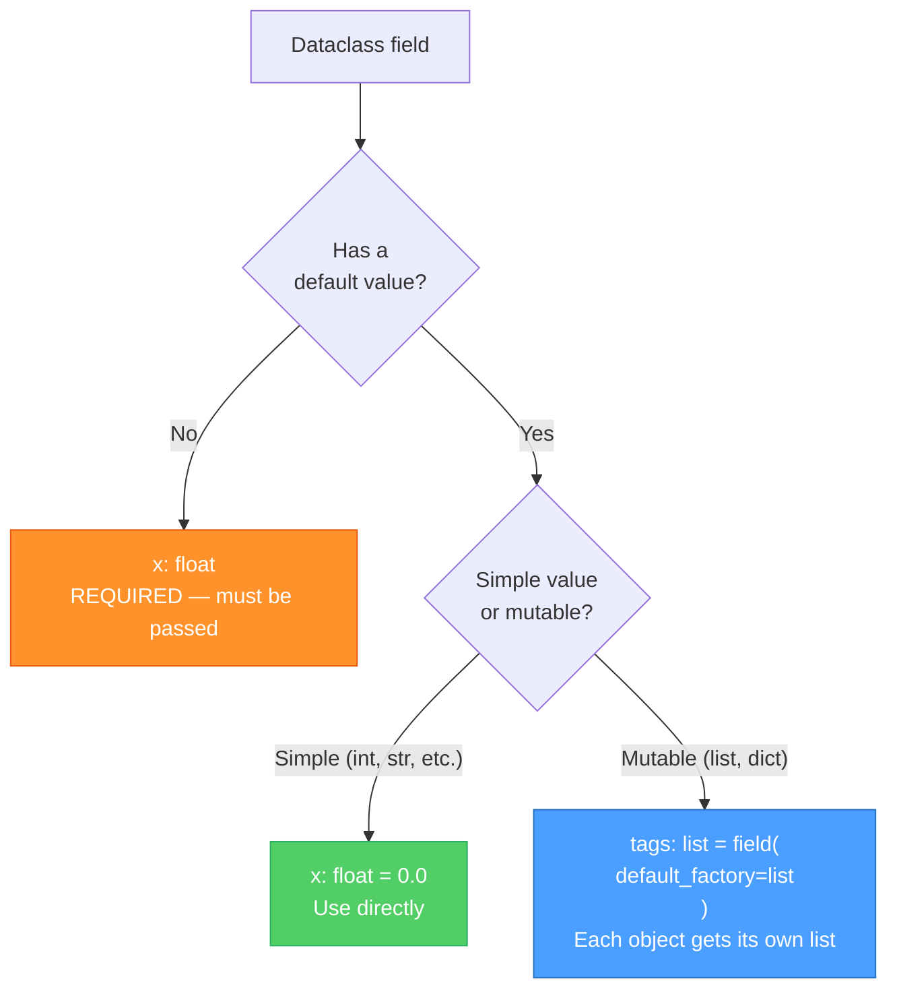
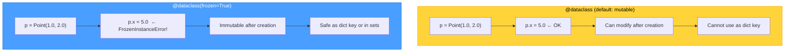
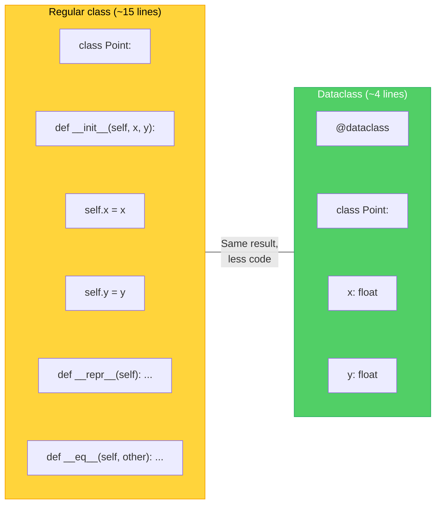

# Diagrams: Dataclasses Explained

[Back to concept](../dataclasses-explained.md)

---

## What @dataclass Auto-Generates

The `@dataclass` decorator reads your field annotations and writes boilerplate methods for you.

## Field Definition Flow

Each field can have a type, a default, or a `field()` with extra configuration.

## Frozen vs Mutable Dataclasses

A frozen dataclass prevents modification after creation, making it safe to use as a dict key or in sets.

## Regular Class vs Dataclass

A dataclass eliminates the repetitive boilerplate of a regular class for data-holding objects.

