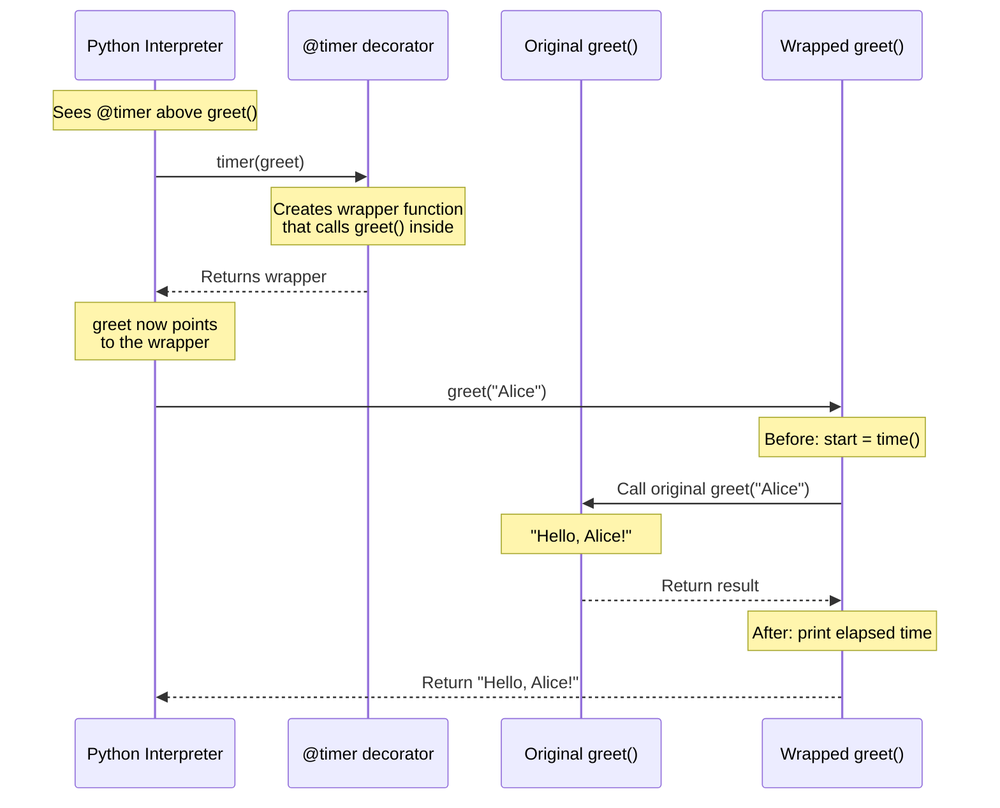
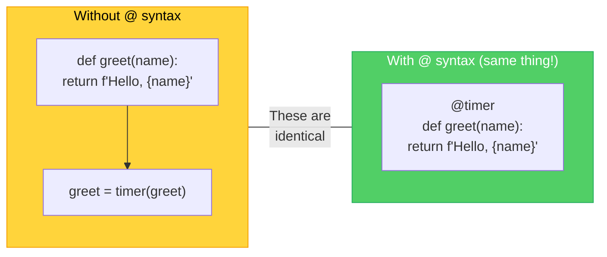
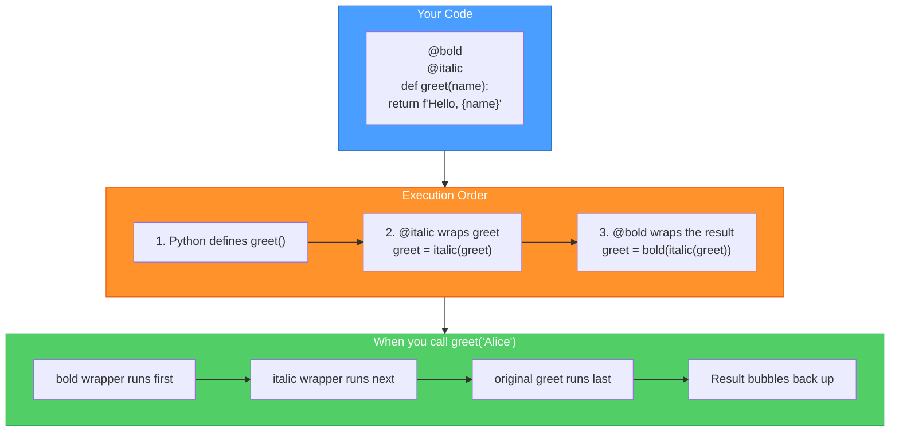
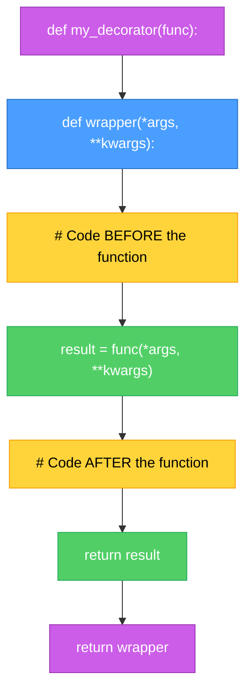

# Diagrams: Decorators Explained

[Back to concept](../decorators-explained.md)

---

## How a Decorator Wraps a Function

A decorator takes your function, wraps it with extra behavior, and gives you the wrapped version back.

## Before and After: What @decorator Does

The `@decorator` syntax is shorthand for reassigning the function name.

## Stacking Multiple Decorators

Decorators stack from bottom to top. The closest decorator to the function runs first.

## Common Decorator Pattern

The structure every decorator follows: take a function, define a wrapper, return the wrapper.

