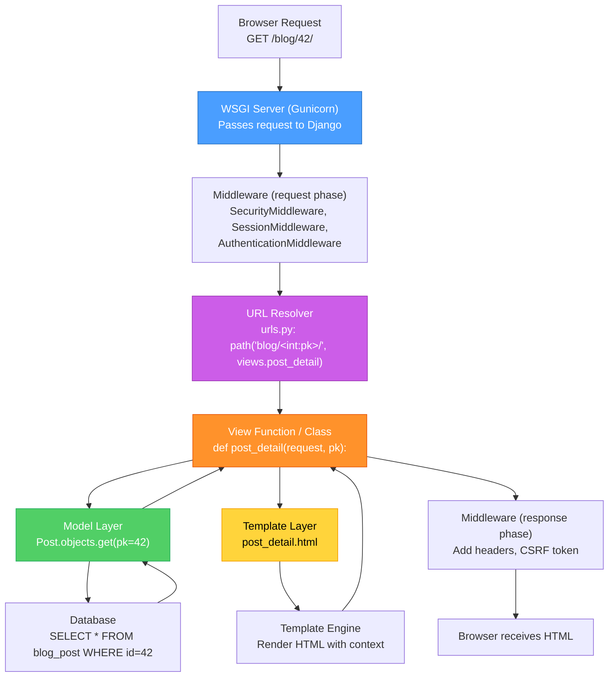
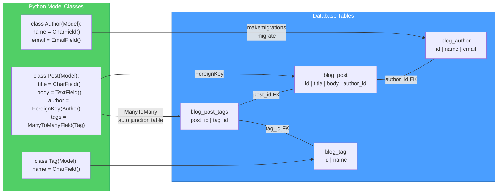
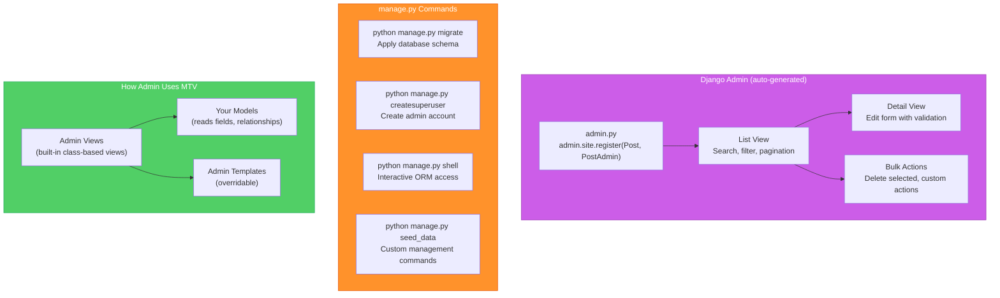

# Django MTV Pattern — Diagrams

[<- Back to Diagram Index](../../guides/DIAGRAM_INDEX.md)

## Overview

These diagrams show how Django processes requests through its Model-Template-View architecture, how the ORM maps Python classes to database tables, and how the admin interface fits into the stack.

## Request Through the MTV Stack

Django's MTV (Model-Template-View) pattern is similar to MVC, but Django calls the controller a "View" and the presentation layer a "Template." Every request flows through URL routing to a view, which coordinates models and templates.

**Key points:**
- The View is the coordinator: it fetches data from Models and passes it to Templates
- URL routing maps URL patterns to view functions using `urls.py`
- Middleware processes every request/response (authentication, security, sessions)
- Templates receive a context dictionary and render HTML

## Django ORM: Model to Database

The ORM translates Python class definitions into database tables. Each model field becomes a column, and relationships become foreign keys or junction tables.

**Key points:**
- Each Model class maps to one database table, named `appname_modelname`
- `ForeignKey` creates a column with a foreign key constraint
- `ManyToManyField` automatically creates a junction table
- `makemigrations` generates SQL; `migrate` applies it to the database

## Django Admin and Management Flow

The admin interface auto-generates CRUD pages for your models. Management commands let you run tasks from the terminal.

**Key points:**
- Registering a model in `admin.py` gives you a full CRUD interface for free
- The admin reads your model fields to auto-generate forms and list displays
- `ModelAdmin` classes let you customize search, filters, display columns, and inline editing
- Management commands extend `manage.py` for custom CLI tasks (seeding data, cleanup jobs)

---

| [Back to Diagram Index](../../guides/DIAGRAM_INDEX.md) |
|:---:|
