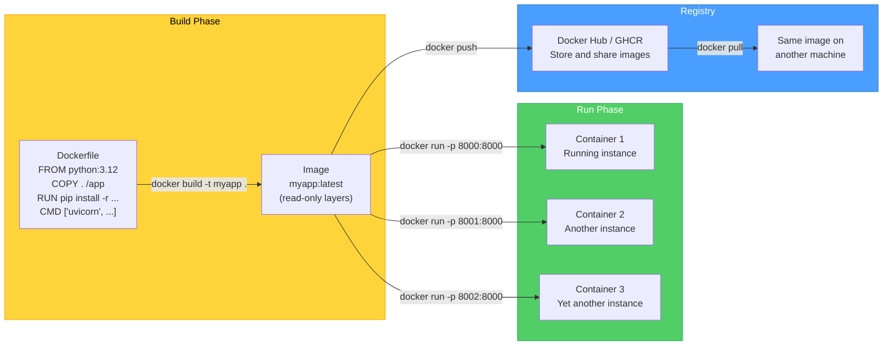
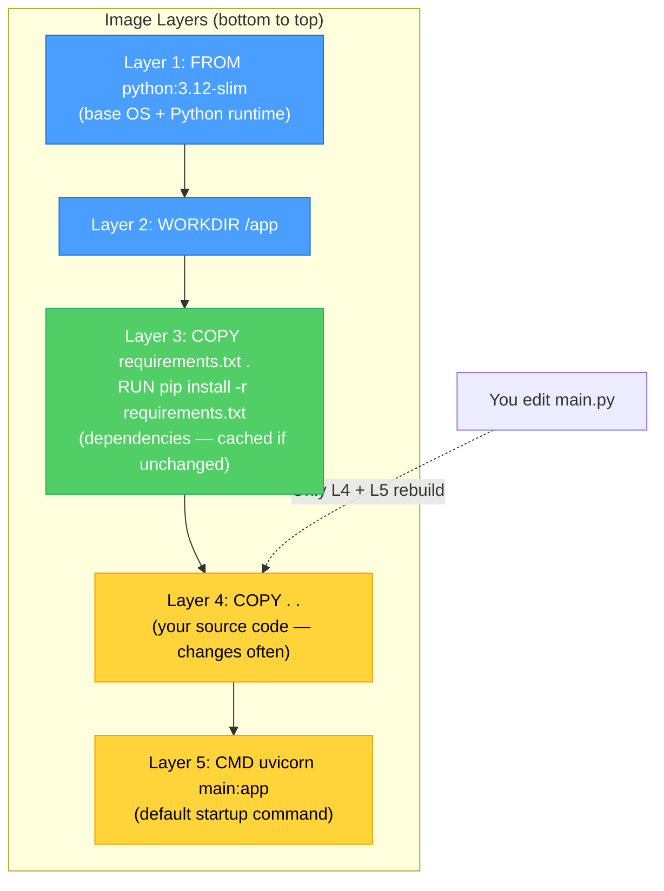
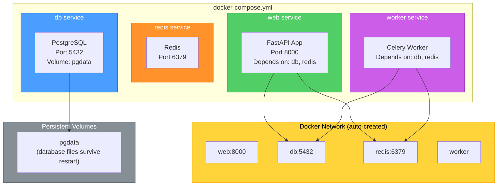

# Docker Container Architecture — Diagrams

[<- Back to Diagram Index](../../guides/DIAGRAM_INDEX.md)

## Overview

These diagrams show how Docker builds images from Dockerfiles, runs containers from those images, and how docker-compose orchestrates multi-container applications with networking and volumes.

## From Dockerfile to Running Container

A Dockerfile is a recipe. Docker reads the recipe to build an image (a snapshot), and you run containers (live instances) from that image.

**Key points:**
- An image is built once from a Dockerfile and reused to create many containers
- Each container is an isolated instance with its own filesystem, network, and process space
- Images are layered: unchanged layers are cached, making rebuilds fast
- Registries (Docker Hub, GitHub Container Registry) store images for sharing and deployment

## Docker Image Layers

Each instruction in a Dockerfile creates a layer. Docker caches layers and only rebuilds from the first changed line downward, so ordering matters for build speed.

**Key points:**
- Copy `requirements.txt` before copying source code so dependency installs are cached
- Layers below the first changed line come from cache (instant rebuild)
- Use `.dockerignore` to exclude `__pycache__`, `.git`, `node_modules` from the build context
- Use slim or alpine base images to reduce final image size

## Docker Compose: Multi-Container Application

A `docker-compose.yml` file defines multiple services that run together. Compose handles networking, volumes, and startup order.

**Key points:**
- Services communicate by name: the app connects to `db:5432`, not `localhost:5432`
- `depends_on` controls startup order (but not readiness — use healthchecks for that)
- Named volumes persist data across container restarts; without them, data is lost on restart
- `docker compose up` starts everything; `docker compose down` stops and removes containers

---

| [Back to Diagram Index](../../guides/DIAGRAM_INDEX.md) |
|:---:|
