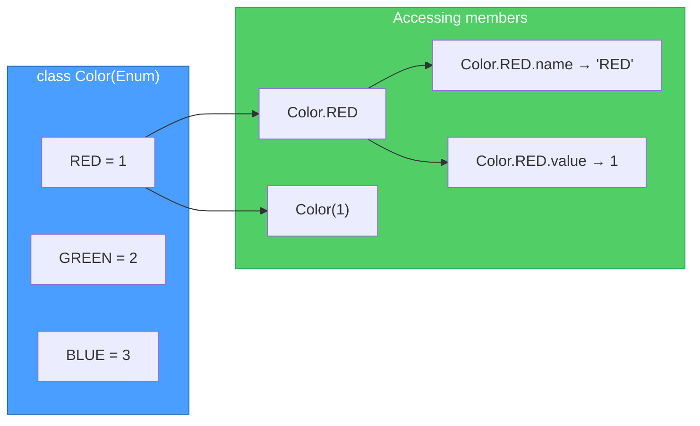
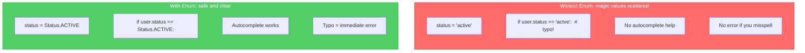
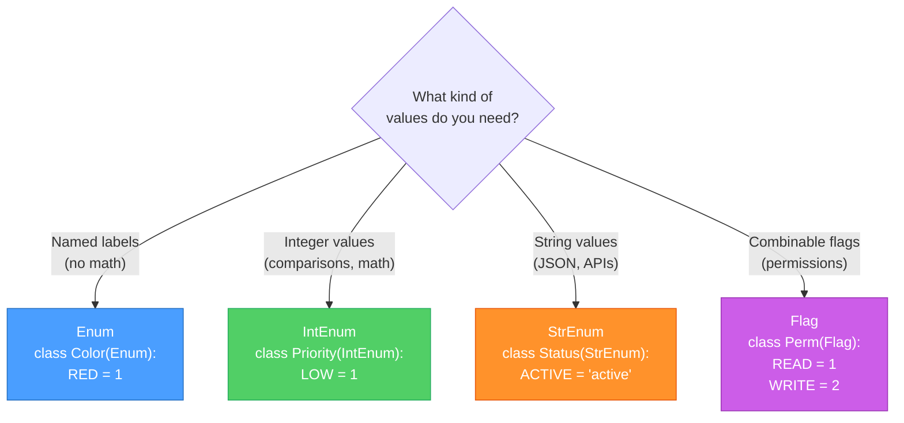
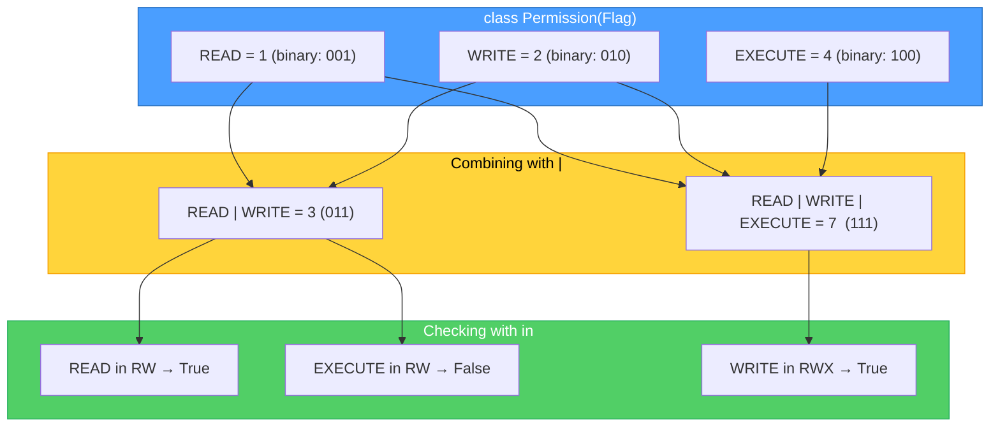

# Diagrams: Enums Explained

[Back to concept](../enums-explained.md)

---

## Enum Value Mapping

An Enum maps meaningful names to fixed values. Each member has a `.name` and a `.value`.

## Enum vs Magic Constants

Enums replace scattered "magic" strings and numbers with a single source of truth.

## Choosing the Right Enum Type

Python provides several Enum base classes for different use cases.

## Flag Enum Composition

Flag enums let you combine members with bitwise OR to represent sets of permissions.

