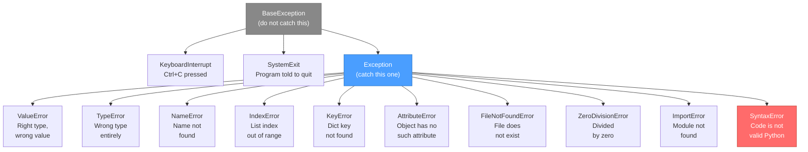
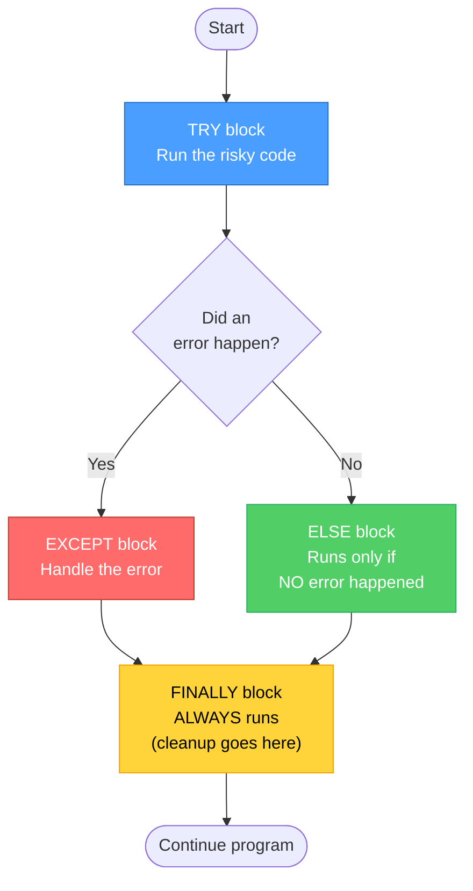
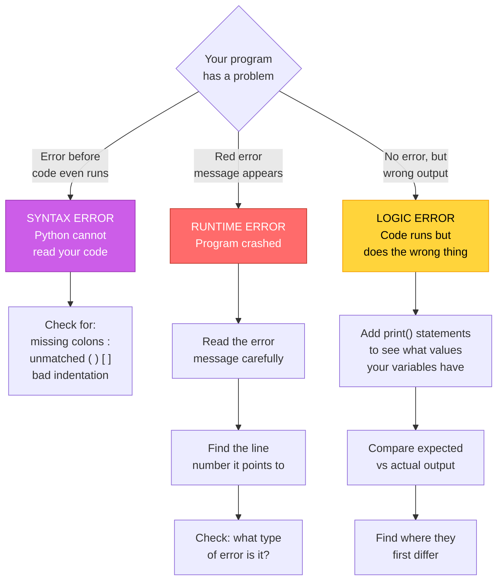

# Diagrams: Errors and Debugging

[Back to concept](../errors-and-debugging.md)

---

## Exception Hierarchy

Python errors form a family tree. Catching a parent catches all its children too.

## Try / Except / Else / Finally Flow

## Debugging Decision Tree: What Kind of Error?

