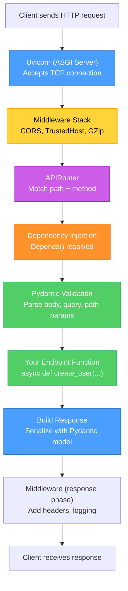
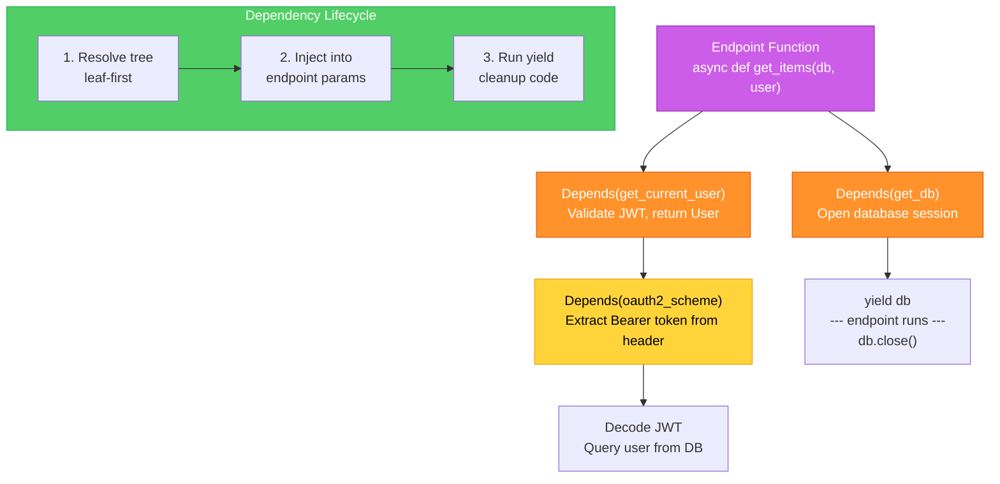
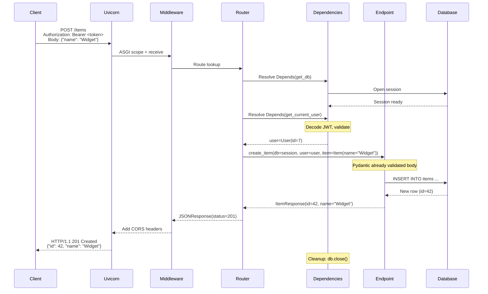

# FastAPI Request Lifecycle — Diagrams

[<- Back to Diagram Index](../../guides/DIAGRAM_INDEX.md)

## Overview

These diagrams trace the full journey of an HTTP request through a FastAPI application, from the ASGI server accepting the connection to the JSON response leaving the wire.

## Request Flow Through the Stack

Every FastAPI request passes through several layers before your endpoint function runs. Understanding this stack helps you debug middleware issues, dependency failures, and response timing.

**Key points:**
- Uvicorn is the ASGI server that translates raw TCP into Python async calls
- Middleware runs twice: once on the way in, once on the way out
- Dependency injection resolves before your function body executes
- Pydantic validates and converts all input data automatically

## Dependency Injection Chain

FastAPI's `Depends()` system lets you build reusable chains of setup logic. Dependencies can depend on other dependencies, forming a tree that resolves from leaves to root.

**Key points:**
- Dependencies form a tree resolved bottom-up (leaves first)
- `yield` dependencies run setup code, then cleanup after the endpoint finishes
- The same dependency used twice in one request is resolved only once (cached)
- Dependency injection replaces global variables with testable, swappable components

## Sequence: Authentication + Database Request

A realistic sequence showing how a protected endpoint handles a request from token validation through database access to JSON response.

**Key points:**
- Authentication happens in the dependency layer, not in your endpoint code
- Pydantic validates the request body before the endpoint function is called
- Database session cleanup runs after the response is built (yield dependency)
- The endpoint only contains business logic, everything else is handled by the framework

---

| [Back to Diagram Index](../../guides/DIAGRAM_INDEX.md) |
|:---:|
