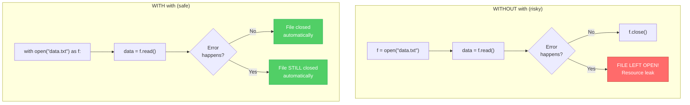
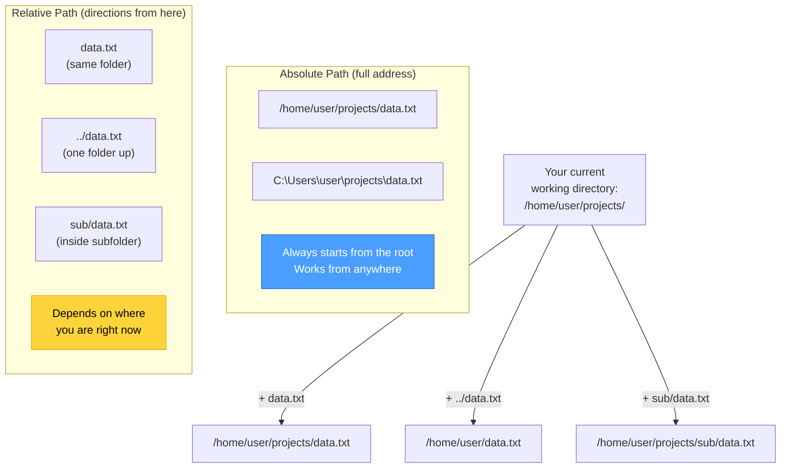
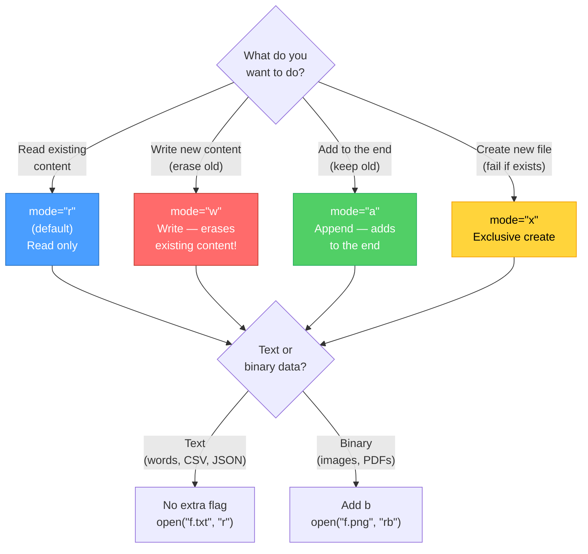

# Diagrams: Files and Paths

[Back to concept](../files-and-paths.md)

---

## File I/O Flowchart

The safe way to work with files uses a `with` statement, which closes the file automatically.

## Path Types: Absolute vs Relative

## File Mode Decision Tree

The `mode` argument in `open()` controls what you can do with the file.

