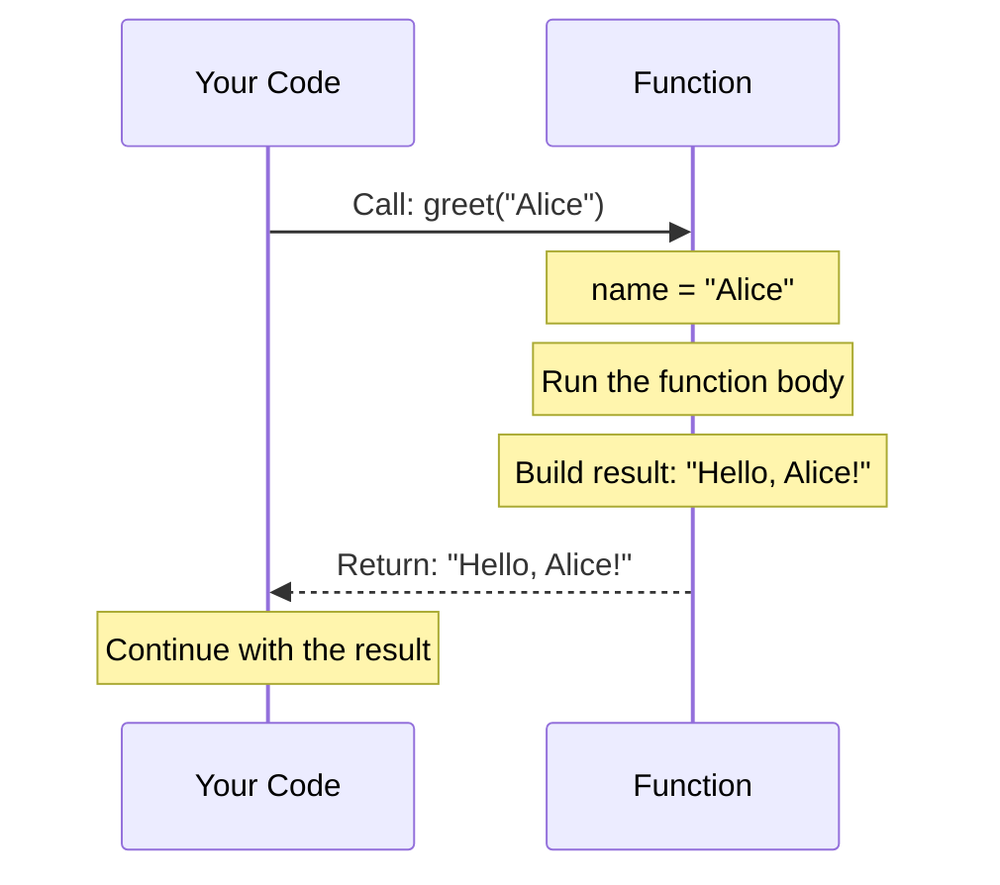
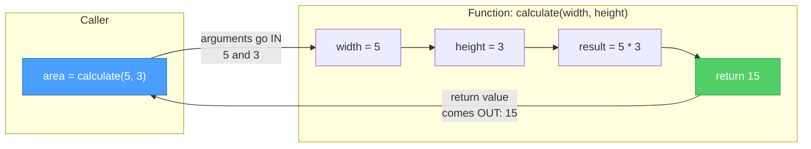
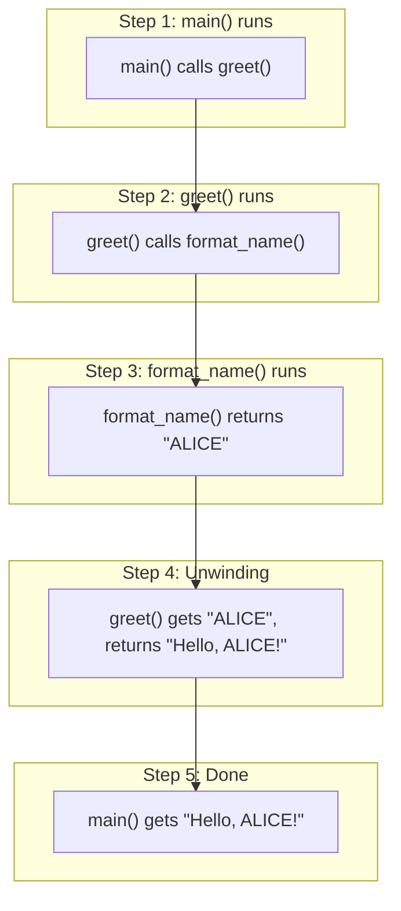
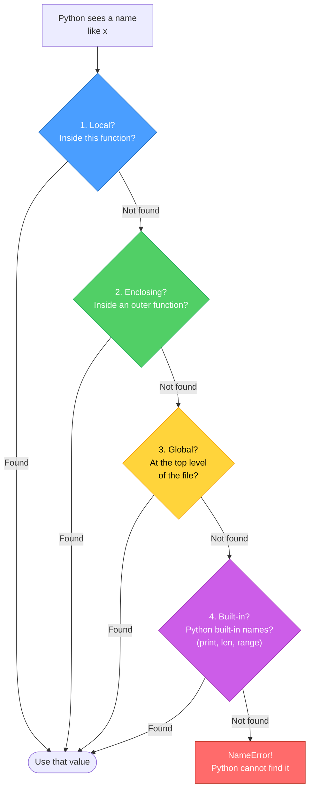

# Diagrams: Functions Explained

[Back to concept](../functions-explained.md)

---

## Function Call Sequence

When you call a function, Python jumps into it, does work, then comes back with a result.

## Parameter Passing Flow

Arguments are values you send IN. The return value is what comes back OUT.

## Call Stack: Nested Function Calls

When functions call other functions, Python stacks them up and unwinds when each one finishes.

## Scope Chain: Where Python Looks for Names

When you use a variable name, Python searches in this order (LEGB rule).

