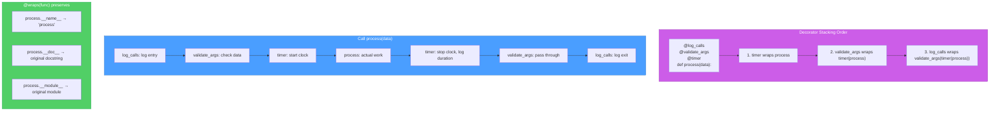
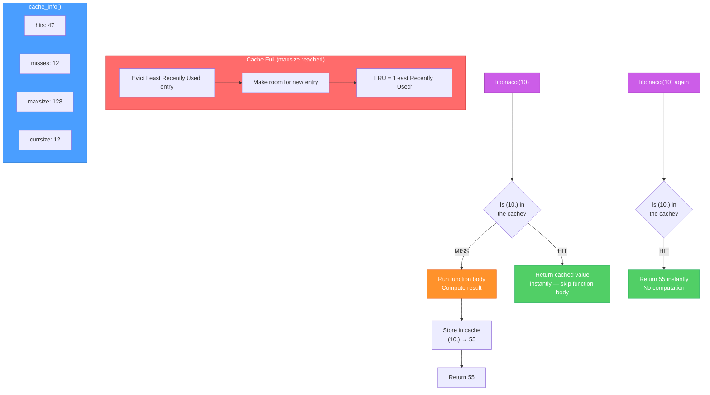

# Diagrams: functools and itertools

[Back to concept](../functools-and-itertools.md)

---

## Decorator Chain with functools.wraps

When stacking decorators, `@wraps` preserves the original function's identity. Without it, debugging becomes confusing.

## lru_cache Hit/Miss Flow

`@lru_cache` memorizes function results. On a cache hit, the function body never runs.

## itertools Pipeline Visualization

`itertools` functions chain together to process sequences lazily — each element flows through the entire pipeline one at a time.

```mermaid
flowchart LR
    subgraph SOURCE ["Source"]
        DATA["[1, 2, 3, 4, 5,<br/>6, 7, 8, 9, 10]"]
    end

    subgraph CHAIN_STEP ["chain()"]
        CH["Combine multiple<br/>iterables into one stream"]
    end

    subgraph FILTER_STEP ["filterfalse(is_odd)"]
        FL["Drop odd numbers<br/>→ 2, 4, 6, 8, 10"]
    end

    subgraph MAP_STEP ["starmap(pow, pairs)"]
        MP["Apply function to<br/>each unpacked tuple"]
    end

    subgraph SLICE_STEP ["islice(iterable, 3)"]
        SL["Take only first 3<br/>Stop early — lazy!"]
    end

    subgraph RESULT ["Result"]
        RES["Consume with<br/>list() or for loop"]
    end

    DATA --> CH --> FL --> MP --> SL --> RES

    style SOURCE fill:#cc5de8,stroke:#9c36b5,color:#fff
    style CHAIN_STEP fill:#ff922b,stroke:#e8590c,color:#fff
    style FILTER_STEP fill:#4a9eff,stroke:#2670c2,color:#fff
    style MAP_STEP fill:#ffd43b,stroke:#f59f00,color:#000
    style SLICE_STEP fill:#51cf66,stroke:#27ae60,color:#fff
    style RESULT fill:#cc5de8,stroke:#9c36b5,color:#fff
```

## functools Key Functions at a Glance

An overview of the most important `functools` utilities and what they do.

```mermaid
flowchart TD
    subgraph PARTIAL ["partial()"]
        P1["Freeze some arguments"]
        P2["base10 = partial(int, base=10)"]
        P3["Creates a new function<br/>with fewer parameters"]
        P1 --> P2 --> P3
    end

    subgraph CACHE ["lru_cache()"]
        CA1["Memoize return values"]
        CA2["@lru_cache(maxsize=128)"]
        CA3["Same args → cached result<br/>Huge speedup for recursion"]
        CA1 --> CA2 --> CA3
    end

    subgraph REDUCE ["reduce()"]
        R1["Fold a sequence<br/>into a single value"]
        R2["reduce(add, [1,2,3,4]) → 10"]
        R3["Applies function cumulatively:<br/>((1+2)+3)+4"]
        R1 --> R2 --> R3
    end

    subgraph WRAPS_FN ["wraps()"]
        WR1["Preserve wrapped<br/>function metadata"]
        WR2["@wraps(original_func)"]
        WR3["Keeps __name__, __doc__<br/>for debugging"]
        WR1 --> WR2 --> WR3
    end

    style PARTIAL fill:#4a9eff,stroke:#2670c2,color:#fff
    style CACHE fill:#51cf66,stroke:#27ae60,color:#fff
    style REDUCE fill:#ff922b,stroke:#e8590c,color:#fff
    style WRAPS_FN fill:#cc5de8,stroke:#9c36b5,color:#fff
```

