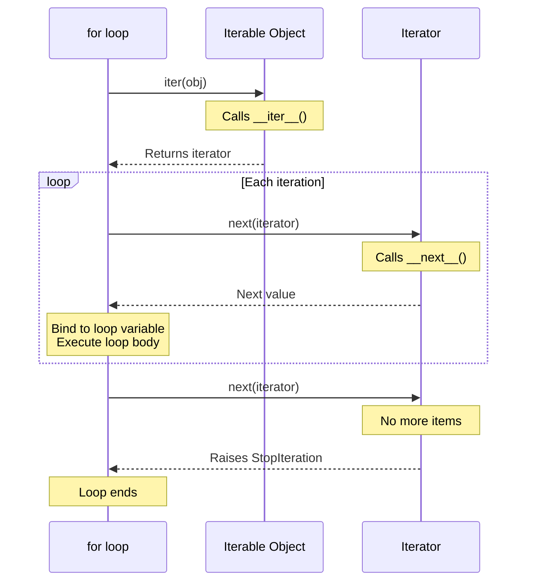
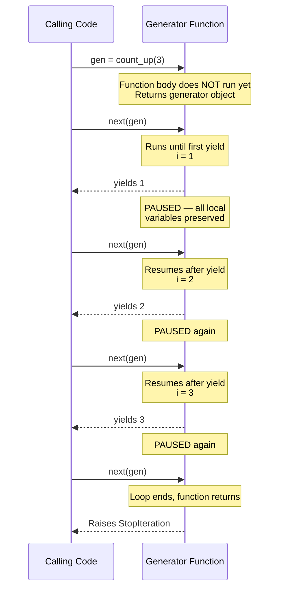
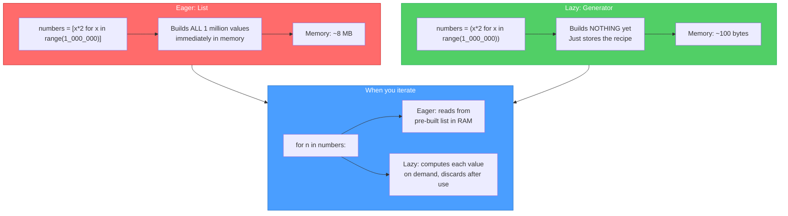
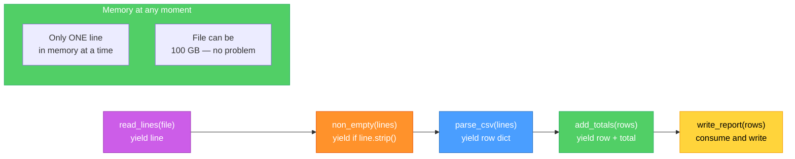

# Diagrams: Generators and Iterators

[Back to concept](../generators-and-iterators.md)

---

## The Iterator Protocol

Every `for` loop in Python uses the iterator protocol under the hood. The object must implement `__iter__()` and `__next__()`.

## Generator Yield and Resume Flow

A generator function pauses at each `yield` and resumes exactly where it left off when `next()` is called again.

## Lazy vs Eager Evaluation

Eager evaluation builds the entire result in memory. Lazy evaluation produces one item at a time, using almost no memory regardless of size.

## Generator Pipeline

Generators can be chained together into processing pipelines. Each stage pulls one item at a time through the chain.

