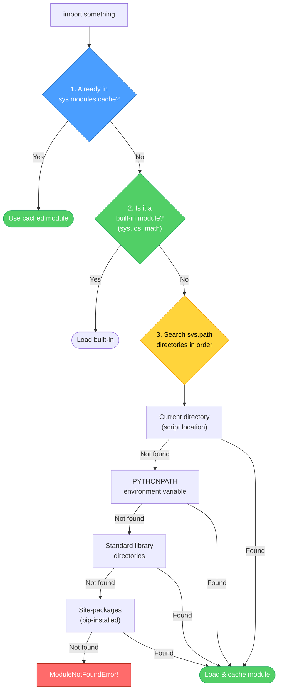
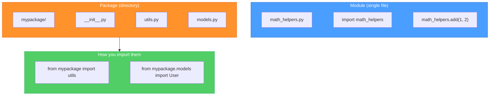
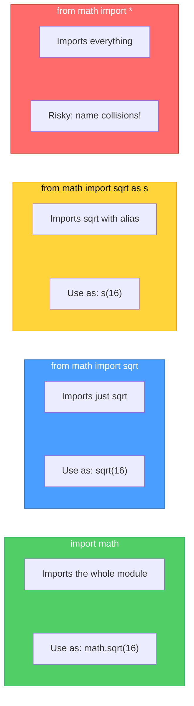

# Diagrams: How Imports Work

[Back to concept](../how-imports-work.md)

---

## Import Resolution Path

When you write `import something`, Python follows a specific search order to find it.

## Package vs Module

A module is a single `.py` file. A package is a directory with an `__init__.py`.

## Import Styles Compared

Different import styles give you different names to use in your code.

