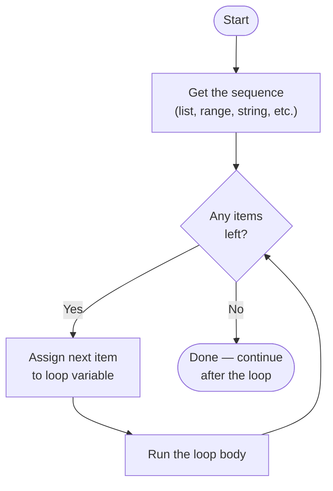
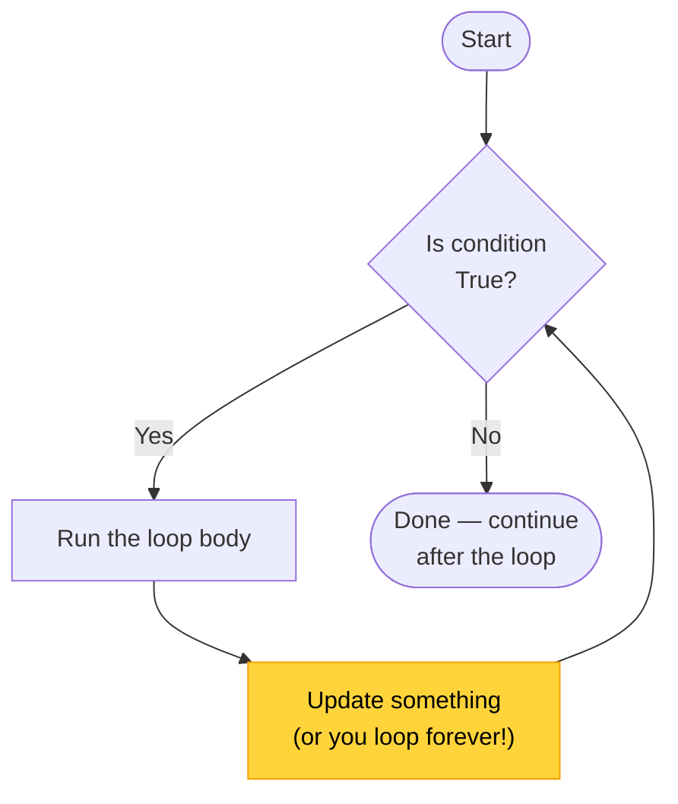
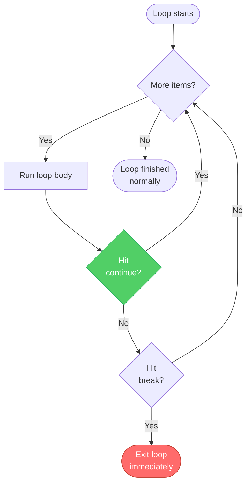
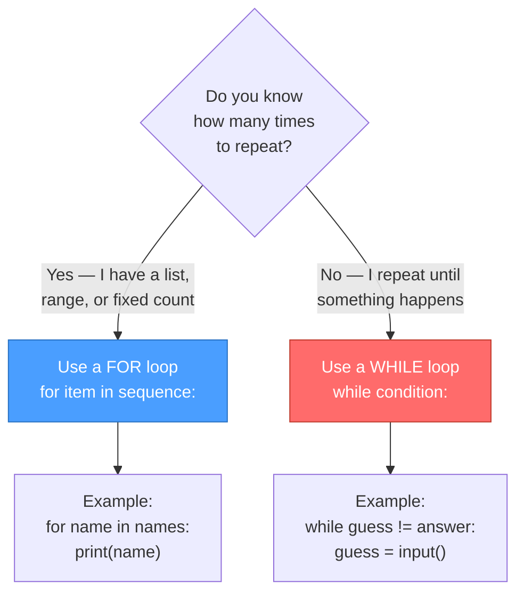

# Diagrams: How Loops Work

[Back to concept](../how-loops-work.md)

---

## For Loop Flowchart

A `for` loop walks through each item in a sequence, one at a time.

## While Loop Flowchart

A `while` loop keeps running as long as its condition is `True`.

## Break and Continue Flow

`break` exits the loop entirely. `continue` skips to the next iteration.

## Decision Tree: For vs While

