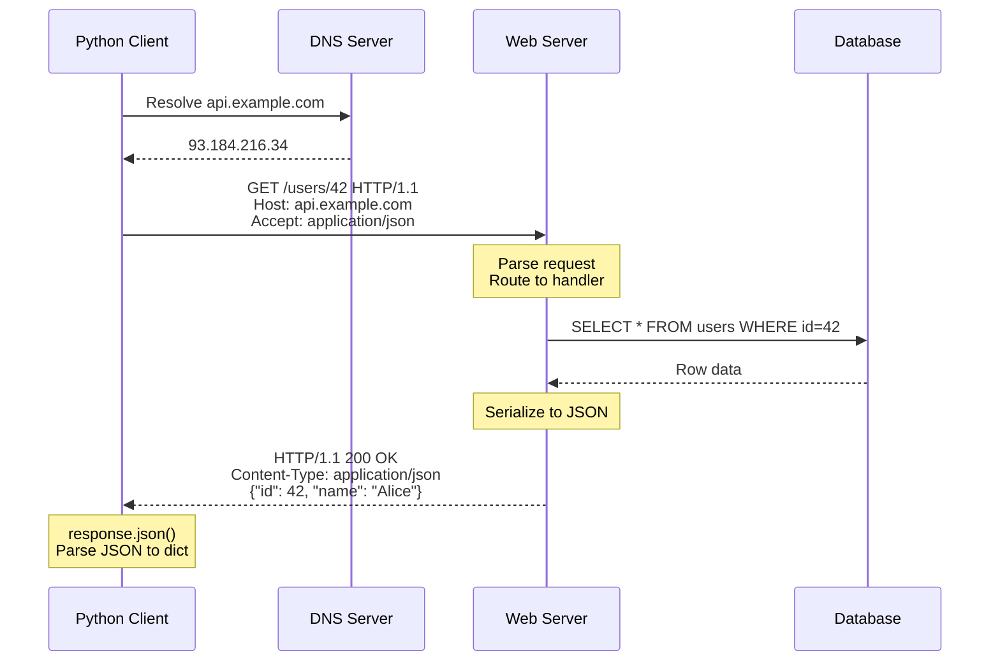
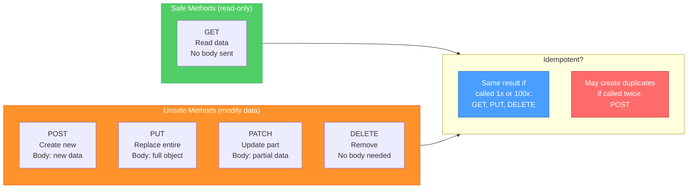
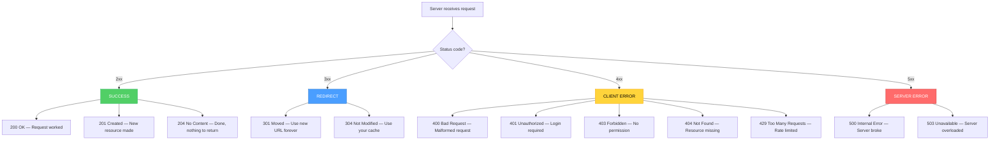
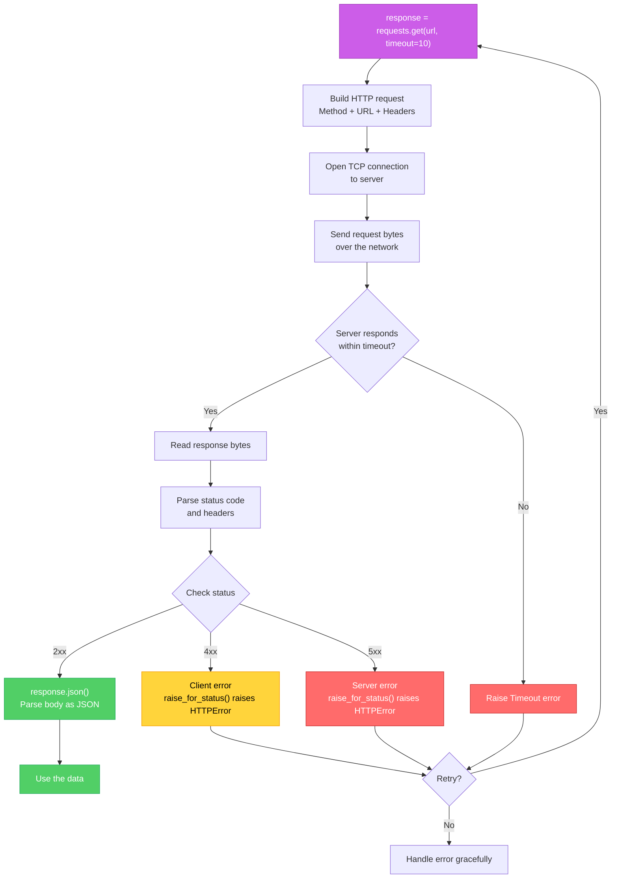

# Diagrams: HTTP Explained

[Back to concept](../http-explained.md)

---

## HTTP Request/Response Cycle

Every HTTP interaction follows the same pattern: the client builds a request, sends it over the network, the server processes it and returns a response.

## HTTP Methods Comparison

Each HTTP method has a specific purpose. The combination of method + URL tells the server exactly what you want to do.

## Status Code Categories

The first digit of the status code tells you the category of response.

## Full Request Lifecycle in Python

What happens step by step when you call `requests.get()`.

