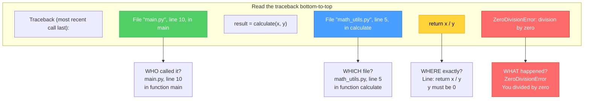
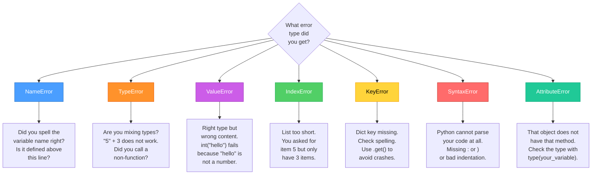
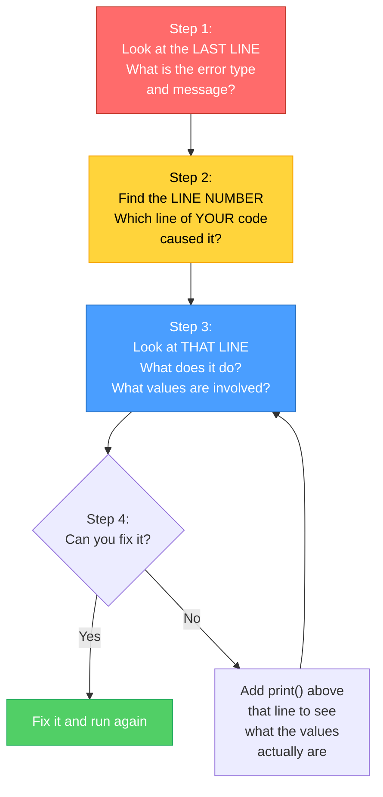

# Diagrams: Reading Error Messages

[Back to concept](../reading-error-messages.md)

---

## Traceback Anatomy

Python error messages read from **bottom to top**. The last line tells you WHAT happened. The lines above tell you WHERE.

## Common Error Types: Quick Diagnosis

When you see an error, match the type to its most likely cause.

## Error Message Reading Checklist

Follow these steps every time you get an error.

