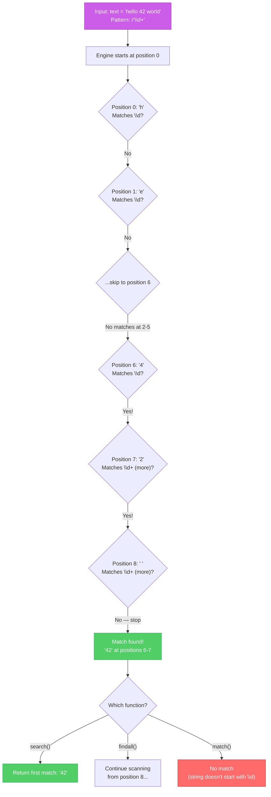
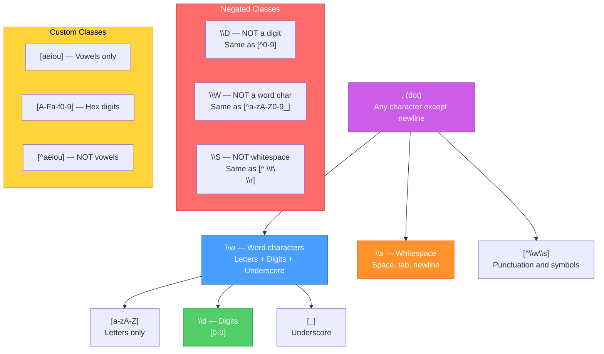
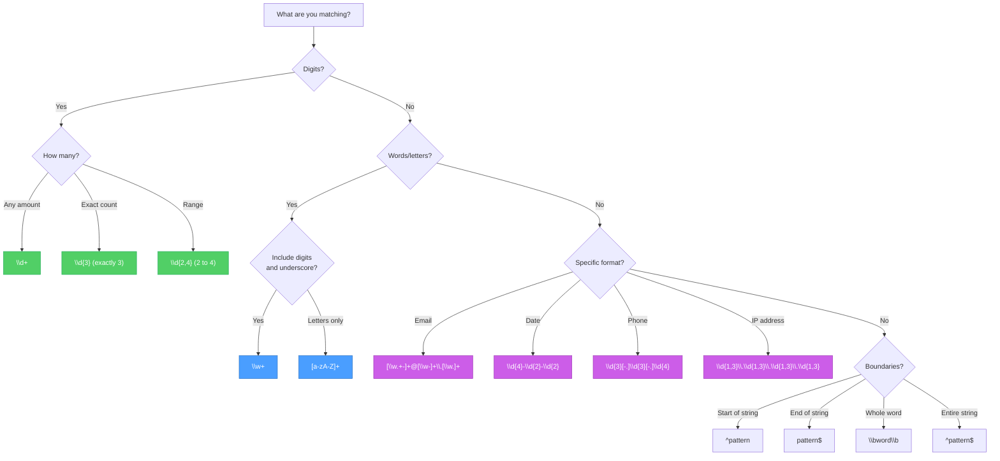
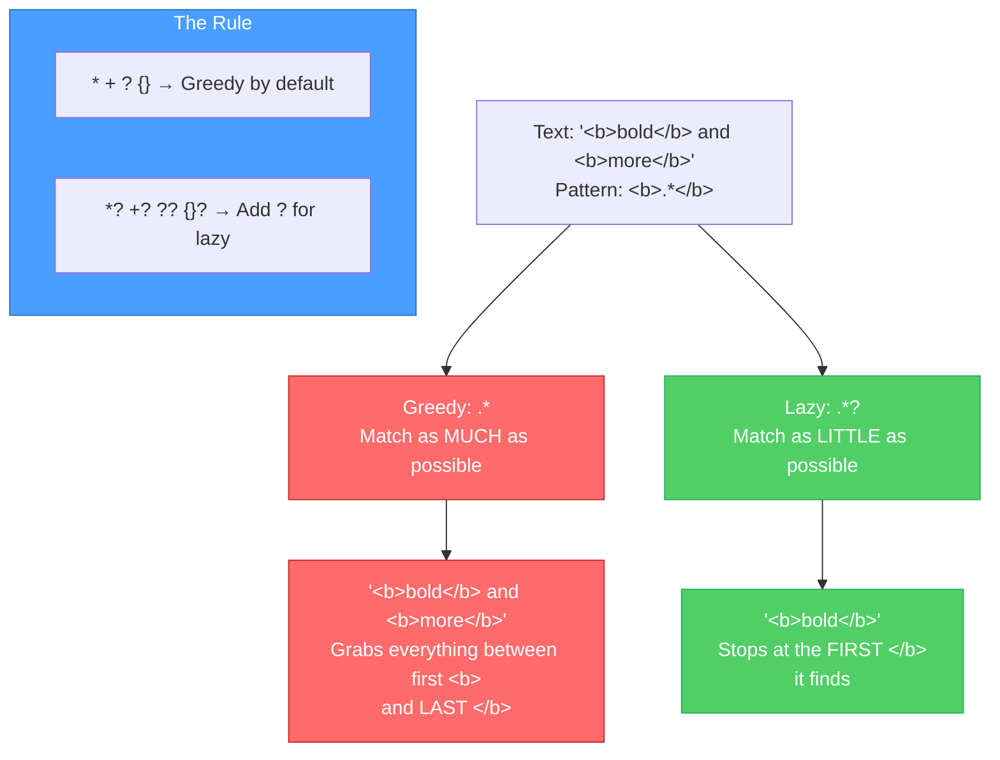

# Diagrams: Regex Explained

[Back to concept](../regex-explained.md)

---

## Regex Engine Matching Flow

How the regex engine processes a pattern against a string, step by step.

## Character Class Hierarchy

How regex character classes relate to each other, from specific to general.

## Common Pattern Decision Tree

Not sure which regex pattern to use? Follow this flowchart.

## Greedy vs Lazy Matching

By default, quantifiers are greedy (match as much as possible). Adding `?` makes them lazy (match as little as possible).

