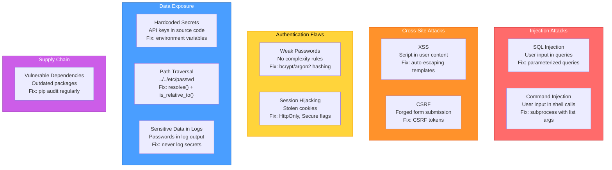
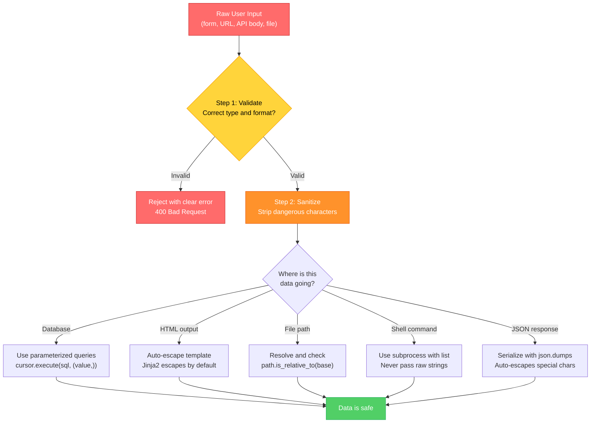
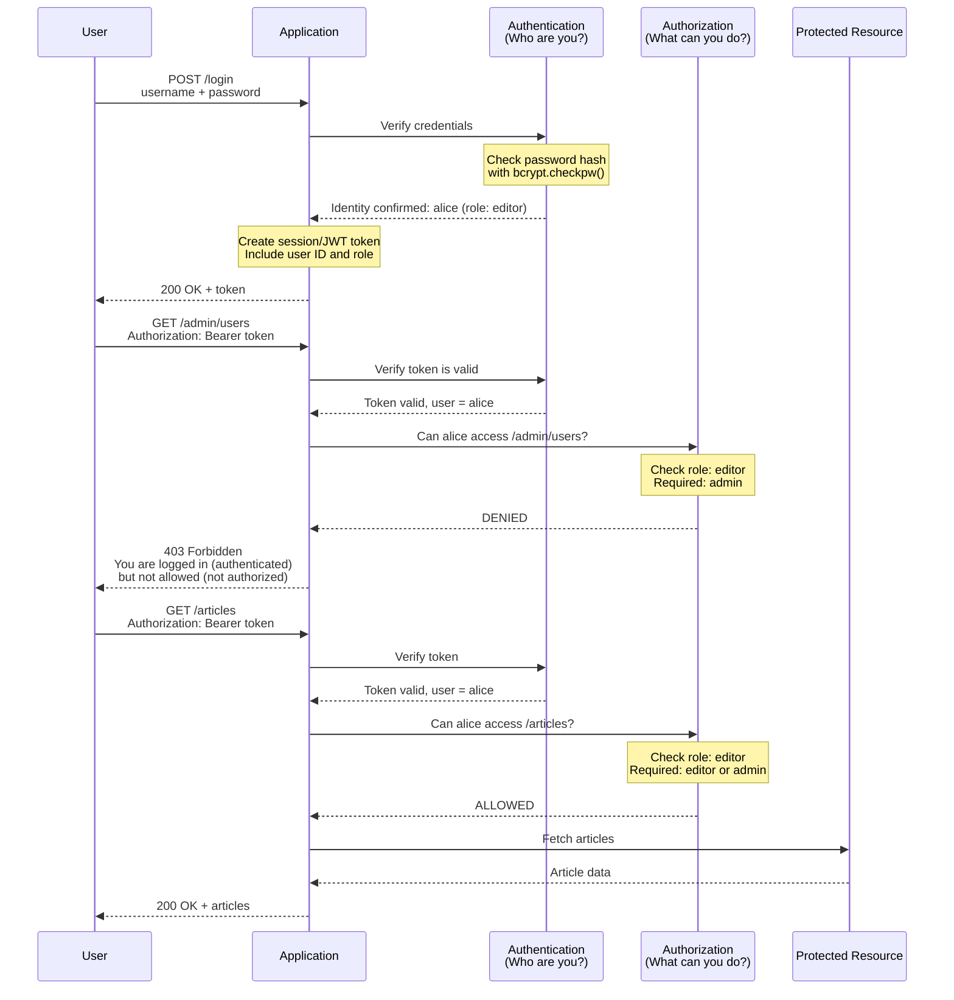
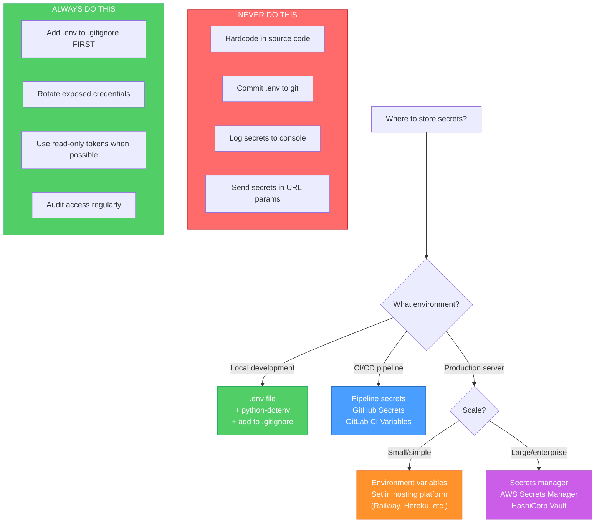

# Diagrams: Security Basics

[Back to concept](../security-basics.md)

---

## OWASP Top Risks for Python Developers

The most common web security vulnerabilities, ranked by how often they appear in Python projects.

## Input Sanitization Flow

Every piece of user input must be validated before it touches your application logic, database, or output.

## Authentication vs Authorization

Authentication proves WHO you are. Authorization determines WHAT you can do. They are separate steps.

## Secrets Management Decision Tree

Where and how to store secrets depends on your environment.

