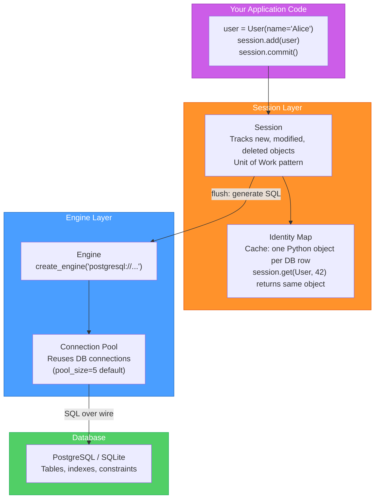
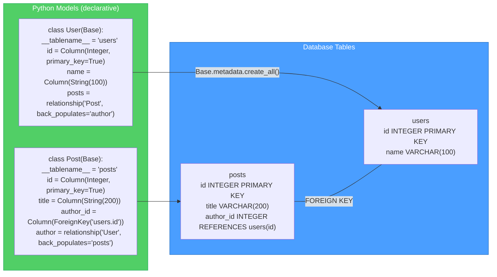
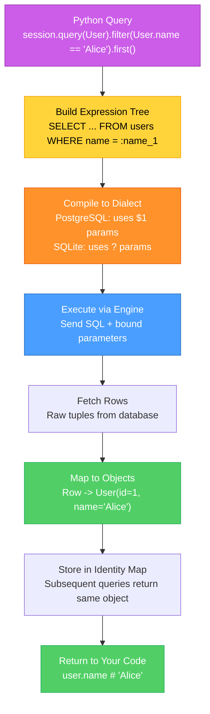
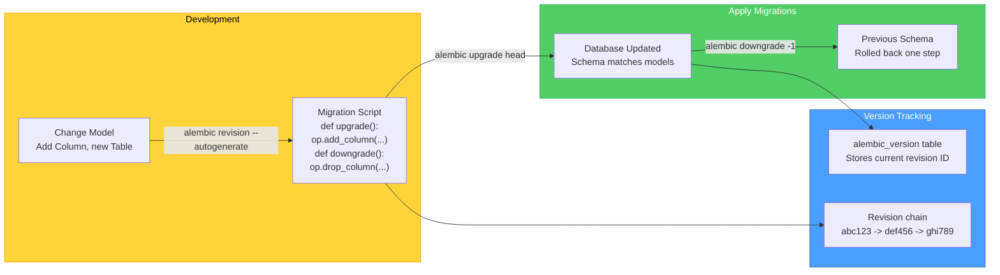

# SQLAlchemy ORM Mapping — Diagrams

[<- Back to Diagram Index](../../guides/DIAGRAM_INDEX.md)

## Overview

These diagrams show how SQLAlchemy connects Python classes to database tables, how the Engine/Session/Model stack works, and how relationships and queries translate to SQL.

## Engine, Session, and Model Stack

SQLAlchemy has three main layers. The Engine manages database connections, the Session tracks changes, and Models define your table structure in Python.

**Key points:**
- The Engine is created once at app startup and shared across the application
- The Session is short-lived: create one per request or unit of work, then close it
- The Identity Map ensures you get the same Python object for the same database row within a session
- `commit()` triggers `flush()` which converts tracked changes into SQL statements

## Model to Table Mapping

SQLAlchemy's declarative system maps Python classes to database tables. Fields become columns, and relationships define how tables connect.

**Key points:**
- `relationship()` creates a Python-level link; `ForeignKey` creates the database-level constraint
- `back_populates` makes the relationship bidirectional: `user.posts` and `post.author`
- `Base.metadata.create_all(engine)` generates all tables (use Alembic for migrations in real projects)
- Column types like `String(100)` map to `VARCHAR(100)` in the database

## Query Execution: Python to SQL

When you query with SQLAlchemy, it builds a SQL expression tree, compiles it to the database dialect, executes it, and maps the results back to Python objects.

**Key points:**
- SQLAlchemy uses bound parameters (`:name_1`) to prevent SQL injection automatically
- The dialect compiler adapts SQL syntax to your specific database engine
- Results are mapped back to Python objects with full attribute access
- The Identity Map means `session.query(User).get(1)` returns the exact same object if already loaded

## Alembic Migration Workflow

Alembic manages database schema changes over time. It generates migration scripts from model changes and applies them in order.

**Key points:**
- `--autogenerate` compares your models to the database and generates the migration diff
- Every migration has `upgrade()` and `downgrade()` so you can roll back safely
- Migrations are chained: each knows its parent revision, ensuring correct ordering
- Always review auto-generated migrations before applying them (they can miss renames or data changes)

---

| [Back to Diagram Index](../../guides/DIAGRAM_INDEX.md) |
|:---:|
