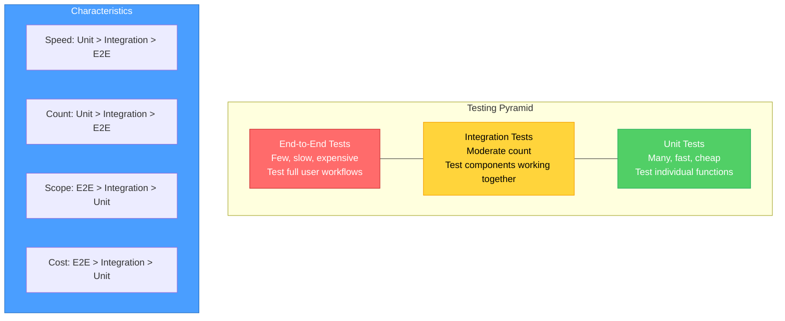
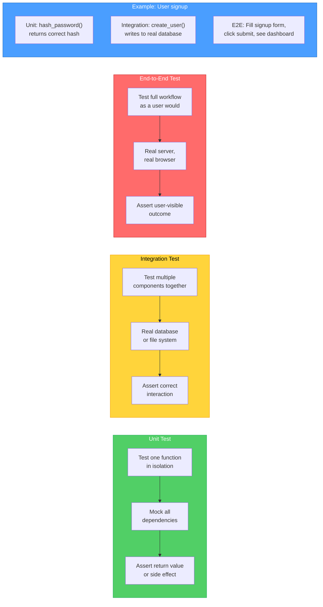
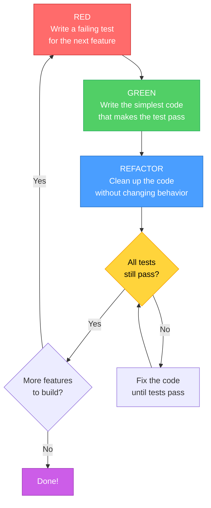
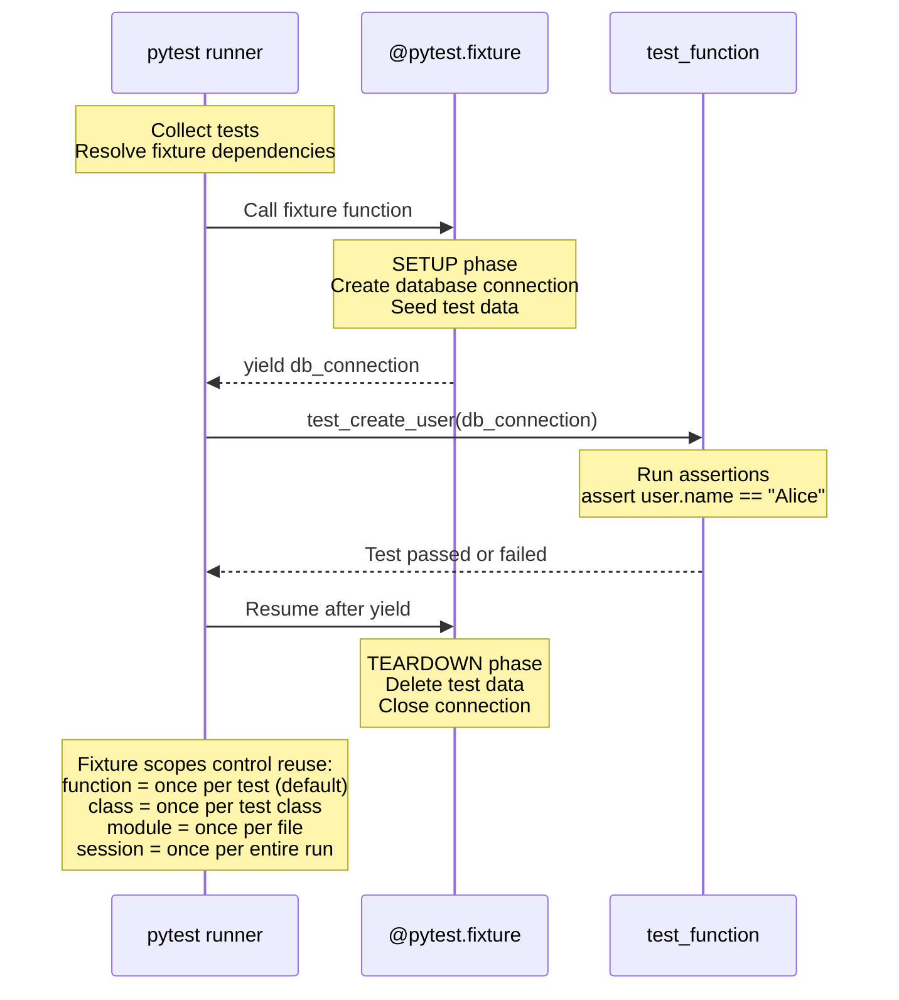

# Diagrams: Testing Strategies

[Back to concept](../testing-strategies.md)

---

## The Testing Pyramid

More unit tests at the base, fewer integration tests in the middle, and a small number of end-to-end tests at the top. The pyramid reflects speed, cost, and quantity.

## Test Types Compared

What each test type covers and how they differ in scope.

## TDD Cycle: Red-Green-Refactor

Test-Driven Development follows a strict cycle: write a failing test first, make it pass with minimal code, then clean up.

## Pytest Fixture Lifecycle

Fixtures provide test dependencies. They set up before the test and tear down after, with different scopes controlling how often.

