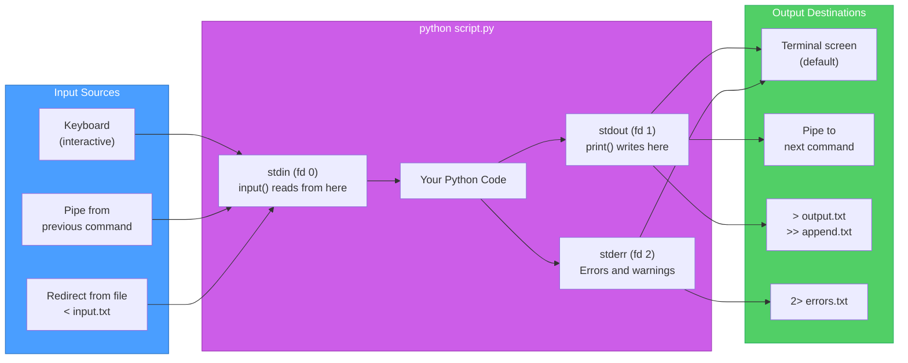
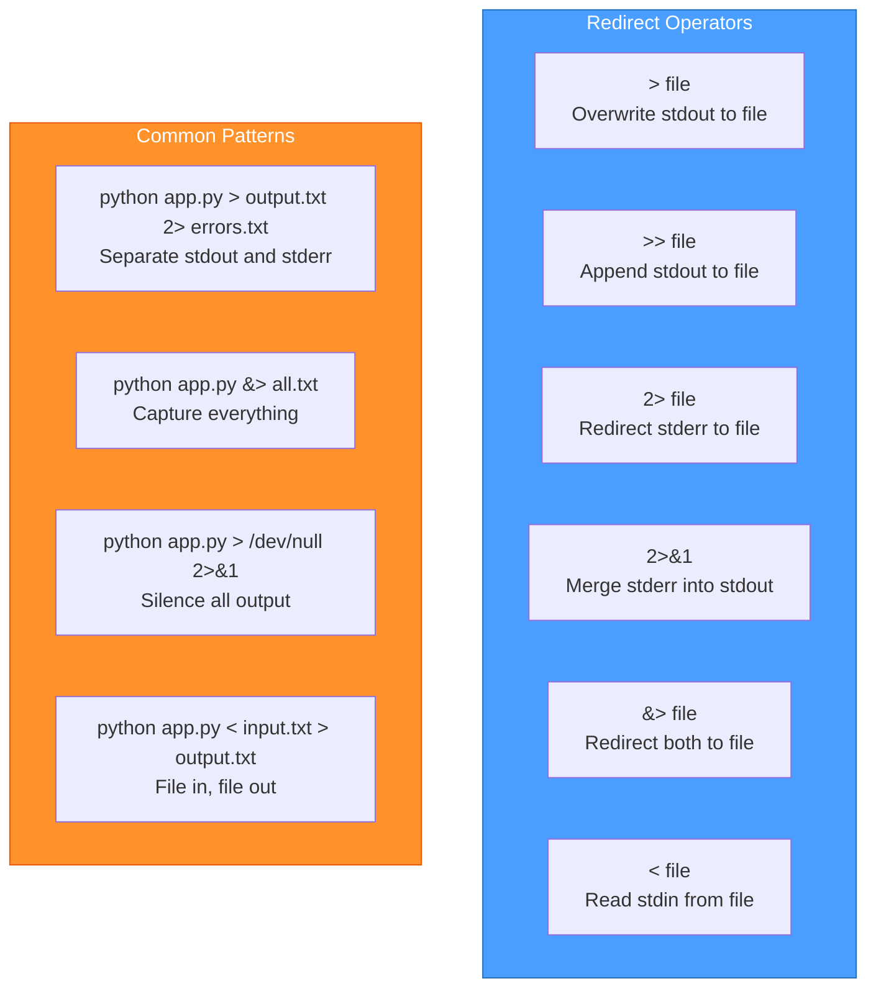

# Diagrams: The Terminal — Going Deeper

[Back to concept](../the-terminal-deeper.md)

---

## Shell Command Pipeline

The pipe `|` connects commands by routing one command's output into the next command's input. Each command runs as a separate process.

```mermaid
flowchart LR
    subgraph CMD1 ["cat access.log"]
        C1_OUT["stdout:<br/>every line of the file"]
    end

    subgraph CMD2 ["grep 'ERROR'"]
        C2_IN["stdin: all lines"]
        C2_WORK["Filter: keep only<br/>lines containing ERROR"]
        C2_OUT["stdout: error lines only"]
        C2_IN --> C2_WORK --> C2_OUT
    end

    subgraph CMD3 ["sort"]
        C3_IN["stdin: error lines"]
        C3_WORK["Sort alphabetically"]
        C3_OUT["stdout: sorted errors"]
        C3_IN --> C3_WORK --> C3_OUT
    end

    subgraph CMD4 ["uniq -c"]
        C4_IN["stdin: sorted errors"]
        C4_WORK["Count consecutive<br/>duplicate lines"]
        C4_OUT["stdout:<br/>3 ERROR timeout<br/>7 ERROR auth failed"]
        C4_IN --> C4_WORK --> C4_OUT
    end

    C1_OUT -->|"pipe"| C2_IN
    C2_OUT -->|"pipe"| C3_IN
    C3_OUT -->|"pipe"| C4_IN

    style CMD1 fill:#cc5de8,stroke:#9c36b5,color:#fff
    style CMD2 fill:#4a9eff,stroke:#2670c2,color:#fff
    style CMD3 fill:#ff922b,stroke:#e8590c,color:#fff
    style CMD4 fill:#51cf66,stroke:#27ae60,color:#fff
```

## Process I/O: stdin, stdout, stderr

Every process has three standard streams. Understanding these is essential for pipes, redirects, and debugging.

## Redirect Operators Cheat Sheet

How each redirect operator routes output to files or other commands.

## Command Chaining Logic

The operators `&&`, `||`, and `;` control whether the next command runs based on the previous command's success or failure.

```mermaid
flowchart TD
    CMD["Run Command A"] --> EXIT{"Exit code?"}

    EXIT -->|"0 (success)"| AND_THEN["&& Command B<br/>Runs only on SUCCESS"]
    EXIT -->|"non-zero (failure)"| OR_THEN["|| Command C<br/>Runs only on FAILURE"]
    EXIT -->|"any"| SEMI["&#59; Command D<br/>Runs REGARDLESS"]

    subgraph EXAMPLES_CHAIN ["Examples"]
        EX1["pytest && echo 'All passed!'<br/>Echo runs only if tests pass"]
        EX2["pytest || echo 'Tests failed!'<br/>Echo runs only if tests fail"]
        EX3["echo 'Start' ; pytest ; echo 'Done'<br/>All three always run"]
        EX4["mkdir build && cd build && cmake ..<br/>Each step depends on the previous"]
    end

    style AND_THEN fill:#51cf66,stroke:#27ae60,color:#fff
    style OR_THEN fill:#ff6b6b,stroke:#c92a2a,color:#fff
    style SEMI fill:#ffd43b,stroke:#f59f00,color:#000
    style EXAMPLES_CHAIN fill:#4a9eff,stroke:#2670c2,color:#fff
```

