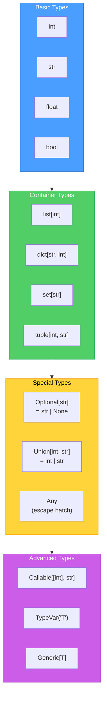
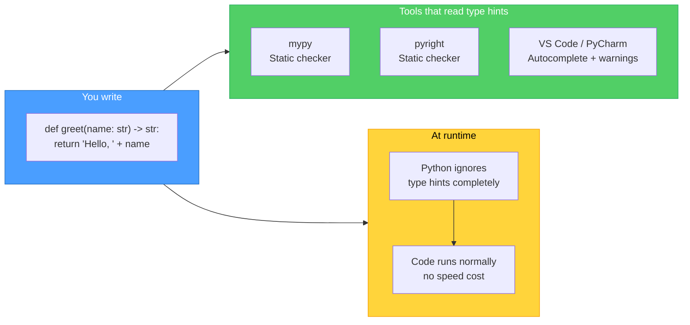
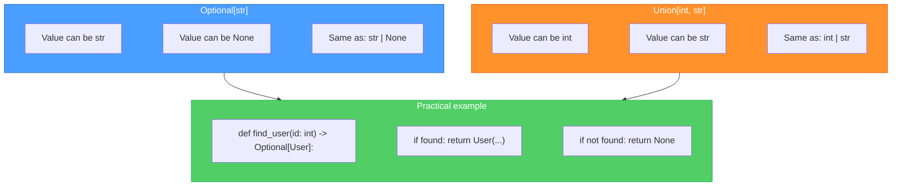
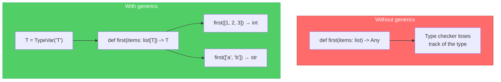

# Diagrams: Type Hints Explained

[Back to concept](../type-hints-explained.md)

---

## Type Annotation Hierarchy

Python's type system forms a hierarchy from simple types to complex generic types.

## How Type Checking Works

Type hints do not run at runtime. A separate tool (mypy, pyright) reads them and reports errors.

## Optional and Union: Handling Multiple Types

`Optional[X]` means "X or None". `Union[X, Y]` means "X or Y". Modern Python uses `|` syntax.

## Generics: Making Reusable Typed Code

Generics let you write functions and classes that work with any type while keeping type safety.

