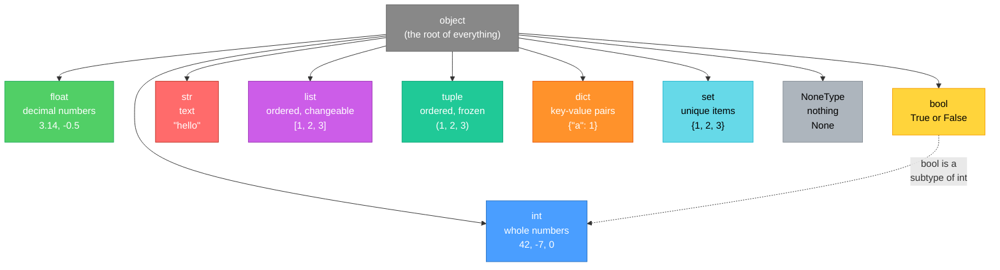
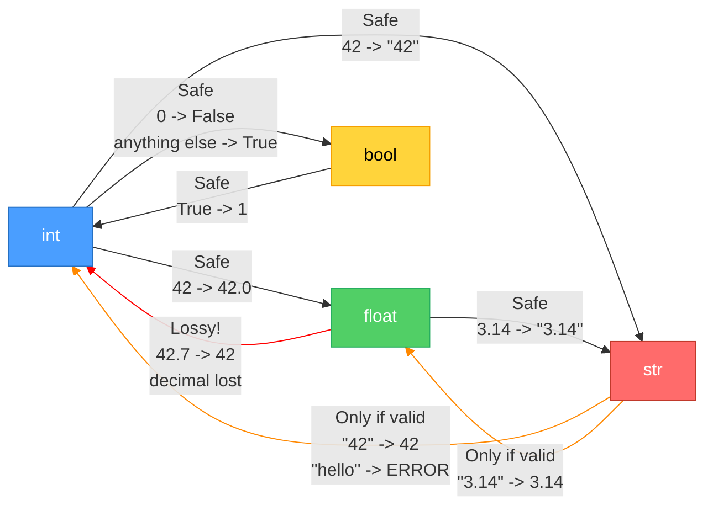
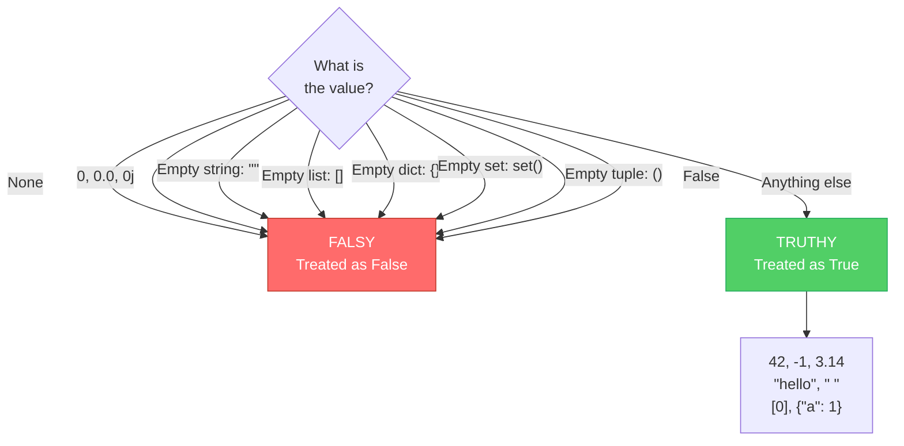

# Diagrams: Types and Conversions

[Back to concept](../types-and-conversions.md)

---

## Python Type Hierarchy

Everything in Python is an `object`. Here are the most common types.

## Type Conversion Paths

Some conversions are safe (no data lost). Others are lossy (information disappears).

## Truthy and Falsy Decision Tree

Python treats some values as `False` when used in `if` statements.

