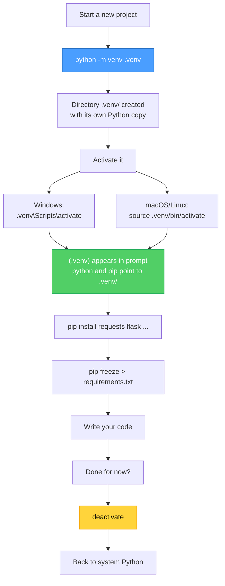
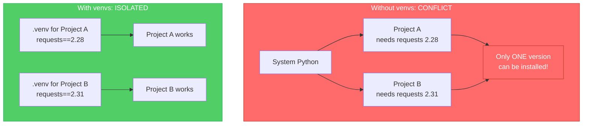

# Diagrams: Virtual Environments

[Back to concept](../virtual-environments.md)

---

## Virtual Environment Creation Flow

Creating and using a virtual environment follows a predictable lifecycle.

## Package Isolation: Why Virtual Environments Matter

Without venvs, all projects share the same packages. Version conflicts break things.

## Activate / Deactivate Lifecycle

Activating changes which `python` and `pip` your terminal uses. Deactivating restores the system default.

```mermaid
flowchart LR
    subgraph BEFORE ["Before activate"]
        B1["python → /usr/bin/python3"]
        B2["pip → /usr/bin/pip3"]
        B3["Packages: system-wide"]
    end

    subgraph DURING ["After activate"]
        D1["python → .venv/bin/python"]
        D2["pip → .venv/bin/pip"]
        D3["Packages: .venv/lib/ only"]
    end

    subgraph AFTER ["After deactivate"]
        A1["python → /usr/bin/python3"]
        A2["pip → /usr/bin/pip3"]
        A3["Back to system packages"]
    end

    BEFORE -->|"source .venv/bin/activate"| DURING
    DURING -->|"deactivate"| AFTER

    style BEFORE fill:#ffd43b,stroke:#f59f00,color:#000
    style DURING fill:#51cf66,stroke:#27ae60,color:#fff
    style AFTER fill:#ffd43b,stroke:#f59f00,color:#000
```

