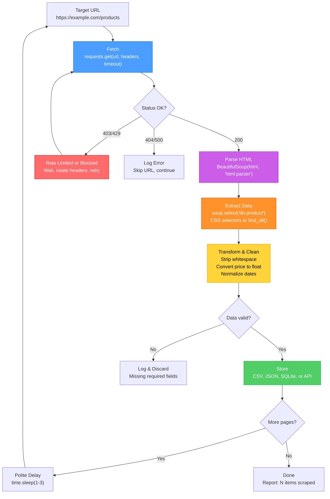
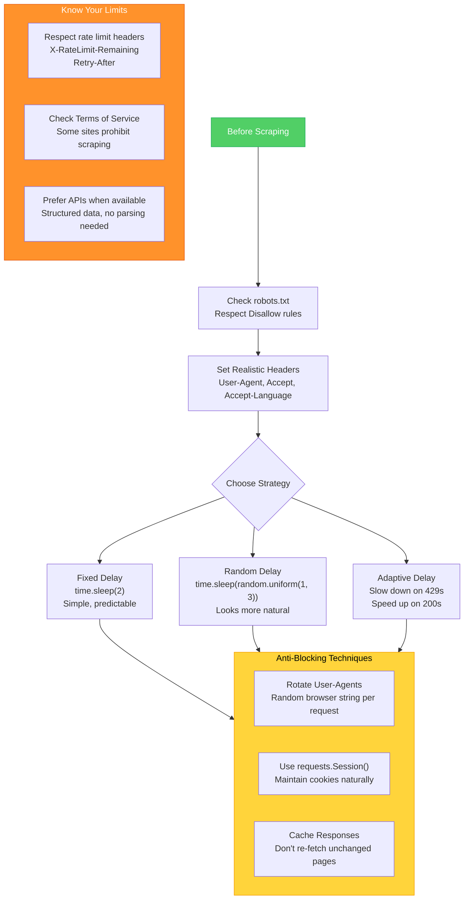
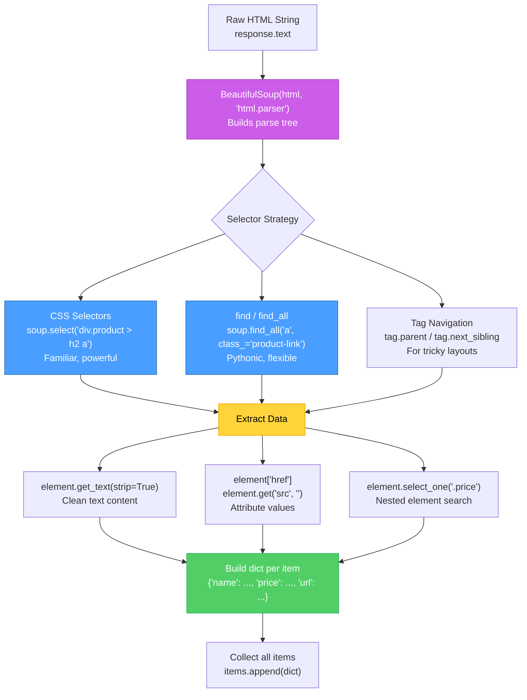

# Web Scraping Pipeline — Diagrams

[<- Back to Diagram Index](../../guides/DIAGRAM_INDEX.md)

## Overview

These diagrams trace the full web scraping workflow from fetching a page to storing structured data, including politeness strategies, error handling, and the parse-extract-transform pipeline.

## End-to-End Scraping Pipeline

A well-structured scraper separates fetching, parsing, extraction, transformation, and storage into distinct stages. Each stage has a clear responsibility and failure mode.

**Key points:**
- Always set a `timeout` on requests to avoid hanging forever on unresponsive servers
- Separate extraction (finding elements) from transformation (cleaning data) for clearer code
- Validate extracted data before storing: catch missing fields early
- Add delays between requests to avoid overwhelming the target server

## Politeness and Rate Limiting Strategy

Responsible scraping means respecting the server. These strategies prevent your scraper from being blocked and keep you on the right side of server policies.

**Key points:**
- Always check `robots.txt` before scraping (it tells you which paths are off-limits)
- Random delays between 1-3 seconds look more natural than fixed intervals
- Rotate User-Agent strings to reduce the chance of being fingerprinted
- If the site has a public API, use it instead of scraping HTML

## Parse and Extract: BeautifulSoup Workflow

The parsing stage turns raw HTML into a navigable tree. Understanding selector strategies helps you write resilient scrapers that survive minor page layout changes.

**Key points:**
- CSS selectors (`select`) are usually the cleanest approach for well-structured HTML
- `get_text(strip=True)` removes whitespace; `get('attr', default)` safely accesses attributes
- Build a dictionary per item, then collect into a list for easy CSV/JSON export
- Test selectors interactively in a Python shell before writing the full scraper

---

| [Back to Diagram Index](../../guides/DIAGRAM_INDEX.md) |
|:---:|
