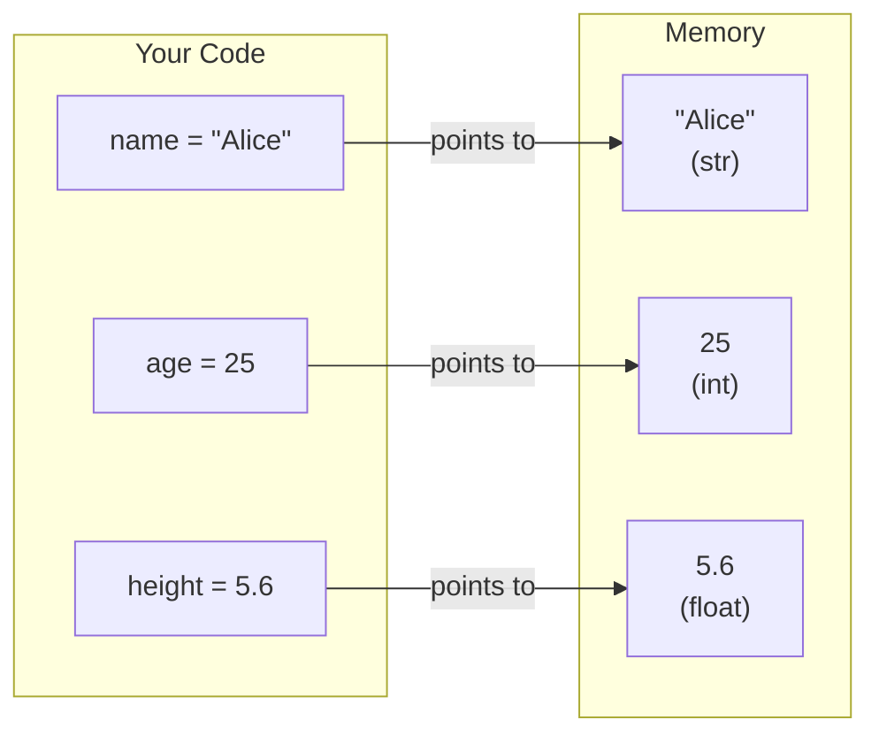
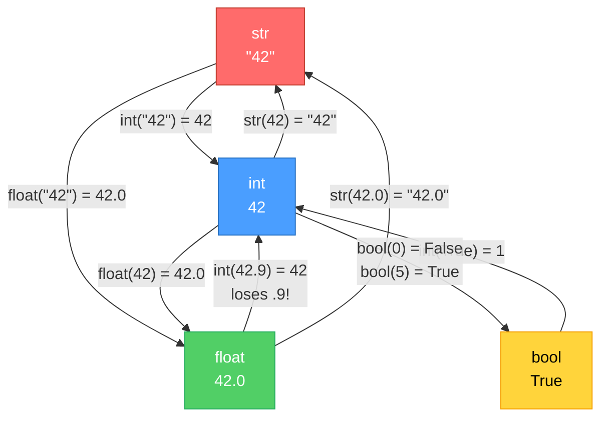
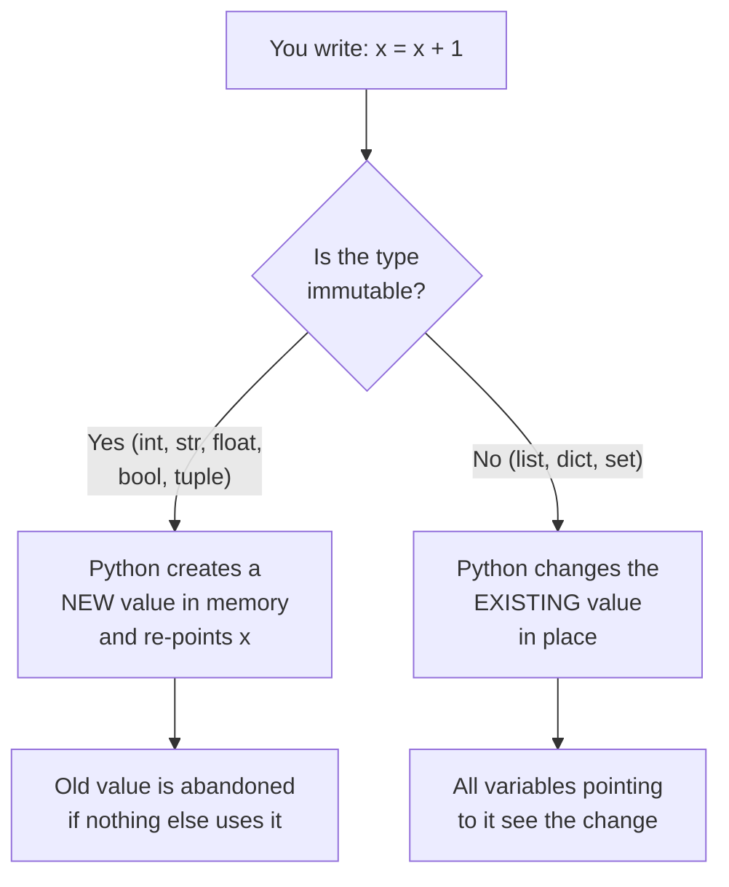

# Diagrams: What Is a Variable

[Back to concept](../what-is-a-variable.md)

---

## Variable as a Labeled Box

A variable is a **name** that points to a **value** stored in memory.



## Assignment vs Reassignment

When you reassign a variable, the label moves to a **new** value. The old value is discarded if nothing else points to it.

```mermaid
flowchart TD
    subgraph Step 1: x = 10
        A1["x"] -->|points to| B1["10"]
    end

    subgraph Step 2: x = 20
        A2["x"] -.->|old| B2["10 (abandoned)"]
        A2 -->|now points to| C2["20"]
    end

    subgraph Step 3: y = x
        A3["x"] -->|points to| D3["20"]
        B3["y"] -->|also points to| D3
    end

    Step_1_x_10 --> Step_2_x_20 --> Step_3_y_x

    style B2 fill:#888,stroke:#666,color:#fff
```

## Type Conversion Flowchart

Python can convert between types, but not every conversion works.



## When Does Python Create a New Value?


