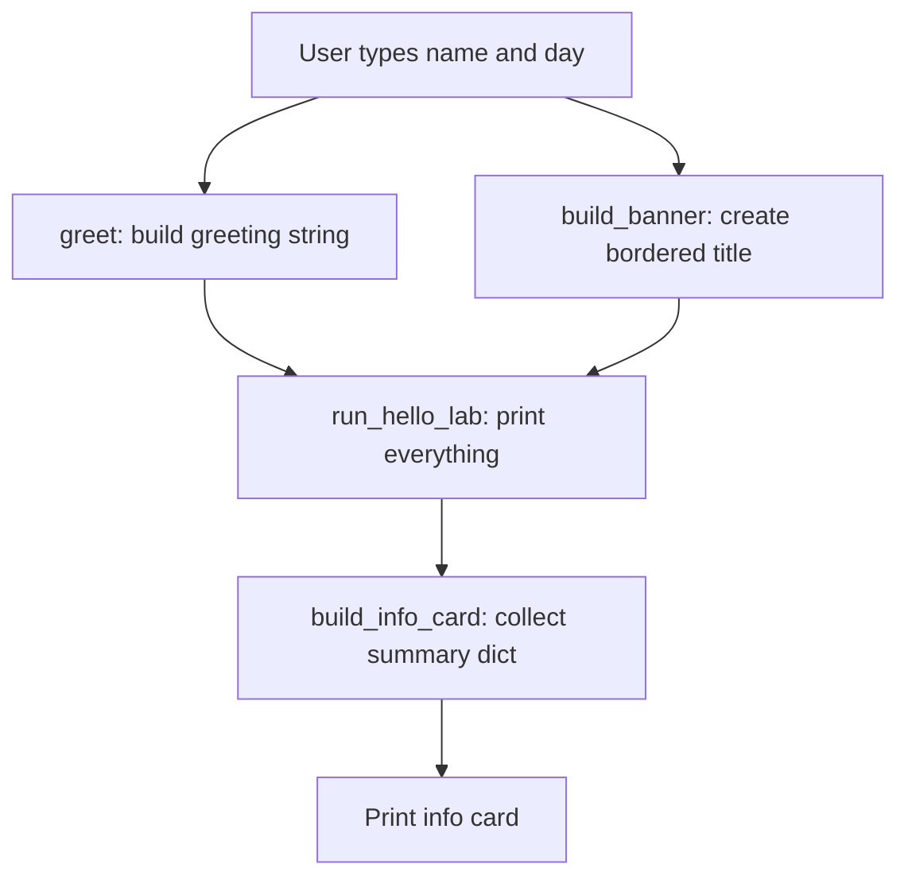

# Walkthrough: Terminal Hello Lab

> This guide walks through the **thinking process** for building this project.
> It does NOT give you the complete solution. For that, see [SOLUTION.md](./SOLUTION.md).

## Before reading this

**Try the project yourself first.** Spend at least 20 minutes.
If you have not tried yet, close this file and open the [project README](./README.md).

---

## Understanding the problem

You need to build a script that asks the user for their name and which day of their Python journey it is, then prints a decorated banner, a personalised greeting, a fun fact, and an info card. The key functions are `greet()`, `build_banner()`, `build_info_card()`, and `run_hello_lab()`.

This is your first project with **tests**. The functions must return values (not just print), so the tests can call them directly and check the output.

## Planning before code



Break the project into three independent building blocks, then one function that ties them together:

1. **greet()** -- take a name, return a greeting string
2. **build_banner()** -- take a title, return a bordered banner
3. **build_info_card()** -- take name/language/day, return a dictionary
4. **run_hello_lab()** -- call the above, print everything, return the info card

## Step 1: The greeting function

Start with the simplest piece. `greet()` takes a name and returns a string.

```python
def greet(name: str) -> str:
    return f"Hello, {name}! Welcome to Python."
```

The f-string `f"Hello, {name}!"` inserts the value of `name` into the text. This is cleaner than concatenation (`"Hello, " + name + "!"`).

### Predict before you scroll

What does `greet("Ada")` return? What about `greet("")`? Is an empty-name greeting a problem the tests will care about?

## Step 2: The banner function

The banner wraps a title in asterisks. You need:
- A top border (a line of `*` characters)
- The title, centred
- A bottom border

```python
def build_banner(title: str, width: int = 40) -> str:
    border = "*" * width
    centered_title = title.center(width)
    return f"{border}\n{centered_title}\n{border}"
```

Two things to notice:
- `"*" * width` repeats the `*` character `width` times. This is **string multiplication**.
- `.center(width)` pads the string with spaces on both sides so it sits in the middle.

### Predict before you scroll

If `width` is 40 and `title` is `"HI"`, how many spaces will appear before `"HI"` in the centred line?

## Step 3: The info card

This function collects facts into a dictionary. Dictionaries let you label data with keys instead of relying on position.

```python
def build_info_card(name: str, language: str, day: int) -> dict:
    return {
        "name": name,
        "language": language,
        "learning_day": day,
        "greeting": greet(name),  # reuses greet()!
    }
```

Notice that `build_info_card` calls `greet()` inside it. Functions can call other functions -- this is **composition**.

## Step 4: Tying it together

`run_hello_lab()` is the orchestrator. It calls the building blocks, prints output, and returns the info card.

```python
def run_hello_lab(name: str, day: int) -> dict:
    print(build_banner("TERMINAL HELLO LAB"))
    print()
    print(greet(name))
    print(f"\tDay {day} of your Python journey.")
    # ...
    return build_info_card(name, "Python", day)
```

The `\t` inside the f-string is a **tab character** -- it indents the text.

## Common mistakes

| Mistake | Why it happens | How to fix |
|---------|---------------|------------|
| `greet()` prints instead of returning | Confusing `print()` with `return` | `print()` shows text on screen; `return` sends data back to the caller. Tests need `return`. |
| Banner width is wrong | Forgetting that `.center()` pads to a total width, not adds that much padding | `.center(40)` makes the whole string 40 characters wide |
| `int(input(...))` crashes on non-numbers | The user typed letters instead of a number | Wrap in `try/except ValueError` or check `.isdigit()` first |
| Forgetting `if __name__ == "__main__"` | Not understanding the guard | Without it, the `input()` calls run when tests import the file |

## Testing your solution

Run the tests from the project directory:

```bash
pytest -q
```

The five tests check:
- `greet("Ada")` contains "Ada" and "Hello"
- `greet()` works for multiple different names
- `build_banner("MY TITLE")` contains the title and has 3 lines
- `build_banner("HI", width=20)` produces borders exactly 20 characters wide
- `build_info_card("Test", "Python", 5)` returns a dict with all expected keys

If a test fails, read the assertion error carefully -- it tells you what value it expected vs. what it got.

## What to explore next

1. Add a `build_greeting_box()` function that wraps the greeting in a box made of `+`, `-`, and `|` characters
2. Add input validation: what should happen if the user types nothing for their name, or letters for the day number?
