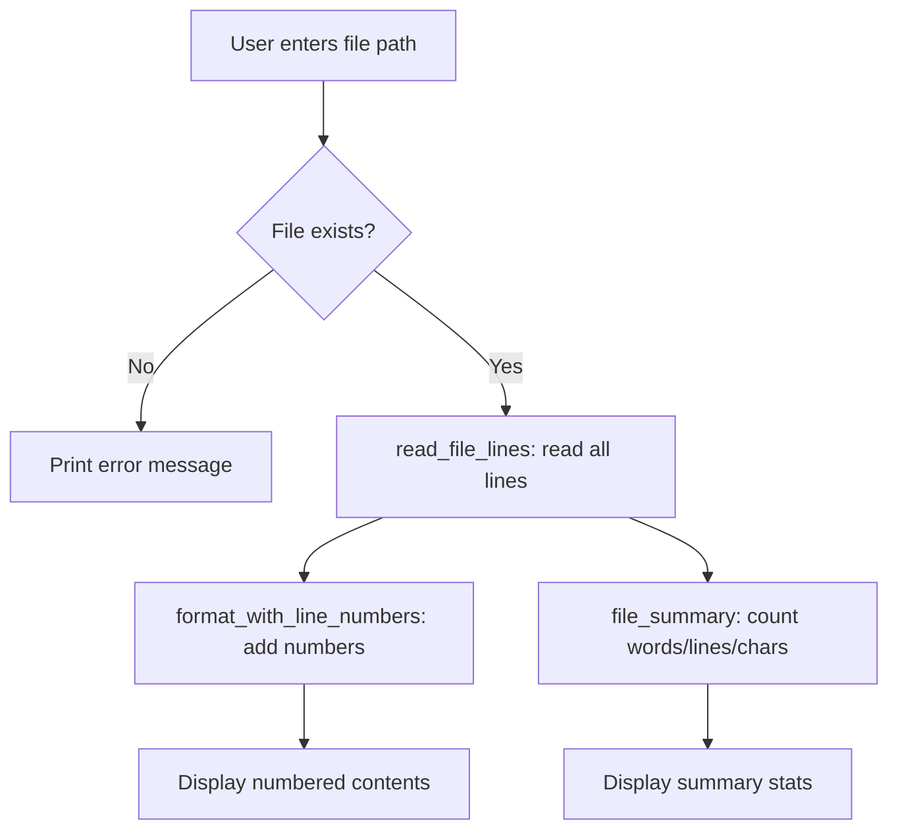

# Walkthrough: First File Reader

> This guide walks through the **thinking process** for building this project.
> It does NOT give you the complete solution. For that, see [SOLUTION.md](./SOLUTION.md).

## Before reading this

**Try the project yourself first.** Spend at least 20 minutes.
If you have not tried yet, close this file and open the [project README](./README.md).

---

## Understanding the problem

You need to build a program that reads a text file, displays its contents with line numbers, and prints a summary (line count, word count, character count, non-empty lines). The program asks the user for a file path and handles the case where the file does not exist.

This is your first encounter with **file I/O** -- reading data from a file on disk instead of from user input.

## Planning before code



Three independent functions, plus error handling:

1. **read_file_lines()** -- open a file, return a list of lines
2. **format_with_line_numbers()** -- take lines, add line numbers
3. **file_summary()** -- count lines, words, characters
4. **Main block** -- ask for path, handle errors, display output

## Step 1: Reading lines from a file

The fundamental pattern for reading a file in Python:

```python
def read_file_lines(filepath: str) -> list:
    with open(filepath, encoding="utf-8") as f:
        return f.read().splitlines()
```

Two important things here:

- **`with open(...) as f`** opens the file and guarantees it gets closed when you are done, even if an error occurs. Always use `with` for files.
- **`.splitlines()`** splits the text on newline characters and returns a list. Unlike `.split("\n")`, it does not leave an extra empty string at the end if the file ends with a newline.

### Predict before you scroll

If `sample_input.txt` contains three lines (one blank), how many items will the returned list have? Will the blank line be included or skipped?

## Step 2: Adding line numbers

You want output like:

```
  1 | Welcome to your first file reader!
  2 |
  3 | This file has several lines of text.
```

The `enumerate()` function gives you both the index and the value as you loop:

```python
def format_with_line_numbers(lines: list) -> str:
    if not lines:
        return "(empty file)"

    width = len(str(len(lines)))  # how many digits for the biggest line number

    numbered = []
    for i, line in enumerate(lines, start=1):
        numbered.append(f"  {i:>{width}} | {line}")

    return "\n".join(numbered)
```

The key trick is `f"{i:>{width}}"`. The `:>` means right-align, and `width` is how many characters wide to make the number. For a 100-line file, `width` would be 3, so line 1 displays as `  1` and line 100 displays as `100`.

### Predict before you scroll

Why does the function handle the empty-lines case separately at the top? What would go wrong if `lines` were an empty list and you tried to calculate `width`?

## Step 3: Building the summary

The summary counts several things about the file:

```python
def file_summary(filepath: str, lines: list) -> dict:
    text = "\n".join(lines)
    word_count = len(text.split())

    name = filepath.replace("\\", "/").split("/")[-1]

    return {
        "file_name": name,
        "lines": len(lines),
        "words": word_count,
        "characters": len(text),
        "non_empty_lines": sum(1 for line in lines if line.strip()),
    }
```

Notice the last line: `sum(1 for line in lines if line.strip())`. This is a **generator expression** that counts only lines that are not blank. `line.strip()` removes whitespace -- if what is left is an empty string, it is falsy, so the condition filters it out.

## Step 4: Handling missing files

In the main block, wrap the file reading in `try/except`:

```python
try:
    lines = read_file_lines(filepath)
except FileNotFoundError:
    print(f"  File not found: {filepath}")
```

This prevents the program from crashing with an ugly traceback when the user types a wrong path.

## Common mistakes

| Mistake | Why it happens | How to fix |
|---------|---------------|------------|
| Using `f.readlines()` instead of `f.read().splitlines()` | Both read lines, but `readlines()` keeps the `\n` at the end of each line | Use `.read().splitlines()` for clean lines without trailing newlines |
| Line numbers start at 0 | `enumerate()` defaults to `start=0` | Pass `start=1` to `enumerate()` |
| Word count is wrong | Splitting on just `" "` misses tabs and multiple spaces | Use `.split()` with no argument -- it splits on any whitespace |
| Crash on empty file | Dividing by zero or formatting empty data | Check `if not lines` at the start and return early |

## Testing your solution

Run the tests from the project directory:

```bash
pytest -q
```

The five tests check:
- Reading a simple 3-line file returns the correct lines
- Reading a missing file raises `FileNotFoundError`
- `format_with_line_numbers()` adds correct line numbers
- An empty file produces the `"(empty file)"` message
- `file_summary()` returns correct line and word counts

## What to explore next

1. Add a feature that asks the user for start and end line numbers, then displays only that range
2. After showing the summary, ask "Read another file? (y/n):" and loop if yes
