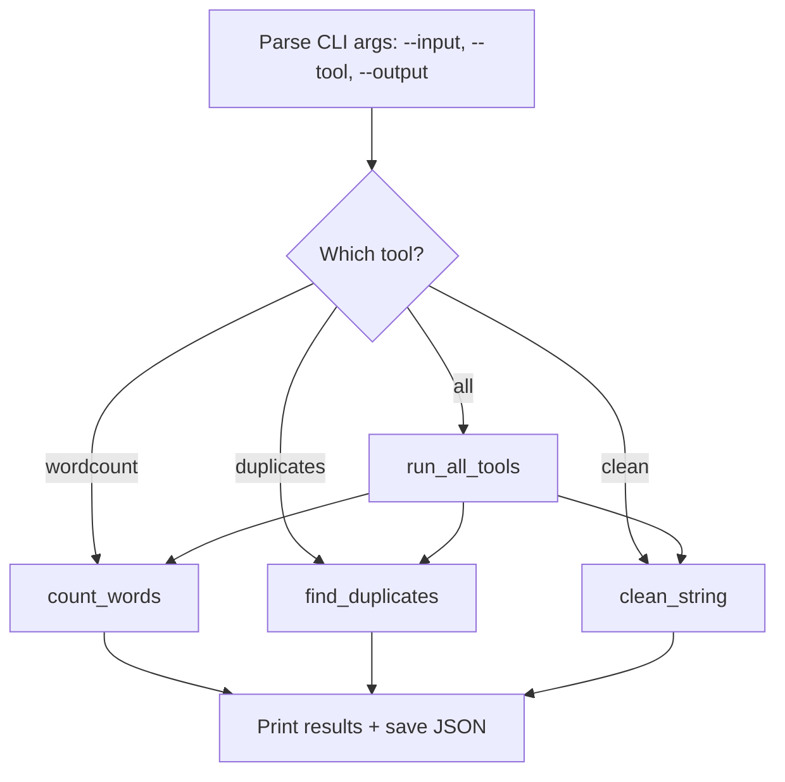

# Walkthrough: Level 0 Mini Toolkit

> This guide walks through the **thinking process** for building this project.
> It does NOT give you the complete solution. For that, see [SOLUTION.md](./SOLUTION.md).

## Before reading this

**Try the project yourself first.** Spend at least 20 minutes.
If you have not tried yet, close this file and open the [project README](./README.md).

---

## Understanding the problem

You need to build a multi-tool command-line script that combines three text utilities into one program:

1. **Word Counter** -- count words, lines, and characters
2. **Duplicate Finder** -- find lines that appear more than once
3. **String Cleaner** -- strip, lowercase, and remove non-alphanumeric characters

The user picks a tool with the `--tool` flag (or runs all three with `--tool all`). Results are printed and saved to a JSON file.

This is the Level 0 capstone -- it shows how small, focused functions compose into a larger program.

## Planning before code



Four pieces to build:

1. **Three tool functions** -- each takes text, returns results
2. **A dispatcher** -- routes the `--tool` argument to the right function
3. **An "all" mode** -- runs every tool and collects results
4. **CLI + file I/O** -- parse arguments, read input file, write output JSON

## Step 1: Word Counter

The simplest tool. Split text into words, lines, and count them.

```python
def count_words(text: str) -> dict:
    words = text.split()
    lines = text.splitlines()
    return {
        "words": len(words),
        "lines": len(lines),
        "characters": len(text),
    }
```

`.split()` with no arguments splits on any whitespace (spaces, tabs, newlines) and ignores leading/trailing whitespace. `.splitlines()` splits on newline characters specifically.

### Predict before you scroll

If the text is `"hello world\ngoodbye world"`, how many words, lines, and characters does this return?

## Step 2: Duplicate Finder

This tool finds lines that appear more than once. The strategy: use a dictionary to count how many times each line appears.

```python
def find_duplicates(lines: list[str]) -> list[dict]:
    counts = {}
    for line in lines:
        stripped = line.strip()
        if not stripped:
            continue
        if stripped in counts:
            counts[stripped] += 1
        else:
            counts[stripped] = 1

    return [
        {"text": text, "count": count}
        for text, count in counts.items()
        if count > 1
    ]
```

The pattern here is **count-then-filter**:
1. Loop through all lines and count occurrences in a dictionary
2. Build a list of only the entries where `count > 1`

### Predict before you scroll

If a file has the same line three times, what will the `count` value be for that line in the result?

## Step 3: String Cleaner

This tool normalises text by stripping whitespace, lowercasing, and removing non-alphanumeric characters.

```python
def clean_string(text: str) -> str:
    result = text.strip().lower()
    cleaned = []
    for char in result:
        if char.isalnum() or char == " ":
            cleaned.append(char)
    return "".join(cleaned)
```

The approach is a **character filter**: loop through every character, keep it only if it is a letter, a digit, or a space. Then join the kept characters back into a string.

## Step 4: The dispatcher

The dispatcher routes a tool name to the right function. This is a fundamental pattern in programming.

```python
def run_tool(tool_name: str, text: str) -> dict:
    if tool_name == "wordcount":
        return {"tool": "wordcount", "result": count_words(text)}
    elif tool_name == "duplicates":
        lines = text.splitlines()
        return {"tool": "duplicates", "result": find_duplicates(lines)}
    elif tool_name == "clean":
        lines = text.splitlines()
        cleaned = [clean_string(line) for line in lines if line.strip()]
        return {"tool": "clean", "result": cleaned}
    else:
        return {"tool": tool_name, "error": f"Unknown tool: {tool_name}"}
```

### Predict before you scroll

What happens if someone passes `--tool unknown_tool`? Does the current code crash, or does it handle it?

## Common mistakes

| Mistake | Why it happens | How to fix |
|---------|---------------|------------|
| `text.split(" ")` gives wrong word count | Splitting on `" "` creates empty strings for multiple spaces | Use `.split()` with no argument |
| Duplicate finder counts blank lines | Empty lines are not meaningful duplicates | Skip lines where `stripped` is empty |
| Clean function collapses into no spaces | Removing all non-alphanumeric removes spaces too | Keep spaces by checking `char == " "` separately |
| JSON output crashes | Trying to serialise something JSON does not support | Make sure all results are dicts, lists, strings, or numbers |

## Testing your solution

Run the tests from the project directory:

```bash
pytest -q
```

The tests check:
- `count_words()` returns correct counts
- `find_duplicates()` identifies repeated lines
- `clean_string()` normalises text correctly
- `run_tool()` dispatches to the correct tool
- `run_all_tools()` runs all three and returns combined results

You can also test manually:

```bash
python project.py --input data/sample_input.txt --tool wordcount
python project.py --input data/sample_input.txt --tool duplicates
python project.py --input data/sample_input.txt --tool all
```

## What to explore next

1. Add a fourth tool: "reverse" that reverses the order of lines in the file
2. Handle the unknown-tool case by raising a `ValueError` with a message listing valid tool names
