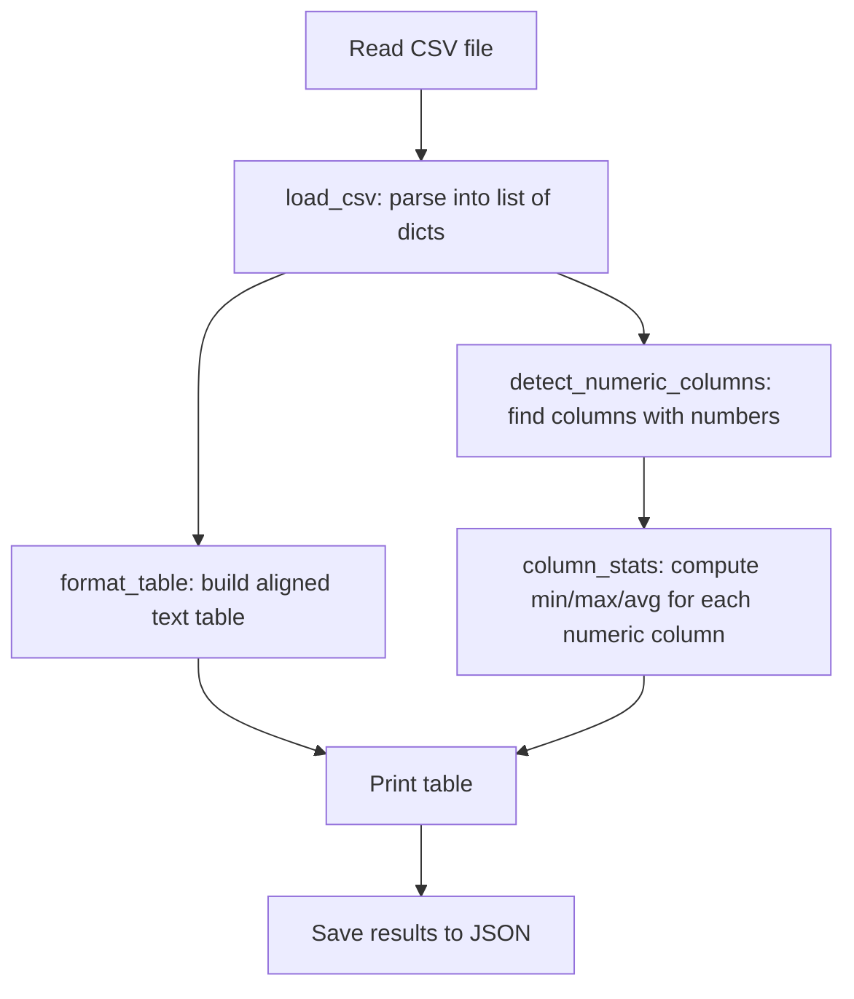

# Walkthrough: CSV First Reader

> This guide walks through the **thinking process** for building this project.
> It does NOT give you the complete solution. For that, see [SOLUTION.md](./SOLUTION.md).

## Before reading this

**Try the project yourself first.** Spend at least 20 minutes.
If you have not tried yet, close this file and open the [project README](./README.md).

---

## Understanding the problem

You need to build a program that reads a CSV (comma-separated values) file, displays the data as a nicely formatted text table, and computes statistics for any columns that contain numbers. The program should auto-detect which columns are numeric.

A CSV file is structured tabular data where the first line is the header (column names) and each subsequent line is a data row:

```
name,department,salary,years
Alice Johnson,Engineering,85000,5
Bob Smith,Marketing,62000,3
```

## Planning before code



Four functions to build:

1. **load_csv()** -- read the file using `csv.DictReader`, return a list of dicts
2. **detect_numeric_columns()** -- figure out which columns contain numbers
3. **column_stats()** -- compute min, max, sum, average for a numeric column
4. **format_table()** -- display the data as an aligned text table

## Step 1: Loading CSV data

Python's `csv` module has a `DictReader` class that automatically uses the first row as dictionary keys:

```python
import csv
from pathlib import Path

def load_csv(path: Path) -> list[dict]:
    rows = []
    with open(path, encoding="utf-8", newline="") as f:
        reader = csv.DictReader(f)
        for row in reader:
            rows.append(row)
    return rows
```

After this, each row is a dictionary like `{"name": "Alice Johnson", "department": "Engineering", "salary": "85000", "years": "5"}`.

Important: all values come back as **strings**, even numbers. The string `"85000"` is not the number `85000` -- you need to convert it later.

### Predict before you scroll

Why use `csv.DictReader` instead of just splitting each line on commas? Think about what happens if a value itself contains a comma, like `"Smith, Jr."`.

## Step 2: Detecting numeric columns

Not all columns can be averaged. You need to check whether every (non-empty) value in a column can be converted to a number:

```python
def detect_numeric_columns(rows: list[dict]) -> list[str]:
    if not rows:
        return []

    columns = list(rows[0].keys())
    numeric = []

    for col in columns:
        is_numeric = True
        for row in rows:
            value = row[col].strip()
            if not value:
                continue  # skip empty cells
            try:
                float(value)
            except ValueError:
                is_numeric = False
                break
        if is_numeric:
            numeric.append(col)

    return numeric
```

The strategy is **try-and-fail**: attempt to convert each value to a `float`. If any value in the column raises a `ValueError`, that column is not numeric.

### Predict before you scroll

If a column has values `["10", "20", "N/A", "30"]`, would `detect_numeric_columns` classify it as numeric or text? Why?

## Step 3: Computing column statistics

Once you know which columns are numeric, calculate stats for each:

```python
def column_stats(rows: list[dict], column: str) -> dict:
    values = []
    for row in rows:
        val = row[column].strip()
        if val:
            values.append(float(val))

    if not values:
        return {"column": column, "count": 0}

    return {
        "column": column,
        "count": len(values),
        "min": min(values),
        "max": max(values),
        "sum": round(sum(values), 2),
        "average": round(sum(values) / len(values), 2),
    }
```

The guard `if not values` prevents a division-by-zero crash if a column has no parseable numbers.

## Step 4: Formatting the table

The table needs aligned columns. The approach: decide on a maximum cell width, pad shorter values with spaces, and truncate longer values.

```python
def format_table(rows: list[dict], max_width: int = 15) -> str:
    if not rows:
        return "(empty table)"

    headers = list(rows[0].keys())

    def truncate(val: str) -> str:
        if len(val) > max_width:
            return val[:max_width - 3] + "..."
        return val

    header_line = "  ".join(truncate(h).ljust(max_width) for h in headers)
    separator = "  ".join("-" * max_width for _ in headers)

    lines = [header_line, separator]
    for row in rows:
        cells = [truncate(row.get(h, "")).ljust(max_width) for h in headers]
        lines.append("  ".join(cells))

    return "\n".join(lines)
```

Two string methods do the heavy lifting:
- `.ljust(width)` pads a string with spaces on the right to make it `width` characters
- Truncation replaces the end of long strings with `...`

## Common mistakes

| Mistake | Why it happens | How to fix |
|---------|---------------|------------|
| Splitting on commas manually instead of using `csv` module | Seems simpler | Breaks on quoted values like `"Smith, Jr."` -- always use the `csv` module |
| Treating all columns as numeric | Forgetting that `float("Alice")` crashes | Detect numeric columns first with try/except |
| `column_stats` crashes on empty data | Dividing by zero when no values exist | Check `if not values` and return early |
| Table columns misaligned | Not accounting for different value lengths | Use `.ljust()` to pad every cell to the same width |

## Testing your solution

Run the tests from the project directory:

```bash
pytest -q
```

The tests verify:
- `load_csv()` returns the correct number of rows as dicts
- `detect_numeric_columns()` correctly identifies numeric vs text columns
- `column_stats()` computes accurate statistics
- `format_table()` produces aligned output with headers

You can also test manually with the sample data:

```bash
python project.py --input data/sample_input.txt
```

## What to explore next

1. Add a `--columns` flag that lets the user select which columns to display (comma-separated names)
2. Add row numbering to the formatted table so the user can reference specific rows
