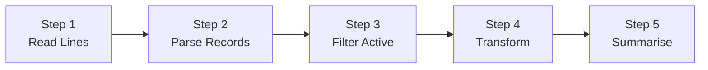
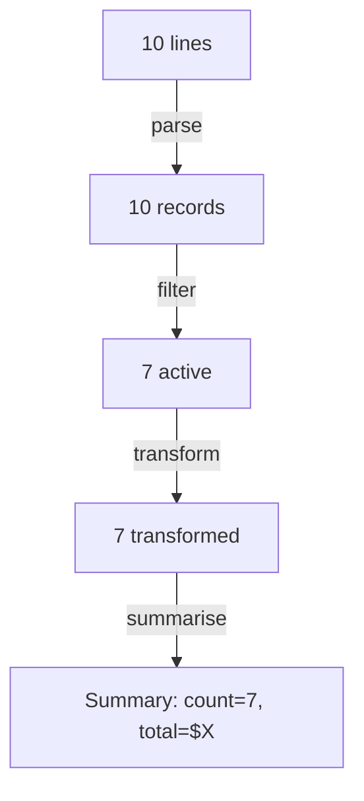

# Walkthrough: Level 1 Mini Automation

> This guide walks through the **thinking process** for building this project.
> It does NOT give you the complete solution. For that, see [SOLUTION.md](./SOLUTION.md).

## Before reading this

**Try the project yourself first.** Spend at least 20 minutes.
If you have not tried yet, close this file and open the [project README](./README.md).

---

## Understanding the problem

You need to build a multi-step data pipeline that reads pipe-delimited records from a file, filters out inactive ones, transforms the data, and produces a summary report. This is a simplified version of an ETL (Extract-Transform-Load) workflow -- the kind of automation that runs behind the scenes in every data-driven company.

The input file looks like:

```
alice johnson | active | 150.00
bob smith | failed | 75.50
carol white | ok | 200.00
```

Each line has three fields separated by `|`: name, status, and value.

## Planning before code



The **pipeline pattern**: each step takes data in, processes it, and passes results to the next step. Five steps, five functions:

1. **step_read_lines()** -- read and clean lines from the file
2. **step_parse_records()** -- split pipe-delimited lines into dicts
3. **step_filter_active()** -- keep only records with active-like statuses
4. **step_transform()** -- normalise names, parse numeric values
5. **step_summarise()** -- aggregate totals and averages

Plus an orchestrator function `run_pipeline()` that calls them in sequence.

## Step 1: Read and clean lines

```python
def step_read_lines(path: Path) -> list[str]:
    raw = path.read_text(encoding="utf-8").splitlines()
    return [line.strip() for line in raw if line.strip()]
```

This reads the file, splits into lines, strips whitespace, and filters out blank lines. The list comprehension does three things in one line -- but each is simple:
- `line.strip()` removes leading/trailing spaces
- `if line.strip()` skips blank lines
- The result is a clean list

## Step 2: Parse records

Each line is pipe-delimited. Split on `|` and build a dictionary:

```python
def step_parse_records(lines: list[str]) -> list[dict[str, str]]:
    records = []
    for line in lines:
        parts = [p.strip() for p in line.split("|")]
        if len(parts) < 3:
            continue  # skip malformed lines
        records.append({
            "name": parts[0],
            "status": parts[1].lower(),
            "value": parts[2],
        })
    return records
```

### Predict before you scroll

Why does the code check `len(parts) < 3`? What would happen if a line had only one `|` separator?

## Step 3: Filter active records

Not all records should be processed. Filter down to ones with "active", "ok", "pass", or "success" statuses:

```python
def step_filter_active(records: list[dict]) -> list[dict]:
    active_statuses = {"active", "ok", "pass", "success"}
    return [r for r in records if r["status"] in active_statuses]
```

Using a **set** for `active_statuses` is intentional: checking `if x in some_set` is faster than `if x in some_list` because sets use hashing. For a small list it does not matter much, but it is a good habit.

### Predict before you scroll

Looking at the sample data, which records have statuses that will pass the filter? How many of the 10 records will survive?

## Step 4: Transform records

Raw data rarely matches the format you need. Transform names to title case and values to floats:

```python
def step_transform(records: list[dict]) -> list[dict]:
    transformed = []
    for r in records:
        name = r["name"].strip().title()
        try:
            value = float(r["value"])
        except ValueError:
            value = 0.0
        transformed.append({"name": name, "status": r["status"], "value": value})
    return transformed
```

The `try/except ValueError` is a safety net: if a value is not a valid number (like `"N/A"`), use `0.0` instead of crashing.

## Step 5: Summarise

The final step produces aggregate statistics:

```python
def step_summarise(records: list[dict]) -> dict:
    if not records:
        return {"count": 0, "total_value": 0.0, "average_value": 0.0, "names": []}

    values = [r["value"] for r in records]
    total = round(sum(values), 2)
    return {
        "count": len(records),
        "total_value": total,
        "average_value": round(total / len(records), 2),
        "names": [r["name"] for r in records],
    }
```

The guard at the top prevents division by zero if all records were filtered out.

## The orchestrator

`run_pipeline()` calls each step in sequence and tracks counts at each stage:

```python
def run_pipeline(input_path: Path) -> dict:
    lines = step_read_lines(input_path)
    records = step_parse_records(lines)
    active = step_filter_active(records)
    transformed = step_transform(active)
    summary = step_summarise(transformed)

    return {
        "total_lines": len(lines),
        "parsed_records": len(records),
        "active_records": len(active),
        "summary": summary,
    }
```



Tracking the count at each stage is a **debugging aid**: if the final count looks wrong, you can see exactly where records were lost.

## Common mistakes

| Mistake | Why it happens | How to fix |
|---------|---------------|------------|
| `line.split("|")` leaves extra whitespace | `"alice | active"` splits to `"alice "` and `" active"` | Strip each part: `[p.strip() for p in line.split("|")]` |
| Division by zero in summarise | All records were filtered out (none were "active") | Check `if not records` at the start |
| Non-numeric value crashes `float()` | Data is messy -- not all values are numbers | Wrap in `try/except ValueError`, default to `0.0` |
| Pipeline order is wrong | Transforming before filtering, or summarising before transforming | Follow the logical sequence: read, parse, filter, transform, summarise |

## Testing your solution

Run the tests from the project directory:

```bash
pytest -q
```

The eight tests verify each step individually and the pipeline as a whole:
- `step_parse_records()` correctly splits pipe-delimited lines
- `step_filter_active()` keeps only active/ok/pass/success records
- `step_transform()` normalises names and parses values
- `step_summarise()` computes correct totals
- `run_pipeline()` chains everything together correctly

## What to explore next

1. Add a Step 6: `step_export_csv()` that writes the active, transformed records to a CSV file
2. Add a `--verbose` flag that prints the intermediate result of each pipeline step as it executes
