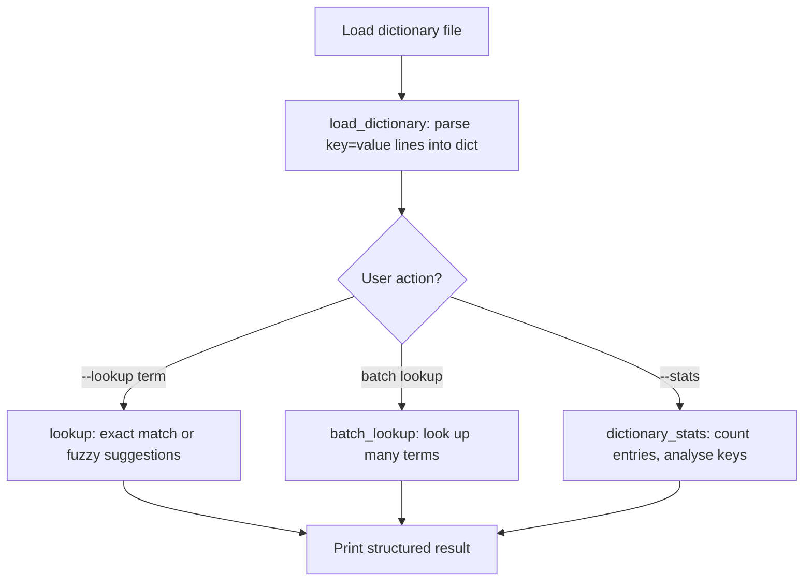

# Walkthrough: Dictionary Lookup Service

> This guide walks through the **thinking process** for building this project.
> It does NOT give you the complete solution. For that, see [SOLUTION.md](./SOLUTION.md).

## Before reading this

**Try the project yourself first.** Spend at least 20 minutes.
If you have not tried yet, close this file and open the [project README](./README.md).

---

## Understanding the problem

You need to build a dictionary lookup tool that loads `key=value` pairs from a file, looks up terms (case-insensitively), and suggests close matches when a term is not found. It also provides statistics about the dictionary. Think of it like a simplified spell-check-enabled glossary.

The dictionary file looks like:

```
python=A high-level programming language
javascript=A language for web development
html=HyperText Markup Language
```

## Planning before code



Four functions to build:

1. **load_dictionary()** -- parse a file of `key=value` lines into a Python dict
2. **lookup()** -- search for a term with fuzzy matching fallback
3. **batch_lookup()** -- look up multiple terms at once
4. **dictionary_stats()** -- compute summary statistics about the dictionary

## Step 1: Loading the dictionary

The file has one entry per line in `key=value` format. Parse it into a Python dictionary using a dict comprehension:

```python
def load_dictionary(path: Path) -> dict[str, str]:
    raw = path.read_text(encoding="utf-8").splitlines()

    entries = {
        parts[0].strip().lower(): parts[1].strip()
        for line in raw
        if "=" in line
        for parts in [line.split("=", 1)]
    }
    return entries
```

Three details to notice:

- **`line.split("=", 1)`** splits on the **first** `=` only. This is critical because definitions might contain `=` signs (like `formula=E=mc2`). Without `maxsplit=1`, that would break into three parts.
- **`.lower()` on keys** makes lookups case-insensitive. "Python", "python", and "PYTHON" all map to the same entry.
- **`if "=" in line`** skips lines that do not have an `=`, like blank lines or comments.

### Predict before you scroll

If the file has two lines with the same key (e.g., `python=...` appears twice), which definition ends up in the dictionary? The first one or the last one?

## Step 2: Looking up a term

The lookup function has two paths: exact match (the happy path) and fuzzy match (the fallback).

```python
import difflib

def lookup(dictionary: dict[str, str], term: str) -> dict:
    normalised = term.strip().lower()

    try:
        definition = dictionary[normalised]
        return {
            "found": True,
            "term": normalised,
            "definition": definition,
            "suggestions": [],
        }
    except KeyError:
        suggestions = difflib.get_close_matches(
            normalised, dictionary.keys(), n=3, cutoff=0.6
        )
        return {
            "found": False,
            "term": normalised,
            "definition": None,
            "suggestions": suggestions,
        }
```

The function uses `try/except KeyError` instead of `if term in dictionary`. Both work, but `try/except` is considered more "Pythonic" when you expect the key to exist most of the time. This is the **EAFP** pattern (Easier to Ask Forgiveness than Permission).

**`difflib.get_close_matches`** uses sequence matching to find similar strings. The `cutoff=0.6` means a match must be at least 60% similar. The `n=3` limits results to the three best matches.

### Predict before you scroll

If the dictionary contains "python" and the user searches for "pythn" (a typo), will `get_close_matches` find it? What if they search for "xyz"?

## Step 3: Batch lookup

Looking up multiple terms is a thin wrapper around `lookup()`:

```python
def batch_lookup(dictionary: dict[str, str], terms: list[str]) -> list[dict]:
    results = []
    for idx, term in enumerate(terms):
        result = lookup(dictionary, term)
        result["index"] = idx
        results.append(result)
    return results
```

`enumerate()` provides both the index and the value. Adding the index to each result lets the caller track which position each term was in.

## Step 4: Dictionary statistics

This function demonstrates **set operations** and **sorting with a key function**:

```python
def dictionary_stats(dictionary: dict[str, str]) -> dict:
    first_letters: set[str] = {k[0] for k in dictionary if k}

    sorted_by_length = sorted(
        dictionary.keys(),
        key=lambda k: len(dictionary[k]),
        reverse=True,
    )

    return {
        "total_entries": len(dictionary),
        "unique_first_letters": sorted(first_letters),
        "longest_definitions": sorted_by_length[:5],
        "shortest_definitions": sorted_by_length[-5:],
    }
```

The set comprehension `{k[0] for k in dictionary if k}` extracts the first character of every key. Since it is a set, duplicates are automatically removed.

`sorted(..., key=lambda k: len(dictionary[k]))` sorts keys by the length of their definitions. The `lambda` is an inline function that tells `sorted()` what value to compare.

## Common mistakes

| Mistake | Why it happens | How to fix |
|---------|---------------|------------|
| `line.split("=")` breaks definitions containing `=` | Default split divides on every `=` | Use `split("=", 1)` to split on first `=` only |
| Lookup is case-sensitive | Forgetting to normalise | `.lower()` both the keys (at load time) and the search term |
| `get_close_matches` returns nothing useful | Cutoff is too high for the input | Lower the cutoff (try 0.5) or check that the dictionary has enough entries |
| `dictionary[term]` crashes on missing key | Using direct access without checking | Either use `try/except KeyError` or `dictionary.get(term)` |

## Testing your solution

Run the tests from the project directory:

```bash
pytest -q
```

The nine tests check:
- Dictionary loading parses entries correctly
- Exact lookups return the definition
- Missing keys return `found: False` with suggestions
- Batch lookup processes multiple terms
- Stats compute correct totals and first letters
- Edge cases: empty terms, duplicate keys, `=` in definitions

You can also test from the command line:

```bash
python project.py --dict data/sample_input.txt --lookup python java haskell
python project.py --dict data/sample_input.txt --stats
```

## What to explore next

1. Add a `--add` option that appends a new `key=value` line to the dictionary file
2. Implement a reverse lookup: given a word that appears in any definition, find which terms contain it
