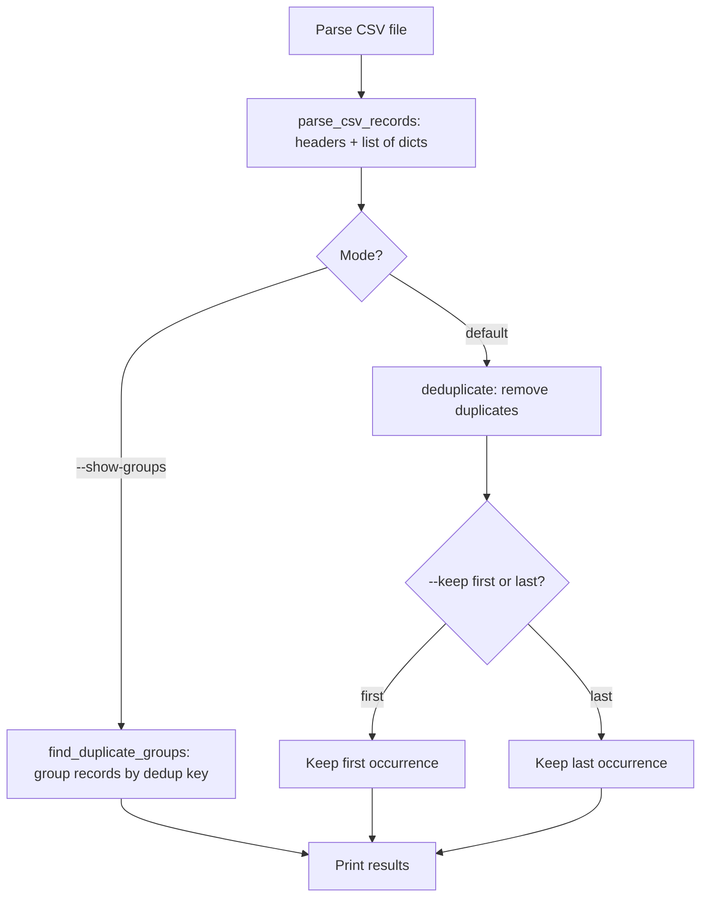
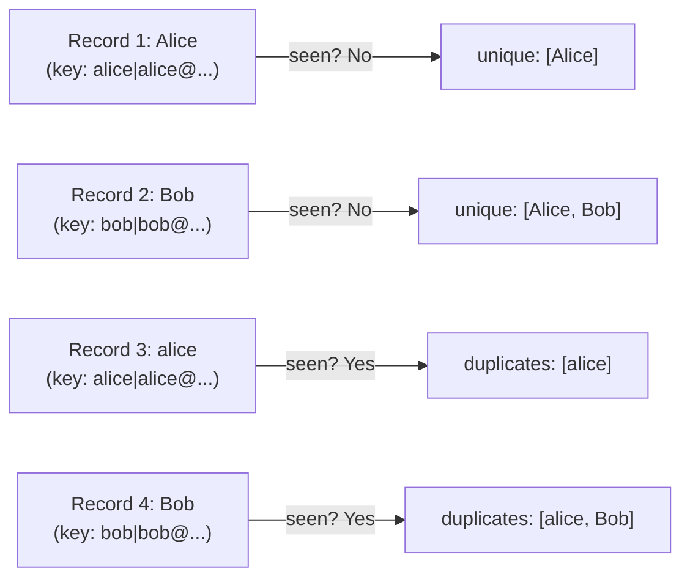

# Walkthrough: Records Deduplicator

> This guide walks through the **thinking process** for building this project.
> It does NOT give you the complete solution. For that, see [SOLUTION.md](./SOLUTION.md).

## Before reading this

**Try the project yourself first.** Spend at least 20 minutes.
If you have not tried yet, close this file and open the [project README](./README.md).

---

## Understanding the problem

You need to build a tool that removes duplicate records from CSV data. The user specifies which columns to use as the "key" for detecting duplicates, and whether to keep the first or last occurrence. The tool also supports grouping duplicates so the user can inspect them.

The sample input looks like:

```
name, email, department
Alice Johnson, alice@example.com, Engineering
Bob Smith, bob@example.com, Marketing
alice johnson, ALICE@EXAMPLE.COM, Sales
Bob Smith, bob@example.com, Marketing
```

Notice that "Alice Johnson" and "alice johnson" are duplicates (different case, same person), and "Bob Smith" appears twice with identical data.

## Planning before code



Five functions to build:

1. **parse_csv_records()** -- read CSV into headers and record dicts
2. **make_dedup_key()** -- build a normalised key from specified fields
3. **deduplicate()** -- remove duplicates, keeping first or last
4. **find_duplicate_groups()** -- group records that share a key
5. **CLI + output** -- parse arguments and display results

## Step 1: Understanding deduplication keys

The core idea is simple: two records are "duplicates" if they have the same values in the key fields. To detect this, combine the key field values into a single string:

```python
def make_dedup_key(record: dict[str, str], key_fields: list[str]) -> str:
    parts = []
    for field in key_fields:
        value = record.get(field, "").strip().lower()
        parts.append(value)
    return "|".join(parts)
```

If the key fields are `["name", "email"]`, then Alice's record produces the key `"alice johnson|alice@example.com"`. Normalising with `.strip().lower()` ensures that `"Alice Johnson"` and `"alice johnson"` produce the same key.

The `|` separator prevents false matches: without it, a record with name `"ab"` and email `"cd"` would have the same key as one with name `"a"` and email `"bcd"` (both would be `"abcd"`).

### Predict before you scroll

If you use `--keys email` instead of `--keys name email`, would Alice's two records (with `alice@example.com` and `ALICE@EXAMPLE.COM`) still be detected as duplicates? Why or why not?

## Step 2: The deduplication logic

The heart of the project. Use a **set** to track which keys you have already seen:

```python
def deduplicate(records, key_fields, keep="first"):
    seen: set[str] = set()
    unique: list[dict] = []
    duplicates: list[dict] = []

    for idx, record in enumerate(records):
        dedup_key = make_dedup_key(record, key_fields)

        if dedup_key in seen:
            # This is a duplicate
            duplicates.append(record)
        else:
            # First time seeing this key
            seen.add(dedup_key)
            unique.append(record)

    return {"unique": unique, "duplicates": duplicates}
```

This is the `keep="first"` logic. When you encounter a key you have already seen, the current record goes to the `duplicates` list. The first occurrence stays in `unique`.



**Why a set instead of a list?** Checking `if key in some_set` is O(1) -- constant time regardless of how many items are in the set. Checking `if key in some_list` is O(n) -- it gets slower as the list grows. For large datasets, this difference matters enormously.

### Predict before you scroll

What changes for `keep="last"` mode? Think about it: you want to keep the **last** occurrence of each key instead of the first. How would you modify the logic?

## Step 3: The "keep last" variant

For `keep="last"`, you need a different strategy. You cannot just skip later records -- you need to **replace** earlier ones:

```python
if keep == "last":
    key_to_record: dict[str, dict] = {}
    for idx, record in enumerate(records):
        dedup_key = make_dedup_key(record, key_fields)
        if dedup_key in key_to_record:
            # Move the old record to duplicates
            duplicates.append(key_to_record[dedup_key])
        key_to_record[dedup_key] = record  # always overwrite with latest

    # Sort by original index to maintain stable order
    unique = sorted(key_to_record.values(), key=lambda r: r["_original_index"])
```

The dictionary `key_to_record` always holds the most recent record for each key. When a new duplicate arrives, the old one gets moved to the `duplicates` list.

## Step 4: Grouping duplicates

Sometimes you just want to see which records are duplicates without removing them:

```python
def find_duplicate_groups(records, key_fields):
    groups: dict[str, list[dict]] = {}
    for record in records:
        key = make_dedup_key(record, key_fields)
        groups.setdefault(key, []).append(record)

    return {k: v for k, v in groups.items() if len(v) > 1}
```

`dict.setdefault(key, [])` is a useful pattern: if the key exists, return its value; if not, set it to `[]` and return that. This avoids the `if key not in groups: groups[key] = []` boilerplate.

The dict comprehension at the end filters to only groups with more than one record -- those are the actual duplicates.

## Common mistakes

| Mistake | Why it happens | How to fix |
|---------|---------------|------------|
| Using a list instead of a set for `seen` | Works but is slow for large data | Sets have O(1) lookup; lists have O(n) |
| Forgetting to normalise keys | "Alice" and "alice" are treated as different | `.strip().lower()` in `make_dedup_key()` |
| No separator between key parts | `"ab" + "cd"` and `"a" + "bcd"` both produce `"abcd"` | Join with `"|"` to keep fields distinct |
| `keep="last"` loses original order | Records come out in dict insertion order, not file order | Track original index and sort at the end |

## Testing your solution

Run the tests from the project directory:

```bash
pytest -q
```

The nine tests verify:
- Dedup key generation normalises correctly
- `keep="first"` keeps the first occurrence
- `keep="last"` keeps the last occurrence
- Duplicate groups are identified correctly
- Edge cases: empty input, all duplicates, single key field

Test from the command line with different modes:

```bash
python project.py data/sample_input.txt --keys name email
python project.py data/sample_input.txt --keys email --keep last
python project.py data/sample_input.txt --keys email --show-groups
```

## What to explore next

1. Add a `--output` flag that writes unique records to a new CSV file
2. Add a count column showing how many times each duplicate key appeared in the original data
