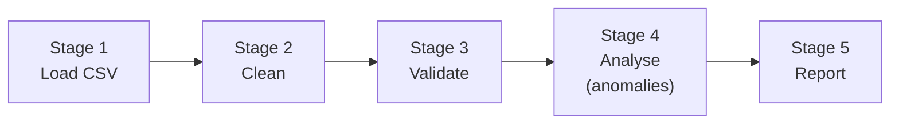
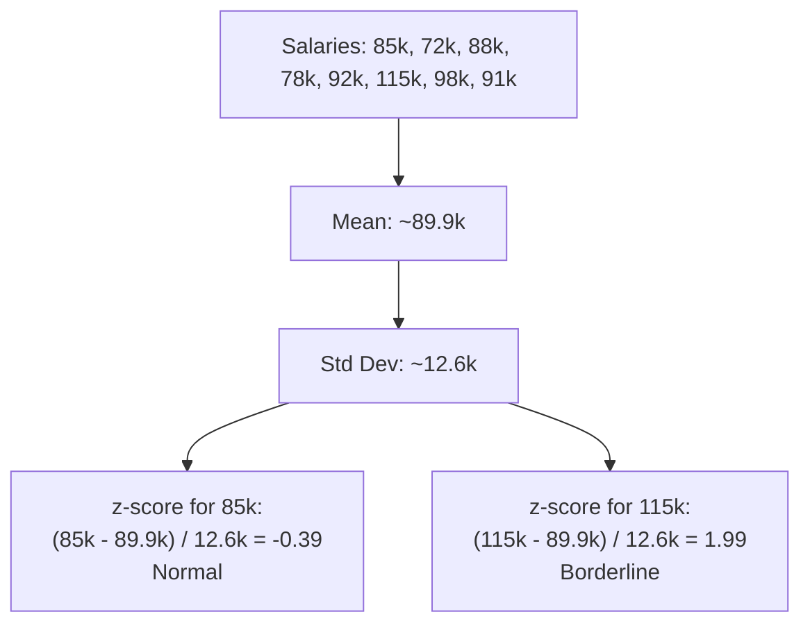

# Walkthrough: Level 2 Mini Capstone -- Data Pipeline

> This guide walks through the **thinking process** for building this project.
> It does NOT give you the complete solution. For that, see [SOLUTION.md](./SOLUTION.md).

## Before reading this

**Try the project yourself first.** Spend at least 20 minutes.
If you have not tried yet, close this file and open the [project README](./README.md).

---

## Understanding the problem

This capstone combines skills from all of Level 2 into a single end-to-end data pipeline. You load CSV data, clean it, validate records against rules, detect anomalies using z-scores, and generate a formatted report. It is a realistic pipeline that mirrors how data is processed in production systems.

The sample input is a CSV with employee data:

```
name,email,age,salary
Alice Johnson,alice@example.com,30,85000
Bob Smith,bob@example.com,25,72000
,bad-email,-5,50000
Kate Bishop,kate@example.com,24,2000000
```

Some records are invalid (missing name, bad email, negative age) and one has an anomalous salary.

## Planning before code



Five pipeline stages, each a separate function:

1. **load_csv()** -- parse CSV into headers and record dicts
2. **clean_records()** -- strip whitespace, normalise emails
3. **validate_batch()** -- check required fields, email format, numeric ranges
4. **detect_anomalies()** -- find outliers using z-score
5. **generate_report()** -- format everything into a human-readable report

Plus an orchestrator: `run_pipeline()`.

## Step 1: Load and parse

This is the same CSV loading pattern you have used before, but with one addition -- skipping comment lines:

```python
def load_csv(path: Path) -> tuple[list[str], list[dict[str, str]]]:
    lines = path.read_text(encoding="utf-8").splitlines()
    lines = [l.strip() for l in lines if l.strip() and not l.startswith("#")]

    if not lines:
        return [], []

    headers = [h.strip() for h in lines[0].split(",")]
    records = []
    for line in lines[1:]:
        values = [v.strip() for v in line.split(",")]
        while len(values) < len(headers):
            values.append("")
        records.append(dict(zip(headers, values)))

    return headers, records
```

The `while len(values) < len(headers)` padding ensures that rows with fewer values than headers do not crash `zip()`.

## Step 2: Clean records

Cleaning is a separate stage because raw data is messy. The cleaner strips whitespace and normalises email fields to lowercase:

```python
def clean_record(record: dict[str, str]) -> dict[str, str]:
    cleaned = {}
    for key, value in record.items():
        value = value.strip()
        if "email" in key.lower():
            value = value.lower()
        cleaned[key] = value
    return cleaned
```

### Predict before you scroll

Why lowercase only email fields and not everything? Think about what would happen if you lowercased the "name" field -- would "Alice Johnson" becoming "alice johnson" be a problem?

## Step 3: Validate against rules

Validation is the most complex stage. It checks each record against a set of rules:

```python
DEFAULT_RULES = {
    "required": ["name", "email"],
    "email_field": "email",
    "ranges": {
        "age": {"min": 0, "max": 150},
        "salary": {"min": 0, "max": 1000000},
    },
}
```

The validator checks three types of rules:

1. **Required fields** -- is the field present and non-empty?
2. **Email format** -- does it match a basic email pattern?
3. **Numeric ranges** -- is the value within acceptable bounds?

```python
def validate_record(record: dict[str, str], rules: dict) -> dict:
    errors: list[str] = []

    for field in rules.get("required", []):
        if not record.get(field, "").strip():
            errors.append(f"Missing required field: {field}")

    email_field = rules.get("email_field")
    if email_field and record.get(email_field):
        if not re.match(r"^[^@]+@[^@]+\.[^@]+$", record[email_field]):
            errors.append(f"Invalid email: {record[email_field]}")

    for field, bounds in rules.get("ranges", {}).items():
        value = record.get(field, "")
        try:
            num = float(value)
            if num < bounds["min"] or num > bounds["max"]:
                errors.append(f"{field} out of range: {num}")
        except (ValueError, TypeError):
            if value:
                errors.append(f"{field} is not numeric: {value}")

    return {"valid": len(errors) == 0, "errors": errors}
```

The same **accumulate errors** pattern from the Input Validator Lab. Each check adds to the `errors` list. A record is valid only if the list is empty.

### Predict before you scroll

Looking at the sample data, which records will fail validation and why? The record `,bad-email,-5,50000` has three problems -- can you name them all?

## Step 4: Anomaly detection with z-scores

This is the most mathematically interesting stage. A **z-score** measures how far a value is from the average, in units of standard deviation:

```
z = (value - mean) / standard_deviation
```

A z-score of 2.0 means the value is 2 standard deviations above the mean. Values with |z| > threshold (default 2.0) are flagged as anomalies.

```python
def detect_anomalies(records, field, threshold=2.0):
    values = [float(r.get(field, "")) for r in records if can_parse_float(r.get(field, ""))]

    if len(values) < 2:
        return []

    avg = sum(values) / len(values)
    variance = sum((x - avg) ** 2 for x in values) / len(values)
    sd = math.sqrt(variance) if variance > 0 else 0

    if sd == 0:
        return []  # all values are identical, no anomalies possible

    anomalies = []
    for idx, record in enumerate(records):
        try:
            val = float(record.get(field, ""))
            z = (val - avg) / sd
            if abs(z) > threshold:
                anomalies.append({"index": idx, "value": val, "z_score": round(z, 3)})
        except (ValueError, TypeError):
            pass

    return anomalies
```



### Predict before you scroll

If Kate Bishop's salary is 2,000,000 but the average is around 90,000, what would her z-score be approximately? Would she be flagged as an anomaly?

## Step 5: Generate the report

The report function assembles all the results into a formatted text output:

```python
def generate_report(total, valid, invalid, anomalies, numeric_field):
    lines = [
        "=" * 60,
        "  DATA PIPELINE REPORT",
        "=" * 60,
        "",
        f"Records loaded:    {total}",
        f"Records valid:     {len(valid)}",
        f"Records invalid:   {len(invalid)}",
        f"Anomalies found:   {len(anomalies)}",
    ]
    # ... add sections for failures, anomalies, statistics
```

Notice the pass rate calculation guards against division by zero: `round(len(valid) / total * 100, 1) if total else 0`. Without the `if total` guard, an empty file would crash.

## The orchestrator

`run_pipeline()` connects all five stages:

```python
def run_pipeline(input_path, rules, numeric_field, anomaly_threshold=2.0):
    headers, raw_records = load_csv(input_path)
    cleaned = clean_records(raw_records)
    valid, invalid = validate_batch(cleaned, rules)
    anomalies = detect_anomalies(valid, numeric_field, threshold=anomaly_threshold)
    report = generate_report(len(raw_records), valid, invalid, anomalies, numeric_field)

    return {
        "total": len(raw_records),
        "valid_count": len(valid),
        "invalid_count": len(invalid),
        "anomaly_count": len(anomalies),
        "report": report,
        # ... plus the actual record lists
    }
```

Notice that anomaly detection runs on **valid** records only -- invalid records were already filtered out. This prevents bad data from skewing the statistics.

## Common mistakes

| Mistake | Why it happens | How to fix |
|---------|---------------|------------|
| Anomaly detection crashes on non-numeric data | Trying `float()` on text values | Wrap in `try/except`, skip non-parseable values |
| Pass rate division by zero | Total records is 0 (empty file) | Guard with `if total else 0` |
| Standard deviation is 0 | All values are identical | Check `if sd == 0` and return no anomalies |
| Validation misses multiple errors per record | Returning after first error | Accumulate all errors in a list, check the list at the end |
| Cleaning stage changes data semantics | Lowercasing names, not just emails | Only normalise fields where case does not matter |

## Testing your solution

Run the tests from the project directory:

```bash
pytest -q
```

The ten tests verify:
- CSV loading and parsing
- Cleaning normalises emails
- Validation catches missing fields, bad emails, out-of-range values
- Anomaly detection flags outliers correctly
- The full pipeline chains all stages together
- Edge cases: empty files, no numeric columns, all records invalid

Test with different options:

```bash
python project.py data/sample_input.txt
python project.py data/sample_input.txt --numeric-field salary --threshold 2.0
python project.py data/sample_input.txt --json
```

## What to explore next

1. Add a `--rules` flag that loads validation rules from a separate JSON file instead of using the defaults
2. Add deduplication as a pipeline stage between cleaning and validation -- combine this capstone with the Records Deduplicator project
